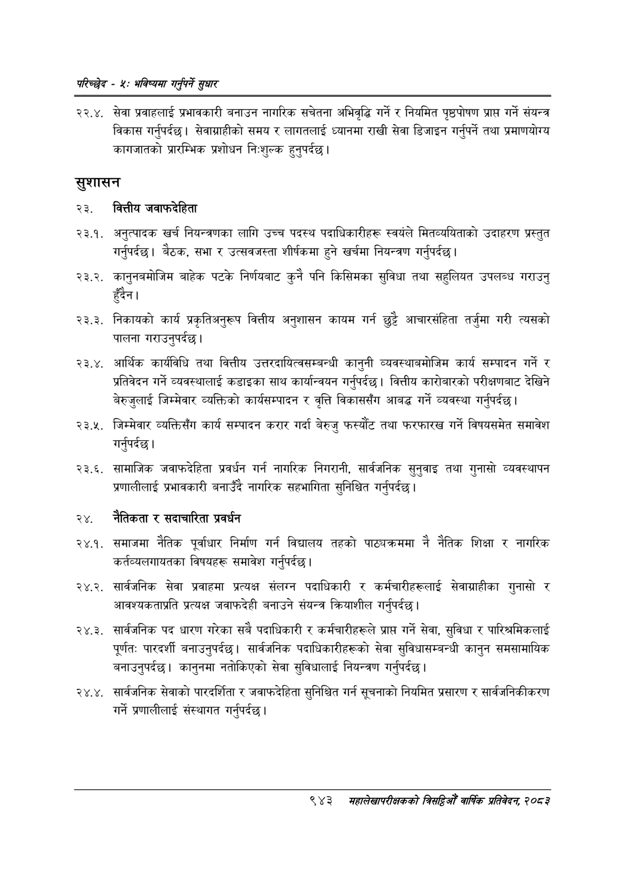

# Page 1001 QA

## Rendered page


## Extracted text

```text
परिच्छेद -४: भविष्यसा गनुपर्ने सुधार
२२.४. सेवा प्रवाहलाई प्रभावकारी बनाउन नागरिक सचेतना अभिवृद्धि गर्ने र नियमित पृष्ठपोषण प्राप्त गर्ने संयन्त्र विकास गर्नुपर्दछ। सेवाग्राहीको समय र लागतलाई ध्यानमा राखी सेवा डिजाइन गर्नुपर्ने तथा प्रमाणयोग्य कागजातको प्रारम्भिक प्रशोधन निःशुल्क हुनुपर्दछ |
सुशासन
२३. वित्तीय जवाफदेहिता
२३.१. अनुत्पादक खर्च नियन्त्रणका लागि उच्च पदस्थ पदाधिकारीहरू स्वयंले मितव्ययिताको उदाहरण प्रस्तुत गर्नुपर्दछ। बैठक, सभा र उत्सवजस्ता शीर्षकमा हुने खर्चमा नियन्त्रण गर्नुपर्दछ।
. कानुनबमोजिम बाहेक पटके निर्णयबाट कुनै पनि किसिमका सुविधा तथा सहुलियत उपलब्ध गराउनु हुँदैन।
. निकायको कार्य प्रकृतिअनुरूप वित्तीय अनुशासन कायम गर्न छुट्टै आचारसंहिता तर्जुमा गरी त्यसको पालना गराउनुपर्दछ।
आर्थिक कार्यविधि तथा वित्तीय उत्तरदायित्वसम्बन्धी कानुनी व्यवस्थाबमोजिम कार्य सम्पादन गर्ने र प्रतिवेदन गर्ने व्यवस्थालाई कडाइका साथ कार्यान्वयन गर्नुपर्दछ। वित्तीय कारोबारको परीक्षणबाट देखिने बेरुजुलाई जिम्मेवार व्यक्तिको कार्यसम्पादन र वृत्ति विकाससँग आबद्ध गर्ने व्यवस्था गर्नुपर्दछ |
. जिम्मेवार व्यक्तिसँग कार्य सम्पादन करार गर्दा बेरुजु फस्यौट तथा फरफारख गर्ने विषयसमेत समावेश गर्नुपर्दछ |
. सामाजिक जवाफदेहिता प्रवर्धन गर्न नागरिक निगरानी, सार्वजनिक सुनुवाइ तथा गुनासो व्यवस्थापन प्रणालीलाई प्रभावकारी बनाउँदै नागरिक सहभागिता सुनिश्चित गर्नुपर्दछ |
२४. नेतिकता र सदाचारिता प्रवर्धन
२४.१. समाजमा नैतिक पूर्वाधार निर्माण गर्न विद्यालय तहको पाठ्यक्रममा नै नैतिक शिक्षा र नागरिक कर्तव्यलगायतका विषयहरू समावेश गर्नुपर्दछ |
२४.२. सार्वजनिक सेवा प्रवाहमा प्रत्यक्ष संलग्न पदाधिकारी र कर्मचारीहरूलाई सेवाग्राहीका गुनासो र आवश्यकताप्रति प्रत्यक्ष जवाफदेही बनाउने संयन्त्र क्रियाशील गर्नुपर्दछ |
२४.३. सार्वजनिक पद धारण गरेका सबै पदाधिकारी र कर्मचारीहरूले प्राप्त गर्ने सेवा, सुविधा र पारिश्रमिकलाई पूर्णतः पारदर्शी बनाउनुपर्दछ। सार्वजनिक पदाधिकारीहरूको सेवा सुविधासम्बन्धी कानुन समसामायिक बनाउनुपर्दछ। कानुनमा नतोकिएको सेवा सुविधालाई नियन्त्रण गर्नुपर्दछ |
.. सार्वजनिक सेवाको पारदर्शिता र जवाफदेहिता सुनिश्चित गर्न सूचनाको नियमित प्रसारण र सार्वजनिकीकरण गर्ने प्रणालीलाई संस्थागत गर्नुपर्दछ |
९४३
मंहालेखापरीक्षकको वार्षिक प्रतिवेदन; २०८२
```

## Flags
- None
