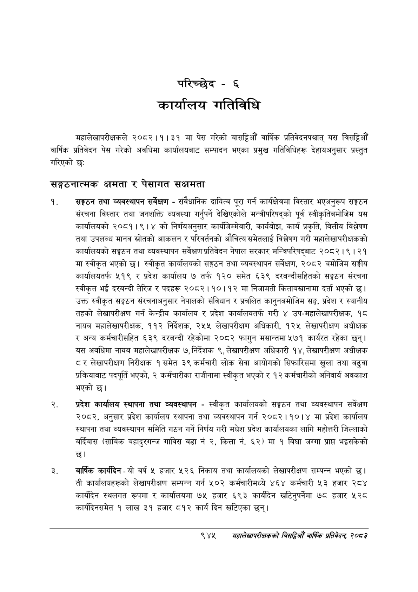

# Page 1005 QA

## Rendered page


## Extracted text

```text
परिच्छेद -६
कार्यालय गतिविधि
महालेखापरीक्षकले २०८२।१।३१ मा पेस गरेको बासट्टिऔं वार्षिक प्रतिवेदनपश्चात्‌ यस तिसष्टिऔँ वार्षिक प्रतिवेदन पेस गरेको अवधिमा कार्यालयबाट सम्पादन भएका प्रमुख गतिविधिहरू देहायअनुसार प्रस्तुत गरिएको छ:
सङ्गठनात्मक क्षमता र पेसागत सक्षमता
सङ्गठन तथा व्यवस्थापन सर्वेक्षण -संवैधानिक दायित्व पूरा गर्न कार्यक्षेत्रमा विस्तार भएअनुरूप सङ्गठन संरचना विस्तार तथा जनशक्ति व्यवस्था गर्नुपर्ने देखिएकोले मन्त्रीपरिषद्को पूर्व स्वीकृतिबमोजिम यस कार्यालयको २०८१।९।४ को निर्णयअनुसार कार्यजिम्मेवारी, कार्यबोझ, कार्य प्रकृति, वित्तीय विश्लेषण तथा उपलब्ध मानव स्रोतको आकलन र परिवर्तनको औचित्य समेतलाई विश्लेषण गरी महालेखापरीक्षकको कार्यालयको सङ्गठन तथा व्यवस्थापन सर्वेक्षण प्रतिवेदन नेपाल सरकार मन्त्रिपरिषद्बाट २०८२।९। २१ मा स्वीकृत भएको | स्वीकृत कार्यालयको सङ्गठन तथा व्यवस्थापन सर्वेक्षण, २०८२ बमोजिम सङ्घीय कार्यालयतर्फ ५१९ र प्रदेश कार्यालय ७ तर्फ १२० समेत ६३९ दरबन्दीसहितको सङ्गठन संरचना स्वीकृत भई दरबन्दी तेरिज र पदहरू २०८२।१०।१२ मा निजामती किताबखानामा दर्ता भएको छ। उक्त स्वीकृत सङ्गठन संरचनाअनुसार नेपालको संविधान र प्रचलित कानुनबमोजिम सङ्घ, प्रदेश र स्थानीय तहको लेखापरीक्षण गर्न केन्द्रीय कार्यालय र प्रदेश कार्यालयतर्फ गरी ४ उप-महालेखापरीक्षक, १८ नायब महालेखापरीक्षक, ११२ निर्देशक, २५५ लेखापरीक्षण अधिकारी, १२५ लेखापरीक्षण अधीक्षक र अन्य कर्मचारीसहित ६३९ दरबन्दी रहेकोमा २०८२ फागुन मसान्तमा ५७१ कार्यरत रहेका छन्‌। यस अवधिमा नायब महालेखापरीक्षक ७, निर्देशक ९, लेखापरीक्षण अधिकारी १४, लेखापरीक्षण अधीक्षक ८ र लेखापरीक्षण निरीक्षक १ समेत ३९ कर्मचारी लोक सेवा आयोगको सिफारिसमा खुला तथा बढुवा प्रक्रियाबाट पदपूर्ति भएको, २ कर्मचारीका राजीनामा स्वीकृत भएको र १२ कर्मचारीको अनिवार्य अवकाश भएको छ।
प्रदेश कार्यालय स्थापना तथा व्यवस्थापन -स्वीकृत कार्यालयको सङ्गठन तथा व्यवस्थापन सर्वेक्षण २०८२, अनुसार प्रदेश कार्यालय स्थापना तथा व्यवस्थापन गर्न २०८२।१०।४ मा प्रदेश कार्यालय स्थापना तथा व्यवस्थापन समिति गठन गर्ने निर्णय गरी मधेश प्रदेश कार्यालयका लागि महोत्तरी जिल्लाको बर्दिबास (साबिक बहादुरगन्ज गाविस वडा नं ३, कित्ता नं. ६२) मा १ बिघा जग्गा प्रापत भइसकेको छ।
वार्षिक कार्यदिन -यो वर्ष ५ हजार ५२६ निकाय तथा कार्यालयको लेखापरीक्षण सम्पन्न भएको छ। ती कार्यालयहरूको लेखापरीक्षण सम्पन्न गर्न ५०२ कर्मचारीमध्ये ४६४ कर्मचारी ५३ हजार २८४ कार्यदिन स्थलगत रूपमा र कार्यालयमा ७५ हजार ६९३ कार्यदिन खटिनुपर्नेमा ७८ हजार ५२८ कार्यदिनसमेत १ लाख ३१ हजार ८१२ कार्य दिन खटिएका छन्‌।
९४४
सहालेखापरीक्षकको बिद्या वा्िक प्रतिवेदन; २०८२
```

## Flags
- None
