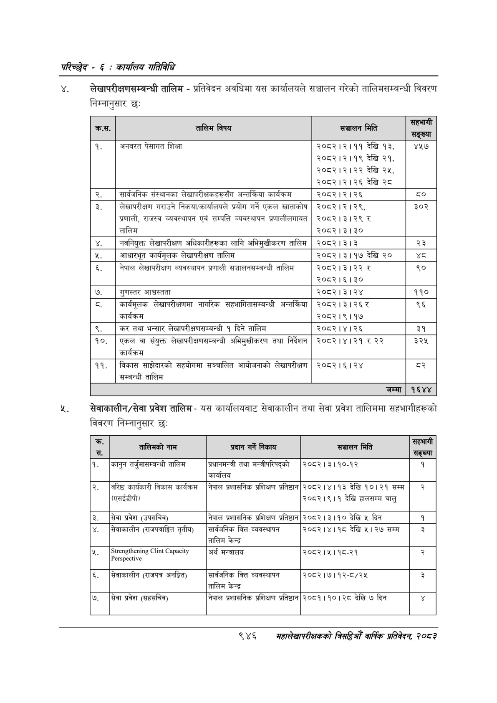

# Page 1006 QA

## Rendered page


## Extracted text

```text
परिच्छेद -€: का्यलिय गतिविधि
४. लेखापरीक्षणसम्बन्धी तालिम -प्रतिवेदन अवधिमा यस कार्यालयले सञ्चालन गरेको तालिमसम्बन्धी विवरण निम्नानुसार छः
४. सेवाकालीन/सेवा प्रवेश तालिम -यस कार्यालयबाट सेवाकालीन तथा सेवा प्रवेश तालिममा सहभागीहरूको विवरण निम्नानुसार छः
९४६
महालेखापरीक्षकको बितदिओ वार्षिक प्रतिवेदन २०८२

| क.स. | तालिम विषय | सञ्चालन मिति | ] सङ्ख्या |
| --- | --- | --- | --- |
| १. | अनबरत पेसागत शिक्षा | २०८२।२।११ देखि १३, २०८२।२।१९ देखि २१, २०८२।२।२२ देखि २५, २०८२।२।२६ देखि २८ | ४५७ |
| २. | शार्वजनिक संस्थानका लेखापरीक्षकहरूसँग अन्तर्निरवा कार्यक्रम | २०८२।२।२६ |  |
| ३. | लेखापरीक्षण गराउने प्रयोग गर्ने एकल खाताको प्रणाली, राजस्व व्यवस्थापन एवं सम्पत्ति व्यवस्थापन प्रणालीलमावत तालिम | २०८२।२। २९, २०८२।३।२९ र २०८२।३। ३० | ३०२ |
|  |  |  |  |
| ४. | नबनिवुक्त लेखापरीक्षण अघिकारीहरूका लागि अभिशुषीक९० तालिम | २०८२।३।३ | २३ |
| [म | आधारभूत क्ार्वभूलक लेखापरीक्षण तालिम | २०८२।३।१७ देखि २० | थ्व |
| ६. | नेपाल लेखापरीक्षण व्यवस्थापन प्रणाली सञ्चालनशन्जन्धी तालिम | २०८२।३।२२ र २०८२।६।३० | ९० |
| ७. | गुणस्तर आश्चस्तता | २०८२।३।२४ | ११० |
|  |  |  |  |
| ८. | कार्यमूलक लेखापरीक्षणमा नागरिक सहभागितासषम्बन्धी अन्त्न्रिषा कार्यक्रम | २०८२।३।२६र २०८२।९।१७ | ९६ |
| ९. | कर तथा भन्सार लेखापरीक्षणसम्वन्धी १ दिने तालिम | २०८२।४।२६ | ३१ |
| १०. | एकल वा संयुक्त लेखापरीक्षणसम्बन्धी अभिमुखीकरण तथा निर्देशन कार्यक्रम | २०८२।४।२१ | ३२५ |
|  |  |  |  |
| ११. | बिकास साझेदारको सहयोगमा सञ्चालित आयोजनाको लेखापरीक्षण सम्बन्धी तालिम | २०८२।६।२४ | ३ |
|  |  | जम्मा | १६४४ |

| = स. | तालिनको नाम | प्रदान गर्ने निकाय | 'सञ्चालन मिति | ] सङ्ख्या |
| --- | --- | --- | --- | --- |
| १ | कानुन तर्जुमाधन्तन्धी तालिम | तथा मन्त्रीपरिषद्को कार्यालव | २०८२।३।१०-१२ | १ |
| २ | वरिष्ठ कार्षक१२ी विकास कार्यक्रम () | नेपाल ्रश॥ाक्षनिक प्रशिक्षण प्रतिष्ठान | २०८२।४।१३ देखि १०।२१ सम्म २०८२।९।१ देखि हालकषन्म चालु | २ |
| ३ | सेवा प्रवेश (३५८१) | नेपाल त्रशासनिक प्रशिक्षण प्रतिष्ठान | २०८२।३।१० देखि ५ दिन | १ |
| ४ | सेवाकालीन (सजपत्राङ्गित तृतीय) | शार्षजनिक वित्त व्यवस्थापन तालिम केन्द्र | २०८२।४।१८ देखि ५। २७ सम्म | ३ |
| ५ |  | अर्थ मन्त्रालय | २०८२।५।१८-२१ | २ |
| ६ | सेवाकालीन (राजपत्र अनङ्गित) | सार्बजनिक वित्त व्यवस्थापन तालिम केन्द्र | २०८२।७।१२-८/२४५ | ३ |
| ७ | सेवा प्रवेश (सह्भिव) | नेपाल प्रशासनिक प्रशिक्षण प्रतिष्ठान | २०८१।१०। २८ देखि ७ दिन |  |
```

## Flags
- table_page
- medium_quality_table
