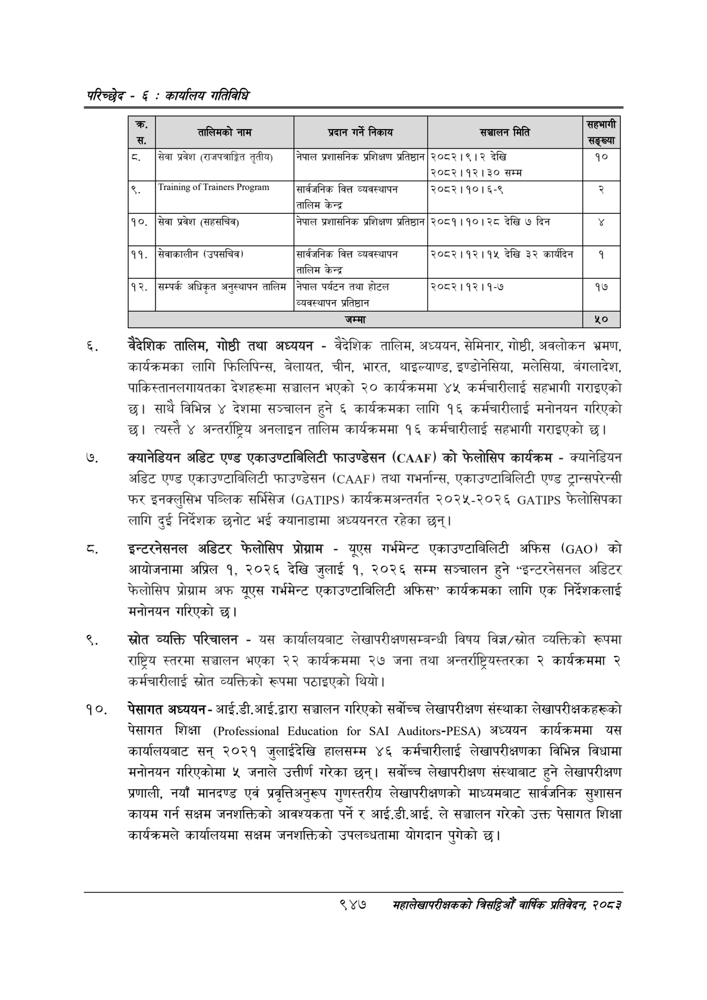

# Page 1007 QA

## Rendered page


## Extracted text

```text
परिच्छेद -€: का्यलिय गतिविधि
वैदेशिक तालिम, गोष्ठी तथा अध्ययन -वैदेशिक तालिम, अध्ययन, सेमिनार, गोष्ठी, अवलोकन भ्रमण, कार्यक्रमका लागि फिलिपिन्स, बेलायत, चीन, भारत, थाइल्याण्ड, इण्डोनेसिया, मलेसिया, बंगलादेश, पाकिस्तानलगायतका देशहरूमा सञ्चालन भएको २० कार्यक्रममा ४५ कर्मचारीलाई सहभागी गराइएको छ। साथै विभिन्न ४ देशमा सञ्चालन हुने ६ कार्यक्रमका लागि १६ कर्मचारीलाई मनोनयन गरिएको छ। त्यस्तै ४ अन्तर्राष्ट्रिय अनलाइन तालिम कार्यक्रममा १६ कर्मचारीलाई सहभागी गराइएको छ।
क्यानेडियन अडिट एण्ड एकाउण्टाबिलिटी फाउण्डेसन () को फेलोसिप कार्यक्रम -क्यानेडियन अडिट एण्ड एकाउण्टाबिलिटी फाउण्डेसन () तथा गभर्नान्स, एकाउण्टाबिलिटी एण्ड ट्रान्सपरेन्सी फर इनक्लुसिभ पब्लिक सर्भिसेज () कार्यक्रमअन्तर्गत २०२५-२०२६ फेलोसिपका लागि दुई निर्देशक छनोट भई क्यानाडामा अध्ययनरत रहेका छन्‌।
इन्टरनेसनल अडिटर फेलोसिप प्रोग्राम -यूएस गर्भमेन्ट एकाउण्टाबिलिटी अफिस (०२०) को आयोजनामा अप्रिल १, २०२६ देखि जुलाई १, २०२६ सम्म सञ्चालन हुने "इन्टरनेसनल अडिटर फेलोसिप प्रोग्राम अफ यूएस गर्भमेन्ट एकाउण्टाबिलिटी अफिस" कार्यक्रमका लागि एक निर्देशकलाई मनोनयन गरिएको छ।
स्रोत व्यक्ति परिचालन -यस कार्यालयबाट लेखापरीक्षणसम्बन्धी विषय विज्ञ/स्रोत व्यक्तिको रूपमा राष्ट्रिय स्तरमा सञ्चालन भएका २२ कार्यक्रममा २७ जना तथा अन्तर्राष्ट्रियस्तरका २ कार्यक्रममा २ कर्मचारीलाई स्रोत व्यक्तिको रूपमा पठाइएको थियो।
पेसागत अध्ययन -आई.डी. आई.द्वारा सञ्चालन गरिएको सर्वोच्च लेखापरीक्षण संस्थाका लेखापरीक्षकहरूको पेसागत शिक्षा ( -) अध्ययन कार्यक्रममा यस कार्यालयबाट सन्‌ २०२१ जुलाईदेखि हालसम्म ४६ कर्मचारीलाई लेखापरीक्षणका विभिन्न विधामा मनोनयन गरिएकोमा ५ जनाले उत्तीर्ण गरेका छन्‌। सर्वोच्च लेखापरीक्षण संस्थाबाट हुने लेखापरीक्षण प्रणाली, नयाँ मानदण्ड एवं प्रवृत्तिअनुरूप गुणस्तरीय लेखापरीक्षणको माध्यमबाट सार्वजनिक सुशासन कायम गर्न सक्षम जनशक्तिको आवश्यकता पर्ने र आई.डी.आई. ले सञ्चालन गरेको उक्त पेसागत शिक्षा कार्यक्रमले कार्यालयमा सक्षम जनशक्तिको उपलब्धतामा योगदान पुगेको छ।
९४७
सहालेखापरीक्षकको बिद्या वा्िक प्रतिवेदन २०८२

| > स. | तालिनको नाम | प्रदान गर्ने निकाय | सञ्चालन मिति | छ सङ्ख्या |
| --- | --- | --- | --- | --- |
| ८. | सेवा प्रवेश (सशपत्राङित तृतीय) | नेपाल प्रशासनिक प्रशिक्षण प्रतिष्ठान | २०८२।९।२ देखि २०८२।१२।३० सम्म | १० |
|  |  | सार्वजनिक वित्त व्यवस्थापन तालिम केन्द्र | २०८२।१०।६-९ | २ |
| १०. | सेवा प्रवेश (सहभिव) | नेपाल प्रशासनिक प्रशिक्षण प्रतिष्ठान | २०८१।१०। २८ देखि ७ दिन |  |
| ११, | सेवाकालीन (उपसचिव) | सार्वजनिक वित्त व्यवस्थापन तालिम केन्द्र | २०८२।१२।१५ देखि ३२ कार्यदिन | १ |
| १२. | सम्पर्क अधिकृत अनुस्थापन तालिम | नेपाल पर्यटन तथा होटल व्यवस्थापन प्रतिष्ठान | २०८२।१२।१-७ | १७ |
|  |  | जम्मा |  |  |
```

## Flags
- table_page
- medium_quality_table
