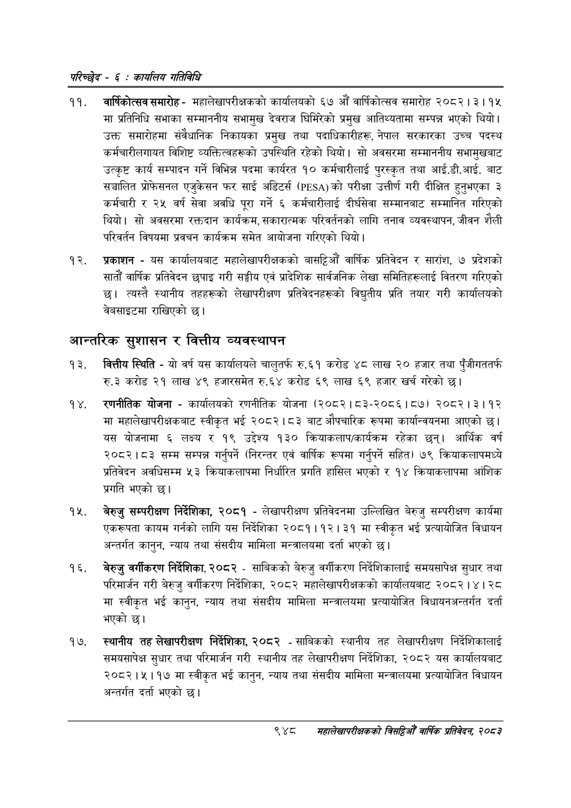

# Page 1008 QA

## Rendered page


## Extracted text

```text
परिच्छेद -€: का्यलिय गतिविधि
वार्षिकोत्सव समारोह -महालेखापरीक्षकको कार्यालयको ६७ औं वार्षिकोत्सव समारोह २०८२। ३। १५ मा प्रतिनिधि सभाका सम्माननीय सभामुख देवराज घिमिरेको प्रमुख आतिथ्यतामा सम्पन्न भएको थियो। उक्त समारोहमा संवैधानिक निकायका प्रमुख तथा पदाधिकारीहरू, नेपाल सरकारका उच्च पदस्थ कर्मचारीलगायत विशिष्ट व्यक्तित्वहरूको उपस्थिति रहेको थियो। सो अवसरमा सम्माननीय सभामुखबाट उत्कृष्ट कार्य सम्पादन गर्ने विभिन्न पदमा कार्यरत १० कर्मचारीलाई पुरस्कृत तथा आई.डी.आई. बाट सञ्चालित प्रोफसनल एजुकेसन फर साई अडिटर्स () को परीक्षा उत्तीर्ण गरी दीक्षित हुनुभएका ३ कर्मचारी र २५ वर्ष सेवा अवधि पूरा गर्ने ६ कर्मचारीलाई दीर्घसेवा सम्मानबाट सम्मानित गरिएको थियो। सो अवसरमा रक्तदान कार्यक्रम, सकारात्मक परिवर्तनको लागि तनाव व्यवस्थापन, जीवन शैली परिवर्तन विषयमा प्रवचन कार्यक्रम समेत आयोजना गरिएको थियो |
प्रकाशन -यस कार्यालयबाट महालेखापरीक्षकको बासट्टिऔँ वार्षिक प्रतिवेदन र सारांश, ७ प्रदेशको सातौं वार्षिक प्रतिवेदन छपाइ गरी सङ्घीय एवं प्रादेशिक सार्वजनिक लेखा समितिहरूलाई वितरण गरिएको छ। त्यस्तै स्थानीय तहहरूको लेखापरीक्षण प्रतिवेदनहरूको विद्युतीय प्रति तयार गरी कार्यालयको वेबसाइटमा राखिएको छ।
आन्तरिक सुशासन र वित्तीय व्यवस्थापन
वित्तीय स्थिति -यो वर्ष यस कार्यालयले चालुतर्फ रु.६१ करोड ४८ लाख २० हजार तथा पुँजीगततर्फ रु.३ करोड २१ लाख ४९ हजारसमेत रु.६४ करोड ६९ लाख ६९ हजार खर्च गरेको |
रणनीतिक योजना -कार्यालयको रणनीतिक योजना (२०८२। ८३-२०८६।८७) २०८२।३।१२ मा महालेखापरीक्षकबाट स्वीकृत भई २०८२।८३ बाट औपचारिक रूपमा कार्यान्वयनमा आएको छ। यस योजनामा ६ लक्ष्य र १९ उद्देश्य १३० क्रियाकलाप/कार्यक्रम रहेका छन्‌। आर्थिक वर्ष २०८२।८३ सम्म सम्पन्न गर्नुपर्ने (निरन्तर एवं वार्षिक रूपमा गर्नुपर्ने सहित) ७९ क्रियाकलापमध्ये प्रतिवेदन अवधिसम्म ५३ क्रियाकलापमा निर्धारित प्रगति हासिल भएको र १४ क्रियाकलापमा आंशिक प्रगति भएको छ।
बेरुजु सम्परीक्षण निर्देशिका, २०८१ -लेखापरीक्षण प्रतिवेदनमा उल्लिखित बेरुजु सम्परीक्षण कार्यमा एकरूपता कायम गर्नको लागि यस निर्देशिका २०८१।१२। ३१ मा स्वीकृत भई प्रत्यायोजित विधायन अन्तर्गत कानुन, न्याय तथा संसदीय मामिला मन्त्रालयमा दर्ता भएको छ।
बेरुजु वर्गीकरण निर्देशिका, २०८२ -साबिकको बेरुजु वर्गीकरण निर्देशिकालाई समयसापेक्ष सुधार तथा परिमार्जन गरी बेरुजु वर्गीकरण निर्देशिका, २०८२ महालेखापरीक्षकको कार्यालयबाट २०८२ १ | २८ मा स्वीकृत भई कानुन, न्याय तथा संसदीय मामिला मन्त्रालयमा प्रत्यायोजित विधायनअन्तर्गत दर्ता भएको छ।
स्थानीय तह लेखापरीक्षण निर्देशिका, २०८२ -साविकको स्थानीय तह लेखापरीक्षण निर्देशिकालाई समयसापेक्ष सुधार तथा परिमार्जन गरी स्थानीय तह लेखापरीक्षण निर्देशिका, २०८२ यस कार्यालयबाट २०८२।५।१७ मा स्वीकृत भई कानुन, न्याय तथा संसदीय मामिला मन्त्रालयमा प्रत्यायोजित विधायन अन्तर्गत दर्ता भएको छ।
९४८
महालेखापरीक्षकको बिद्या वा्िक प्रतिवेदन २०८२
```

## Flags
- None
