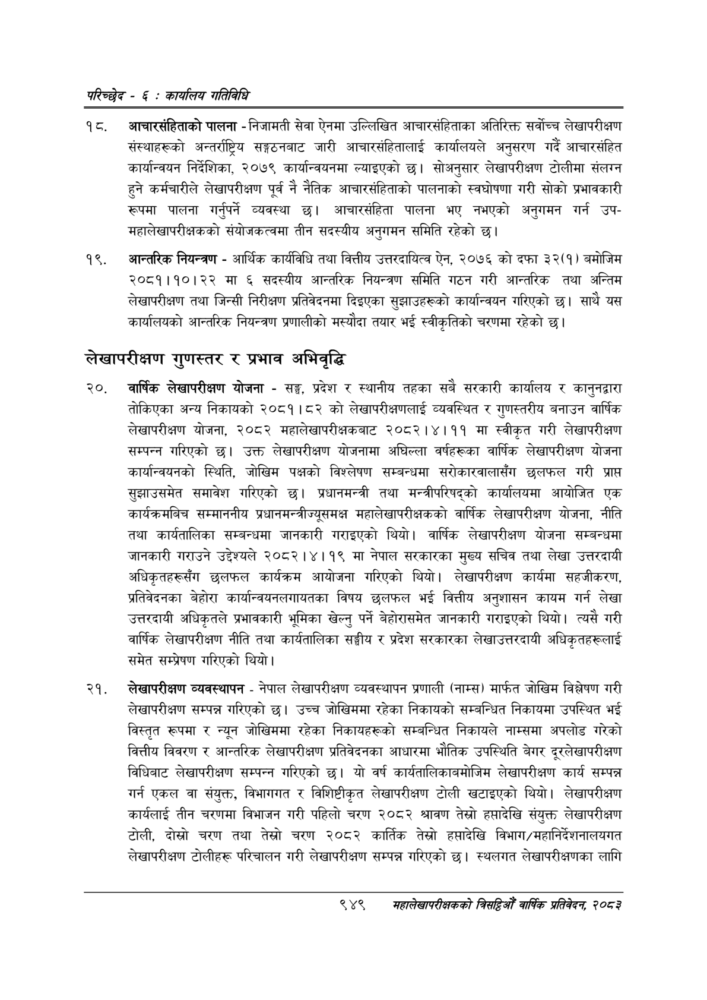

# Page 1009 QA

## Rendered page


## Extracted text

```text
परिच्छेद -€: का्यलिय गतिविधि
१८, आचारसंहिताको पालना -निजामती सेवा ऐनमा उल्लिखित आचारसंहिताका अतिरिक्त सर्वोच्च लेखापरीक्षण संस्थाहरूको अन्तर्राष्ट्रिय सङ्गठनबाट जारी आचारसंहितालाई कार्यालयले अनुसरण गर्दै आचारसंहित कार्यान्वयन निर्देशिका, २०७९ कार्यान्वयनमा ल्याइएको छ। सोअनुसार लेखापरीक्षण टोलीमा संलग्न हुने कर्मचारीले लेखापरीक्षण पूर्व नै नैतिक आचारसंहिताको पालनाको स्वघोषणा गरी सोको प्रभावकारी रूपमा पालना गर्नुपर्ने व्यवस्था छ। आचारसंहिता पालना भए नभएको अनुगमन गर्न उपमहालेखापरीक्षकको संयोजकत्वमा तीन सदस्यीय अनुगमन समिति रहेको छ।
आन्तरिक नियन्त्रण -आर्थिक कार्यविधि तथा वित्तीय उत्तरदायित्व ऐन, २०७६ को दफा ३२(१) बमोजिम २०८१।१०।२२ मा ६ सदस्यीय आन्तरिक नियन्त्रण समिति गठन गरी आन्तरिक तथा अन्तिम लेखापरीक्षण तथा जिन्सी निरीक्षण प्रतिवेदनमा दिइएका सुझाउहरूको कार्यान्वयन गरिएको छ। साथै यस कार्यालयको आन्तरिक नियन्त्रण प्रणालीको मस्यौदा तयार भई स्वीकृतिको चरणमा रहेको छ।
लेखापरीक्षण गुणस्तर र प्रभाव अभिवृद्धि
वार्षिक लेखापरीक्षण योजना -सङ्घ, प्रदेश र स्थानीय तहका सबै सरकारी कार्यालय र कानुनद्वारा तोकिएका अन्य निकायको २०८१।८२ को लेखापरीक्षणलाई व्यवस्थित र गुणस्तरीय बनाउन वार्षिक लेखापरीक्षण योजना, २०८२ महालेखापरीक्षकबाट २०८२।४।११ मा स्वीकृत गरी लेखापरीक्षण सम्पन्न गरिएको छ। उक्त लेखापरीक्षण योजनामा अघिल्ला वर्षहरूका वार्षिक लेखापरीक्षण योजना कार्यान्वयनको स्थिति, जोखिम पक्षको विश्लेषण सम्बन्धमा सरोकारवालासँग छलफल गरी प्राप्त सुझाउसमेत समावेश गरिएको छ। प्रधानमन्त्री तथा मन्त्रीपरिषद्को कार्यालयमा आयोजित एक कार्यक्रमबिच सम्माननीय प्रधानमन्त्रीज्यूसमक्ष महालेखापरीक्षकको वार्षिक लेखापरीक्षण योजना, नीति तथा कार्यतालिका सम्बन्धमा जानकारी गराइएको थियो। वार्षिक लेखापरीक्षण योजना सम्बन्धमा जानकारी गराउने उद्देश्यले २०८२।४।१९ मा नेपाल सरकारका मुख्य सचिव तथा लेखा उत्तरदायी अधिकृतहरूसँग छलफल कार्यक्रम आयोजना गरिएको थियो। लेखापरीक्षण कार्यमा सहजीकरण, प्रतिवेदनका बेहोरा कार्यान्वयनलगायतका विषय छलफल भई वित्तीय अनुशासन कायम गर्न लेखा उत्तरदायी अधिकृतले प्रभावकारी भूमिका खेल्नु पर्ने बेहोरासमेत जानकारी गराइएको थियो। त्यसै गरी वार्षिक लेखापरीक्षण नीति तथा कार्यतालिका सङ्घीय र प्रदेश सरकारका लेखाउत्तरदायी अधिकृतहरूलाई समेत सम्प्रेषण गरिएको थियो।
लेखापरीक्षण व्यवस्थापन -नेपाल लेखापरीक्षण व्यवस्थापन प्रणाली (नाम्स) मार्फत जोखिम विश्लेषण गरी लेखापरीक्षण सम्पन्न गरिएको छ। उच्च जोखिममा रहेका निकायको सम्बन्धित निकायमा उपस्थित भई विस्तृत रूपमा र न्यून जोखिममा रहेका निकायहरूको सम्बन्धित निकायले नाम्समा अपलोड गरेको वित्तीय विवरण र आन्तरिक लेखापरीक्षण प्रतिवेदनका आधारमा भौतिक उपस्थिति बेगर दूरलेखापरीक्षण विधिबाट लेखापरीक्षण सम्पन्न गरिएको छ। यो वर्ष कार्यतालिकाबमोजिम लेखापरीक्षण कार्य सम्पन्न गर्न एकल वा संयुक्त, विभागगत र विशिष्टीकृत लेखापरीक्षण टोली खटाइएको थियो। लेखापरीक्षण कार्यलाई तीन चरणमा विभाजन गरी पहिलो चरण २०८२ श्रावण तेस्रो हप्तादेखि संयुक्त लेखापरीक्षण टोली, दोस्रो चरण तथा तेत्रो चरण २०८२ कार्तिक तेस्रो हप्तादेखि विभाग/महानिर्देशनालयगत लेखापरीक्षण टोलीहरू परिचालन गरी लेखापरीक्षण सम्पन्न गरिएको छ। स्थलगत लेखापरीक्षणका लागि
९४९
सहालेखापरीक्षकको बिद्या वा्िक प्रतिवेदन २०८२
```

## Flags
- None
