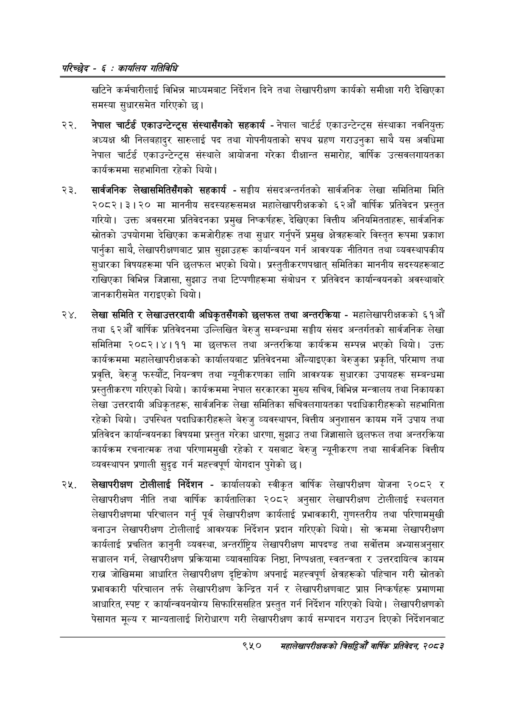

# Page 1010 QA

## Rendered page


## Extracted text

```text
परिच्छेद -€: का्यलिय गतिविधि
खटिने कर्मचारीलाई विभिन्न माध्यमबाट निर्देशन दिने तथा लेखापरीक्षण कार्यको समीक्षा गरी देखिएका समस्या सुधारसमेत गरिएको छ।
नेपाल चार्टर्ड एकाउन्टेन्ट्स संस्थासँगको सहकार्य -नेपाल चार्टर्ड एकाउन्टेन्ट्स संस्थाका नवनियुक्त अध्यक्ष श्री निलबहादुर सारुलाई पद तथा गोपनीयताको सपथ ग्रहण गराउनुका साथै यस अवधिमा नेपाल चार्टर्ड एकाउन्टेन्ट्स संस्थाले आयोजना गरेका दीक्षान्त समारोह, वार्षिक उत्सवलगायतका कार्यक्रममा सहभागिता रहेको थियो।
सार्वजनिक लेखासमितिसँगको सहकार्य -सङ्घीय संसदअन्तर्गतको सार्वजनिक लेखा समितिमा मिति २०८२।३।२० मा माननीय सदस्यहरूसमक्ष महालेखापरीक्षकको ६२औं वार्षिक प्रतिवेदन प्रस्तुत गरियो। उक्त अवसरमा प्रतिवेदनका प्रमुख निष्कर्षहरू, देखिएका वित्तीय अनियमितताहरू, सार्वजनिक स्रोतको उपयोगमा देखिएका कमजोरीहरू तथा सुधार गर्नुपर्ने प्रमुख क्षेत्रहरूबारे विस्तृत रूपमा प्रकाश पार्नुका साथै, लेखापरीक्षणबाट प्राप्त सुझाउहरू कार्यान्वयन गर्न आवश्यक नीतिगत तथा व्यवस्थापकीय सुधारका विषयहरूमा पनि छलफल भएको थियो। प्रस्तुतीकरणपश्चात्‌ समितिका माननीय सदस्यहरूबाट राखिएका विभिन्न जिज्ञासा, सुझाउ तथा टिप्पणीहरूमा संबोधन र प्रतिवेदन कार्यान्वयनको अवस्थाबारे जानकारीसमेत गराइएको थियो।
लेखा समिति र लेखाउत्तरदायी अधिकृतसँगको छलफल तथा अन्तरक्रिया -महालेखापरीक्षकको € औं तथा ६२औँ वार्षिक प्रतिवेदनमा उल्लिखित बेरुजु सम्बन्धमा सङ्घीय संसद अन्तर्गतको सार्वजनिक लेखा समितिमा २०८२।४।११ मा छलफल तथा अन्तरक्रिया कार्यक्रम सम्पन्न भएको थियो। उक्त कार्यक्रममा महालेखापरीक्षकको कार्यालयबाट प्रतिवेदनमा औंल्याइएका बेरुजुका प्रकृति, परिमाण तथा प्रवृत्ति, बेरुजु फस्यौंट, नियन्त्रण तथा न्यूनीकरणका लागि आवश्यक सुधारका उपायहरू सम्बन्धमा प्रस्तुतीकरण गरिएको थियो। कार्यक्रममा नेपाल सरकारका मुख्य सचिव, विभिन्न मन्त्रालय तथा निकायका लेखा उत्तरदायी अधिकृतहरू, सार्वजनिक लेखा समितिका सचिवलगायतका पदाधिकारीहरूको सहभागिता रहेको थियो। उपस्थित पदाधिकारीहरूले बेरुजु व्यवस्थापन, वित्तीय अनुशासन कायम गर्ने उपाय तथा प्रतिवेदन कार्यान्वयनका विषयमा प्रस्तुत गरेका धारणा, सुझाउ तथा जिज्ञासाले छलफल तथा अन्तरक्रिया कार्यक्रम रचनात्मक तथा परिणाममुखी रहेको र यसबाट बेरुजु न्यूनीकरण तथा सार्वजनिक वित्तीय व्यवस्थापन प्रणाली सुदृढ गर्न महत्त्वपूर्ण योगदान पुगेको छ।
लेखापरीक्षण टोलीलाई निर्देशन -कार्यालयको स्वीकृत वार्षिक लेखापरीक्षण योजना २०८२ र लेखापरीक्षण नीति तथा वार्षिक कार्यतालिका २०८२ अनुसार लेखापरीक्षण टोलीलाई स्थलगत लेखापरीक्षणमा परिचालन गर्नु पूर्व लेखापरीक्षण कार्यलाई प्रभावकारी, गुणस्तरीय तथा परिणाममुखी बनाउन लेखापरीक्षण टोलीलाई आवश्यक निर्देशन प्रदान गरिएको थियो। सो क्रममा लेखापरीक्षण कार्यलाई प्रचलित कानुनी व्यवस्था, अन्तर्राष्ट्रिय लेखापरीक्षण मापदण्ड तथा सर्वेत्तिम अभ्यासअनुसार सञ्चालन गर्न, लेखापरीक्षण प्रक्रियामा व्यावसायिक निष्ठा, निष्पक्षता, स्वतन्त्रता र उत्तरदायित्व कायम राख जोखिममा आधारित लेखापरीक्षण दृष्टिकोण अपनाई महत्त्वपूर्ण क्षेत्रहरूको पहिचान गरी स्रोतको प्रभावकारी परिचालन तर्फ लेखापरीक्षण केन्द्रित गर्न र लेखापरीक्षणबाट प्राप्त निष्कर्षहरू प्रमाणमा आधारित, स्पष्ट र कार्यान्वयनयोग्य सिफारिससहित प्रस्तुत गर्न निर्देशन गरिएको थियो। लेखापरीक्षणको पेसागत मूल्य र मान्यतालाई शिरोधारण गरी लेखापरीक्षण कार्य सम्पादन गराउन दिएको निर्देशनबाट
९५०
सहालेखापरीक्षकको बिद्या वा्िक प्रतिवेदन २०८२
```

## Flags
- None
