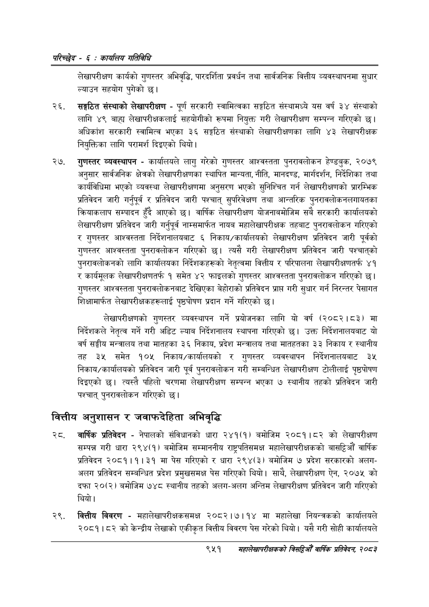

# Page 1011 QA

## Rendered page


## Extracted text

```text
परिच्छेद -€: का्यलिय गतिविधि
लेखापरीक्षण कार्यको गुणस्तर अभिवृद्धि, पारदर्शिता प्रवर्धन तथा सार्वजनिक वित्तीय व्यवस्थापनमा सुधार ल्याउन सहयोग पुगेको छ।
सङ्गठित संस्थाको लेखापरीक्षण -पूर्ण सरकारी स्वामित्वका सङ्गठित संस्थामध्ये यस वर्ष ३४ संस्थाको लागि ४९ बाह्य लेखापरीक्षकलाई सहयोगीको रूपमा नियुक्त गरी लेखापरीक्षण सम्पन्न गरिएको छ। अधिकांश सरकारी स्वामित्व भएका ३६ सङ्गठित संस्थाको लेखापरीक्षणका लागि ४३ लेखापरीक्षक नियुक्तिका लागि परामर्श दिइएको थियो।
गुणस्तर व्यवस्थापन -कार्यालयले लागु गरेको गुणस्तर आश्वस्तता पुनरावलोकन हेण्डबुक, २०७९ अनुसार सार्वजनिक क्षेत्रको लेखापरीक्षणका स्थापित मान्यता, नीति, मानदण्ड, मार्गदर्शन, निर्देशिका तथा कार्यविधिमा भएको व्यवस्था लेखापरीक्षणमा अनुसरण भएको सुनिश्चित गर्न लेखापरीक्षणको प्रारम्भिक प्रतिवेदन जारी गर्नुपूर्व र प्रतिवेदन जारी पश्चात्‌ सुपरिवेक्षण तथा आन्तरिक पुनरावलोकनलगायतका क्रियाकलाप सम्पादन हुँदै आएको छ। वार्षिक लेखापरीक्षण योजनाबमोजिम सबै सरकारी कार्यालयको लेखापरीक्षण प्रतिवेदन जारी गर्नुपूर्व नाम्समार्फत नायब महालेखापरीक्षक तहबाट पुनरावलोकन गरिएको र गुणस्तर आश्वस्तता निर्देशनालयबाट ६ निकाय/कार्यालयको लेखापरीक्षण प्रतिवेदन जारी पूर्वको गुणस्तर आश्वस्तता पुनरावलोकन गरिएको छ। त्यसै गरी लेखापरीक्षण प्रतिवेदन जारी पश्चात्‌को पुनरावलोकनको लागि कार्यालयका निर्देशकहरूको नेतृत्वमा वित्तीय र परिपालना लेखापरीक्षणतर्फ ४१ र कार्यमूलक लेखापरीक्षणतर्फ १ समेत ४२ फाइलको गुणस्तर आश्वस्तता पुनरावलोकन गरिएको छ। गुणस्तर आश्वस्तता पुनरावलोकनबाट देखिएका बेहोराको प्रतिवेदन प्राप्त गरी सुधार गर्न निरन्तर पेसागत शिक्षामार्फत लेखापरीक्षकहरूलाई पृष्ठपोषण प्रदान गर्ने गरिएको छ।
लेखापरीक्षणको गुणस्तर व्यवस्थापन गर्ने प्रयोजनका लागि यो वर्ष (२०८२।८३) मा निर्देशकले नेतृत्व गर्ने गरी अडिट ल्याब निर्देशनालय स्थापना गरिएको छ। उक्त निर्देशनालयबाट यो वर्ष सङ्घीय मन्त्रालय तथा मातहका ३६ निकाय, प्रदेश मन्त्रालय तथा मातहतका ३३ निकाय र स्थानीय तह ३५ समेत १०५ निकाय/कार्यालयको र गुणस्तर व्यवस्थापन निर्देशनालयबाट ३५ निकाय/कार्यालयको प्रतिवेदन जारी पूर्व पुनरावलोकन गरी सम्बन्धित लेखापरीक्षण टोलीलाई पृष्ठपोषण दिइएको छ। त्यस्तै पहिलो चरणमा लेखापरीक्षण सम्पन्न भएका ७ स्थानीय तहको प्रतिवेदन जारी पश्चात्‌ पुनरावलोकन गरिएको छ।
वित्तीय अनुशासन र जवाफदेहिता अभिवृद्धि
वार्षिक प्रतिवेदन -नेपालको संविधानको धारा २४१(१) बमोजिम २०८१।८२ को लेखापरीक्षण सम्पन्न गरी धारा २९४(१) बमोजिम सम्माननीय राष्ट्रपतिसमक्ष महालेखापरीक्षकको बासट्टिऔँ वार्षिक प्रतिवेदन २०८१।१।३१ मा पेस गरिएको र धारा २९४(३) बमोजिम ७ प्रदेश सरकारको अलगअलग प्रतिवेदन सम्बन्धित प्रदेश प्रमुखसमक्ष पेस गरिएको थियो। साथै, लेखापरीक्षण ऐन, २०७५ को दफा २०(२) बमोजिम ७४८ स्थानीय तहको अलग-अलग अन्तिम लेखापरीक्षण प्रतिवेदन जारी गरिएको थियो।
वित्तीय विवरण -महालेखापरीक्षकसमक्ष २०८२।७।१४ मा महालेखा नियन्त्रकको कार्यालयले २०८१।८२ को केन्द्रीय लेखाको एकीकृत वित्तीय विवरण पेस गरेको थियो। यसै गरी सोही कार्यालयले
९५१
महालेखापरीक्षकको बितदिओ वार्षिक प्रतिवेदन २०८२
```

## Flags
- None
