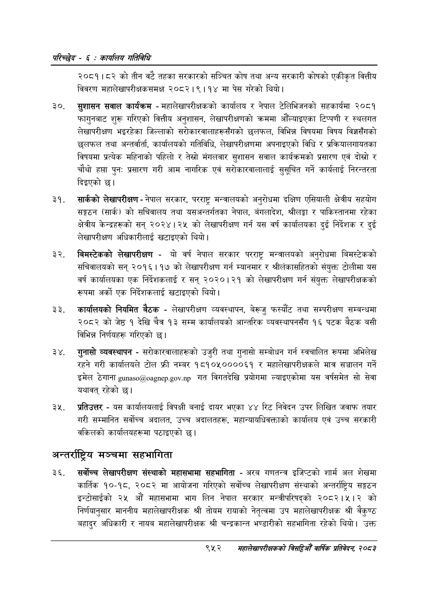

# Page 1012 QA

## Rendered page


## Extracted text

```text
परिच्छेद -€: का्यलिय गतिविधि
२०८१।८२ को तीन वटै तहका सरकारको सञ्चित कोष तथा अन्य सरकारी कोषको एकीकृत वित्तीय विवरण महालेखापरीक्षकसमक्ष २०८२।९।१४ मा पेस गरेको थियो।
सुशासन सवाल कार्यक्रम -महालेखापरीक्षकको कार्यालय र नेपाल टेलिभिजनको सहकार्यमा २०८१ फागुनबाट शुरू गरिएको वित्तीय अनुशासन, लेखापरीक्षणको क्रममा औँल्याइएका टिप्पणी र स्थलगत लेखापरीक्षण भइरहेका जिल्लाको सरोकारवालाहरूसँगको छलफल, विभिन्न विषयमा विषय विज्ञसँगको छलफल तथा अन्तर्वार्ता, कार्यालयको गतिविधि, लेखापरीक्षणमा अपनाइएको विधि र प्रक्रियालगायतका विषयमा प्रत्येक महिनाको पहिलो र तेस्रो मंगलवार सुशासन सवाल कार्यक्रमको प्रसारण एवं दोस्रो र चौथो हप्ता पुनः प्रसारण गरी आम नागरिक एवं सरोकारवालालाई सुसूचित गर्ने कार्यलाई निरन्तरता दिइएको छ।
सार्कको लेखापरीक्षण -नेपाल सरकार, परराष्ट्र मन्त्रालयको अनुरोधमा दक्षिण एसियाली क्षेत्रीय सहयोग सङ्गठन (सार्क) को सचिवालय तथा यसअन्तर्गतका नेपाल, बंगलादेश, श्रीलङ्गा र पाकिस्तानमा रहेका क्षेत्रीय केन्द्रहरूको सन्‌ २०२४। २५ को लेखापरीक्षण गर्न यस वर्ष कार्यालयका दुई निर्देशक र दुई लेखापरीक्षण अधिकारीलाई खटाइएको थियो।
बिमस्टेकको लेखापरीक्षण -यो वर्ष नेपाल सरकार परराष्ट्र मन्त्रालयको अनुरोधमा बिमस्टेकको सचिवालयको सन्‌ २०१६।११७ को लेखापरीक्षण गर्न म्यानमार र श्रीलंकासहितको संयुक्त टोलीमा यस वर्ष कार्यालयका एक निर्देशकलाई र सन्‌ २०२०।२१ को लेखापरीक्षण गर्न संयुक्त लेखापरीक्षकको रूपमा अर्को एक निर्देशकलाई खटाइएको थियो |
कार्यालयको नियमित बैठक -लेखापरीक्षण व्यवस्थापन, बेरूजु फस्यौट तथा सम्परीक्षण सम्बन्धमा २०८२ कोजेष्ठ १ देखि चैत्र १३ सम्म कार्यालयको आन्तरिक व्यवस्थापनसँग १६ पटक बैठक बसी विभिन्न निर्णयहरू गरिएको छ।
गुनासो व्यवस्थापन -सरोकारवालाहरूको उजुरी तथा गुनासो सम्बोधन गर्न स्वचालित रूपमा अभिलेख रहने गरी कार्यालयले टोल फ्री नम्बर १८१०५००००६१ र महालेखापरीक्षकले मात्र सञ्चालन गर्ने इमेल ठेगाना .. गत विगतदेखि प्रयोगमा ल्याइएकोमा यस वर्षसमेत सो सेवा यथावत्‌ रहेको छ।
प्रतिउत्तर -यस कार्यालयलाई विपक्षी बनाई दायर भएका ४४ रिट निवेदन उपर लिखित जवाफ तयार गरी सम्मानित सर्वोच्च अदालत, उच्च अदालतहरू, महान्यायधिवक्ताको कार्यालय एवं उच्च सरकारी वकिलको कार्यालयहरूमा पठाइएको छ।
अन्तर्राष्ट्रिय मञ्चमा सहभागिता
सर्वोच्च लेखापरीक्षण संस्थाको महासभामा सहभागिता -अरव गणतन्त्र इजिप्टको शार्म अल शेखमा कार्तिक १०-१८, २०८२ मा आयोजना गरिएको सर्वोच्च लेखापरीक्षण संस्थाको अन्तर्राष्ट्रिय सङ्गठन इन्टोसाईको २५ औं महासभामा भाग लिन नेपाल सरकार मन्त्रीपरिषद्को २०८२।५।२ को निर्णयानुसार माननीय महालेखापरीक्षक श्री तोयम रायाको नेतृत्वमा उप महालेखापरीक्षक श्री वैकुण्ठ बहादुर अधिकारी र नायब महालेखापरीक्षक श्री चन्द्रकान्त भण्डारीको सहभागिता रहेको थियो। उक्त
९५२
सहालेखापरीक्षकको बिद्या वा्िक प्रतिवेदन २०८२
```

## Flags
- None
