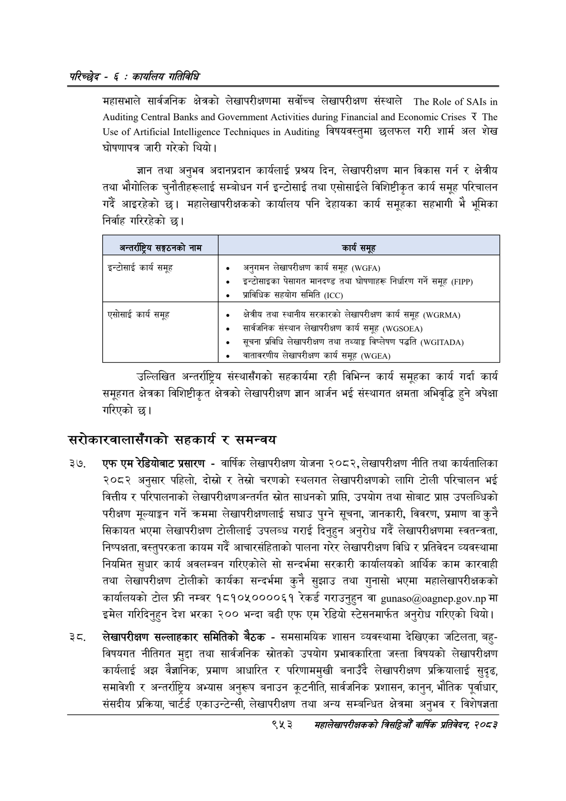

# Page 1013 QA

## Rendered page


## Extracted text

```text
परिच्छेद -€: का्यलिय गतिविधि
महासभाले सार्वजनिक क्षेत्रको लेखापरीक्षणमा सर्वोच्च लेखापरीक्षण संस्थाले १०८ र १११६ १० विषयवस्तुमा छलफल गरी शार्म अल शेख घोषणापत्र जारी गरेको थियो |
ज्ञान तथा अनुभव अदानप्रदान कार्यलाई प्रश्रय दिन, लेखापरीक्षण मान विकास गर्न र क्षेत्रीय तथा भौगोलिक चुनौतीहरूलाई सम्बोधन गर्न इन्टोसाई तथा एसोसाईले विशिष्टीकृत कार्य समूह परिचालन गर्दै आइरहेको छ। महालेखापरीक्षकको कार्यालय पनि देहायका कार्य समूहका सहभागी भै भूमिका निर्वाह गरिरहेको छ।
उल्लिखित अन्तर्राष्ट्रिय संस्थासँगको सहकार्यमा रही विभिन्न कार्य समूहका कार्य गर्दा कार्य समूहगत क्षेत्रका विशिष्ठीकृत क्षेत्रको लेखापरीक्षण ज्ञान आर्जन भई संस्थागत क्षमता अभिवृद्धि हुने अपेक्षा गरिएको |
सरोकारवालासँगको सहकार्य र समन्वय
एफ एम रेडियोबाट प्रसारण -वार्षिक लेखापरीक्षण योजना २०८२, लेखापरीक्षण नीति तथा कार्यतालिका २०८२ अनुसार पहिलो, दोस्रो र तेस्रो चरणको स्थलगत लेखापरीक्षणको लागि टोली परिचालन भई वित्तीय र परिपालनाको लेखापरीक्षणअन्तर्गत स्रोत साधनको प्राप्ति, उपयोग तथा सोबाट प्राप्त उपलब्धिको परीक्षण मूल्याङ्कन गर्ने क्रममा लेखापरीक्षणलाई सघाउ पुग्ने सूचना, जानकारी, विवरण, प्रमाण वा कुनै सिकायत भएमा लेखापरीक्षण टोलीलाई उपलब्ध गराई दिनुहुन अनुरोध गर्दै लेखापरीक्षणमा स्वतन्त्रता, निष्पक्षता, वस्तुपरकता कायम गर्दै आचारसंहिताको पालना गरेर लेखापरीक्षण विधि र प्रतिवेदन व्यवस्थामा नियमित सुधार कार्य अवलम्बन गरिएकोले सो सन्दर्भमा सरकारी कार्यालयको आर्थिक काम कारवाही तथा लेखापरीक्षण टोलीको कार्यका सन्दर्भमा कुनै सुझाउ तथा गुनासो भएमा महालेखापरीक्षकको कार्यालयको टोल फ्री नम्बर १८१०५००००६१ रेकर्ड गराउनुहुन वा .. मा इमेल गरिदिनुहुन देश भरका २०० भन्दा बढी एफ एम रेडियो स्टेसनमार्फत अनुरोध गरिएको थियो।
लेखापरीक्षण सल्लाहकार समितिको बैठक -समसामयिक शासन व्यवस्थामा देखिएका जटिलता, बहुविषयगत नीतिगत मुद्दा तथा सार्वजनिक स्रोतको उपयोग प्रभावकारिता जस्ता विषयको लेखापरीक्षण कार्यलाई अझ वैज्ञानिक, प्रमाण आधारित र परिणाममुखी बनाउँदै लेखापरीक्षण प्रक्रियालाई सुदृढ, समावेशी र अन्तर्राष्ट्रिय अभ्यास अनुरूप बनाउन कूटनीति, सार्वजनिक प्रशासन, कानुन, भौतिक पूर्वाधार, संसदीय प्रक्रिया, चार्टर्ड एकाउन्टेन्सी, लेखापरीक्षण तथा अन्य सम्बन्धित क्षेत्रमा अनुभव र विशेषज्ञता
९५३
समहालेखापरीक्षकको बिद्या वा्िक प्रतिवेदन २०८२

| अन्तर्राष्ट्रिय सङ्गठनको नाम | कार्य समूह |
| --- | --- |
| इन्टोसाई कार्य समूह | ० अनुगमन लेखापरीक्षण कार्य समूह () ० इन्टोसाइका पेसागत मानदण्ड तथा घोषणाहरू निर्धारण गर्ने समूह () ७ प्राविधिक सहयोग समिति (००) |
| 'एसोसाई कार्य समूह | ० क्षेत्रीय तथा स्थानीय कारको लेखापरीक्षण कार्य समूह () ७० लार्बणनिक संस्थान लेखापरीक्षण कार्य समूह () ७० सूचना प्रविधि लेखापरीक्षण तथा तथ्याङ्क विष्लेषण पद्धति () ७० वातावरणीय लेखापरीक्षण कार्य समूह () |
```

## Flags
- table_page
- medium_quality_table
