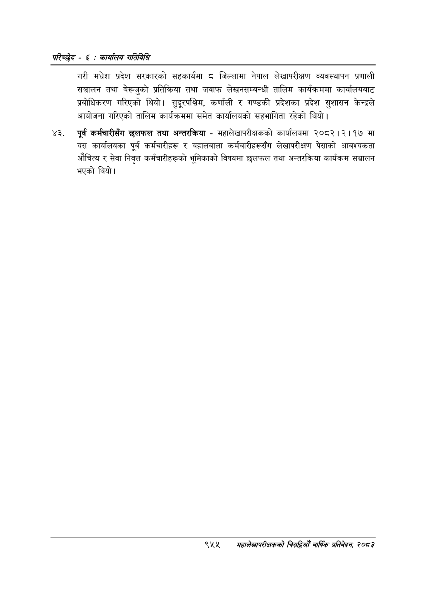

# Page 1015 QA

## Rendered page


## Extracted text

```text
परिच्छेद -€: का्यलिय गतिविधि
गरी मधेश प्रदेश सरकारको सहकार्यमा ८ जिल्लामा नेपाल लेखापरीक्षण व्यवस्थापन प्रणाली सञ्चालन तथा बेरूजुको प्रतिक्रिया तथा जवाफ लेखनसम्बन्धी तालिम कार्यक्रममा कार्यालयबाट प्रवोधिकरण गरिएको थियो। सुदूरपश्चिम, कर्णाली र गण्डकी प्रदेशका प्रदेश सुशासन केन्द्रले आयोजना गरिएको तालिम कार्यक्रममा समेत कार्यालयको सहभागिता रहेको थियो।
पूर्व कर्मचारीसँग छलफल तथा अन्तरक्रिया -महालेखापरीक्षकको कार्यालयमा २०८२।२।१७ मा यस कार्यालयका पूर्व कर्मचारीहरू र बहालवाला कर्मचारीहरूसँग लेखापरीक्षण पेसाको आवश्यकता औचित्य र सेवा निवृत्त कर्मचारीहरूको भूमिकाको विषयमा छलफल तथा अन्तरक्रिया कार्यक्रम सञ्चालन भएको थियो।
९५४
सहालेखापरीक्षकको बिद्या वा्िक प्रतिवेदन २०८२
```

## Flags
- None
