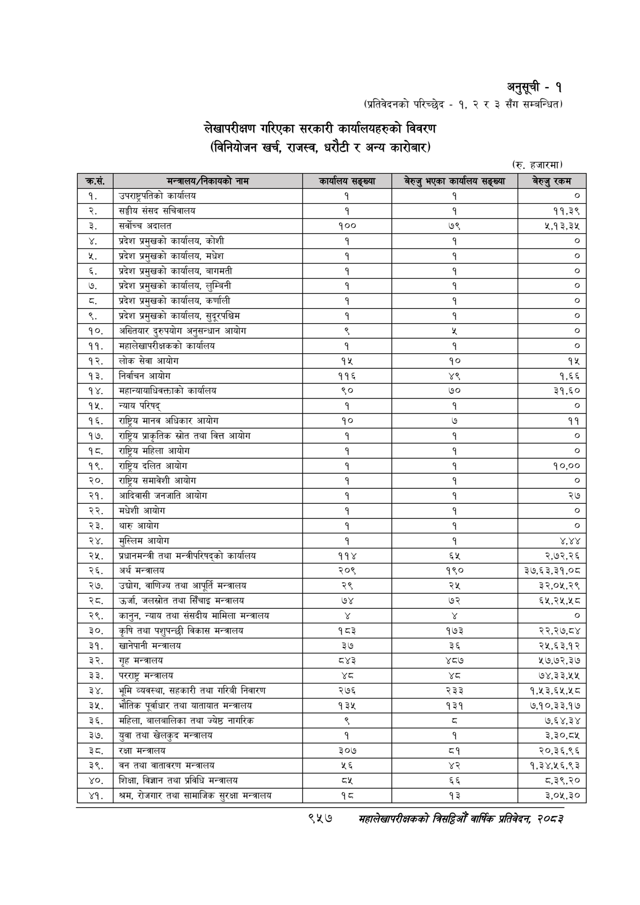

# Page 1019 QA

## Rendered page


## Extracted text

```text
अनुसूची -१
(प्रतिवेदनको परिच्छेद -१, २ र ३ सँग सम्बन्धित)
लेखापरीक्षण गरिएका सरकारी कार्यालयहरुको विवरण (विनियोजन खर्च, राजस्व, धरौटी र अन्य कारोबार)
(रु. हजारमा)
९४५७
सहालेखापरीक्षकको बितदिमो वार्षिक प्रतिवेदन २०८३

| क्रस.      | मन्त्रालय/निकायको नाम                           | कार्यालय सङ्ख्या   | बेरुजु भएका कार्यालय सङ्ख्या   | बेरुजु रकम   |
|------------|-------------------------------------------------|--------------------|--------------------------------|--------------|
| १.         | उपराष्ट्रपतिको कार्यालय                         | १                  | १                              | । ०]         |
| २.         | सङ्घीय संसद सचिवालय                             | । १                | १                              | ११,३९        |
| ३.         | सर्वोच्च अदालत                                  | १००                | ७९                             | २,१२,२३२५    |
| Y.         | प्रदेश प्रमुखको कार्यालय, कोशी                  | &#124; १           | १                              | लि           |
| 9.         | प्रदेश प्रमुखको कार्यालय, मधेश                  | ।[ १               | १                              | । ०]         |
| ६. &#124;  | प्रदेश प्रमुखको कार्यालय, बागमती                | । १                |                                | &#124; o]    |
| ७.         | प्रदेश प्रमुखको कार्यालय, लुम्बिनी              | । १                |                                | ।__ o]       |
| ८. &#124;  | प्रदेश प्रमुखको कार्यालय, कर्णाली               | ।[ १               |                                | लि           |
| ९.         | प्रदेश प्रमुखको कार्यालय, सुदूरपश्चिम           | &#124; १           |                                | । o]         |
| १०.        | &#124; अख्तियार दुरुपयोग अनुसन्धान आयोग         | <                  | %                              | । o]         |
| ११.        | &#124; महालेखापरीक्षकको कार्यालय                | १                  |                                | । ०]         |
| १२.        | लोक सेवा आयोग                                   | १५                 | &#124; १० ०                    | १५           |
| १३.        | &#124; निर्वाचन आयोग                            | ११६                | ४९                             | १,६६         |
| १४.        | महान्यायाधिवक्ताको कार्यालय                     | ९०                 | ७०                             | ३१,६०        |
| १५.        | न्याय परिषद्‌                                   | । १                | १                              | लि           |
| १६.        | राष्ट्रिय मानव अधिकार आयोग                      | १०                 | ७                              | ११           |
| १७.        | [राष्ट्रिय प्राकृतिक स्रोत तथा वित्त आयोग       | । १                | १                              | &#124; ०]    |
| १८.        | राष्ट्रिय महिला आयोग                            | । १                | १                              | &#124; o]    |
| १९.        | राष्ट्रिय दलित आयोग                             | । १                | १                              | १०,००        |
| २०, &#124; | राष्ट्रिय समावेशी आयोग                          | ।[ १               | १                              | । o]         |
| २१.        | &#124; आदिवासी जनजाति आयोग                      | । १                |                                | २७           |
| २२.        | &#124; मधेशी आयोग                               | । १                |                                | । ०]         |
| २३.        | थारु आयोग                                       | &#124; १           |                                | लि           |
| २४.        | मुस्लिम आयोग                                    | &#124; १           |                                | ४४४          |
| २५.        | प्रधानमन्त्री तथा मन्त्रीपरिषद्को कार्यालय      | ११४                | ६५                             | २,७२,२६      |
| २६.        | &#124; अर्थ मन्त्रालय                           | २०९                | १९०                            | ३७,६३,३१,०८  |
| २७.        | उद्योग, वाणिज्य 
```

## Flags
- table_page
- low_quality_table
