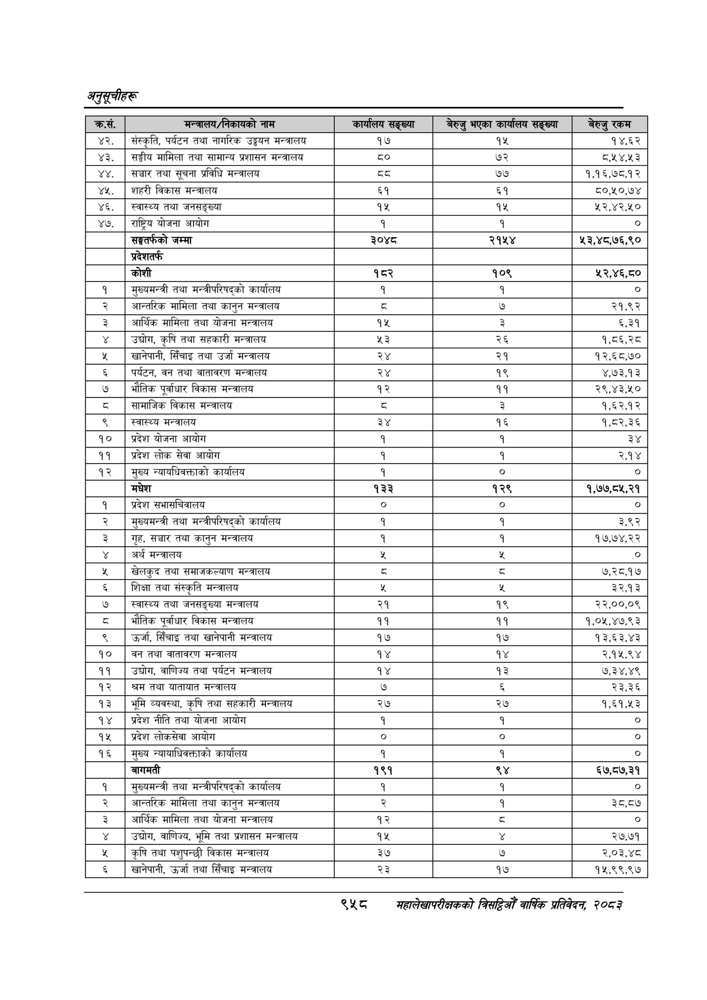

# Page 1020 QA

## Rendered page


## Extracted text

```text
अनुतूचीहरू
९४५८
सहालेखापरीक्षकको बितदिमो वार्षिक प्रतिवेदन २०८३

| क्रस.   | मन्त्रालय/निकायको नाम                               | कार्यालय सङ्ख्या   | बेरुजु भएका कार्यालय सङ्ख्या   | बेरुजु रकम    |
|---------|-----------------------------------------------------|--------------------|--------------------------------|---------------|
| ४२.     | &#124; संस्कृति, पर्यटन तथा नागरिक उड्डयन मन्त्रालय | १७                 | १५                             | १४.६२         |
| ४३.     | &#124; सङ्घीय मामिला तथा सामान्य प्रशासन मन्त्रालय  | co                 | ७२                             | ८,५४,५३       |
| ४४.     | &#124; सञ्चार तथा सूचना प्रविधि मन्त्रालय           | 54                 | ७७                             | १,१६,७८,१२    |
| ४५.     | &#124; शहरी विकास मन्त्रालय                         | ६१                 | ६१                             | ८०,१०,७४      |
| ४६.     | &#124; स्वास्थ्य तथा जनसङ्ख्या                      | १५                 | १५                             | ५२,४२,१०      |
| ४७.     | [राष्ट्रिय योजना आयोग                               | १                  | १                              | ०]            |
|         | सङ्घतर्फको जम्मा                                    | ३०४८               | २१५४                           | । २३,४८,७६,९० |
|         | प्रदेशतर्फ                                          |                    |                                |               |
|         | कोशी                                                | १८२                | १०९                            | २,४६,८०       |
| १       | मुख्यमन्त्री तथा मन्त्रीपरिषद्को कार्यालय           | १                  | १                              | । o]          |
| २       | आन्तरिक मामिला तथा कानुन मन्त्रालय                  | 5                  | ७                              | २१,९२         |
| ३       | आर्थिक मामिला तथा योजना मन्त्रालय                   | १५                 | ३                              | ६,३१          |
| ४       | । उद्योग, कृषि तथा सहकारी मन्त्रालय                 | 43                 | २६                             | १,८६,२८       |
| ४       | खानेपानी, सिँचाइ तथा उर्जा मन्त्रालय                | २४                 | २१                             | १२,६८,७०      |
| &       | पर्यटन, वन तथा वातावरण मन्त्रालय                    | २४                 | १९                             | ४,७३,१३       |
| ७       | ।भौतिक पूर्वाधार विकास मन्त्रालय                    | १२                 | ११                             | २९,४३,१०      |
| ८       | &#124; सामाजिक विकास मन्त्रालय                      | [                  | 3                              | १,६२,१२       |
| ९       | स्वास्थ्य मन्त्रालय                                 | ३४                 | १६                             | १,८२,३६       |
| [१० o   | &#124; प्रदेश योजना आयोग                            | १                  | १                              | ३४            |
| 99      | प्रदेश लोक सेवा आयोग                                | १                  | १                              | २,१४          |
| १२      | मुख्य न्यायधिवक्ताको कार्यालय                       | १                  | &#124; ०                       | ०]            |
| ।       | मधेश                                                | १३३                | १२९                            | १,७७,८५,२१    |
| १       | प्रदेश सभासचिवालय                                   | । ०                | &#124; ०                       | । ०]          |
| २       | । मुख्यमन्त्री तथा मन्त्रीपरिषद्को कार्यालय         | १                  | १                              | २,९२          |
| ३       | गृह, सञ्चार तथा कानुन मन्त्रालय                     | १                  | १                              | १७,७४,२२      |
| ¥       | अर्थ मन्त्रालय                                      | %                  | %                              | _             |
| ५       | &#124; खेलकुद तथा समाजकल्याण मन्त्रालय              | c                  | c                              | ७,२८,१७
```

## Flags
- table_page
- low_quality_table
