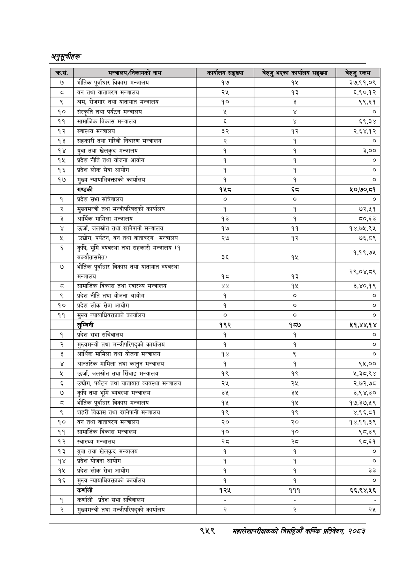

# Page 1021 QA

## Rendered page


## Extracted text

```text
अनुतूचीहरू
९५९
सहालेखापरीक्षकको बिदिओँ वार्षिक प्रतिवेदन; २०८२

| क्रस.     | मन्त्रालय/निकायको नाम                                                    | कार्यालय सङ्ख्या   | बेरुजु भएका कार्यालय सङ्ख्या   | बेरुजु रकम   |
|-----------|--------------------------------------------------------------------------|--------------------|--------------------------------|--------------|
| ७         | ।भौतिक पूर्वाधार विकास मन्त्रालय                                         | १७                 | १५                             | ३७,९१,०९     |
| [         | वन तथा वातावरण मन्त्रालय                                                 | २५                 | १३                             | 5,९0०, २     |
| ९         | श्रम, रोजगार तथा यातायात मन्त्रालय                                       | । १० ०             | 2                              | ९९,६१        |
| &#124; 90 | संस्कृति तथा पर्यटन मन्त्रालय                                            | %                  |                                | । ०]         |
| 99        | &#124; सामाजिक विकास मन्त्रालय                                           | ६                  |                                | ६९,३४        |
| १२        | स्वास्थ्य मन्त्रालय                                                      | 3R                 | १२                             | २,६४,१२      |
| 93        | । सहकारी तथा गरिबी निबारण मन्त्रालय                                      | २                  | १                              | &#124; ०]    |
| १४        | &#124; युवा तथा खेलकुद मन्त्रालय                                         | १                  |                                | ३,००         |
| १५        | प्रदेश नीति तथा योजना आयोग                                               | १                  |                                | &#124; ०]    |
| १६        | प्रदेश लोक सेवा आयोग                                                     | १                  |                                | लि           |
| १७        | । मुख्य न्यायाधिवक्ताको कार्यालय                                         | १                  |                                | o]           |
|           | गण्डकी                                                                   | १५८                | &5                             | ५०,७०,८१     |
| १         | प्रदेश सभा सचिवालय                                                       | । ०                | &#124; ० ।                     | । ०]         |
| २ ।       | मुख्यमन्त्री तथा मन्त्रीपरिषद्को कार्यालय                                | १                  |                                | ७२,५१        |
| ३         | आर्थिक मामिला मन्त्रालय                                                  | १३                 | १                              | ८०,६३        |
| ४         | । उर्जा, जलस्रोत तथा खानेपानी मन्त्रालय                                  | १७                 | ११                             | १४,७५,९५     |
| प्‌       | उद्योग, पर्यटन, वन तथा वातावरण मन्त्रालय                                 | २७                 | १२                             | ७६,८९        |
| ६         | कृषि, भूमि व्यवस्था तथा सहकारी मन्त्रालय (१ छ बक्यौतासमेत - बक्यातासमेत) | ३६                 | १५                             | १,१९,७५      |
| ७ ।       | भौतिक पूर्वाधार विकास तथा यातायात व्यवस्था & मन्त्रालय                   | १८                 | १३                             | २९,०४,८९     |
| ८         | &#124; सामाजिक विकास तथा स्वास्थ्य मन्त्रालय                             | ¥Y                 | १५                             | ३,४०,१९      |
| R         | प्रदेश नीति तथा योजना आयोग                                               | १                  | &#124; ०                       | लि           |
| [१० o     | &#124; &#124; प्रदेश लोक सेवा आयोग                                       | १                  | &#124; ०                       | । ०]         |
| ११ ।      | मुख्य न्यायाधिवक्ताको कार्यालय                                           | । ०                | । ०                            | ०
```

## Flags
- table_page
- medium_quality_table
