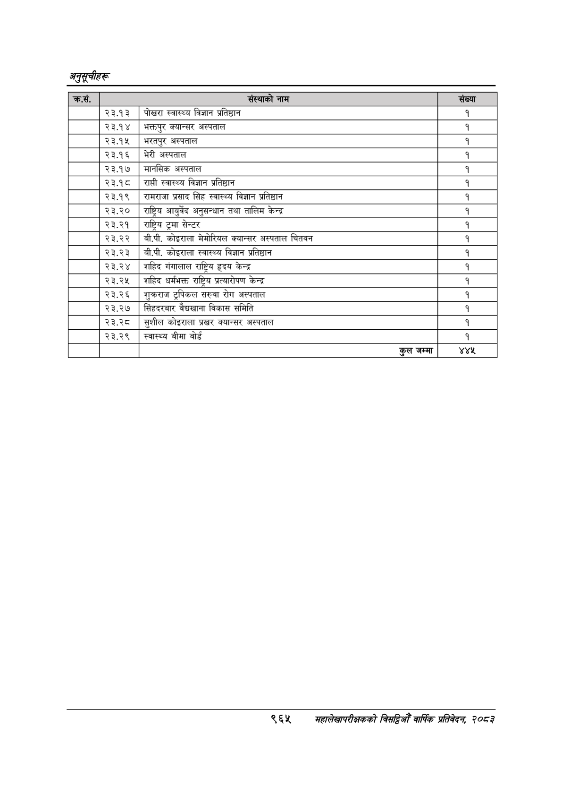

# Page 1027 QA

## Rendered page


## Extracted text

```text
अनुतूचीहरू
९६५
सहालेखापरीक्षकको वार्षिक प्रतिवेदन; २०८२

|  |  |  |
| --- | --- | --- |
|  | २३.१३ | पोखरा स्वास्थ्य विज्ञान प्रतिष्ठान |
|  | २३.१४ | भक्तपुर क्यान्सर अस्पताल |
|  | २३.१५ | भरतपुर अस्पताल |
|  | २३.१६ | भेरी अस्पताल |
|  | २३.१७ | मानसिक अस्पताल |
|  | २३.१८ | राती स्वास्थ्य विज्ञान प्रतिष्ठान |
|  | २३.१९ | रामराजा प्रसाद सिंह स्वास्थ्य विज्ञान प्रतिष्ठान |
|  | २३.२० | राष्ट्रिय आयुर्वेद अनुसन्धान तथा तालिम केन्द्र |
|  | २३.२१ | राष्ट्रिय ट्रमा सेन्टर |
|  | २३.२२ | बी.पी. कोइराला मेमोरियल क्यान्सर अस्पताल चितवन |
|  | २३.२३ | बी.पी. कोइराला स्वास्थ्य विज्ञान प्रतिष्ठान |
|  | २३.२४ | शाहिद गंगालाल राष्ट्रिय हृदय केन्द्र |
|  | २३.२५ | शाहिद धर्मभक्त राष्ट्रिय ५त५।२)५० केन्द्र |
|  | २३.२६ | शुक्रराज ट्रपिकल सरुवा रोग अस्पताल |
|  | २३.२७ | सिंहदरवार वैद्याना विकास समिति |
|  | २३.२८ | सुशील कोइराला प्रखर क्यान्सर अस्पताल |
|  | २३.२९ | स्वास्थ्य बीमा बोर्ड |
|  |  | कुल जम्मा |
```

## Flags
- table_page
- medium_quality_table
