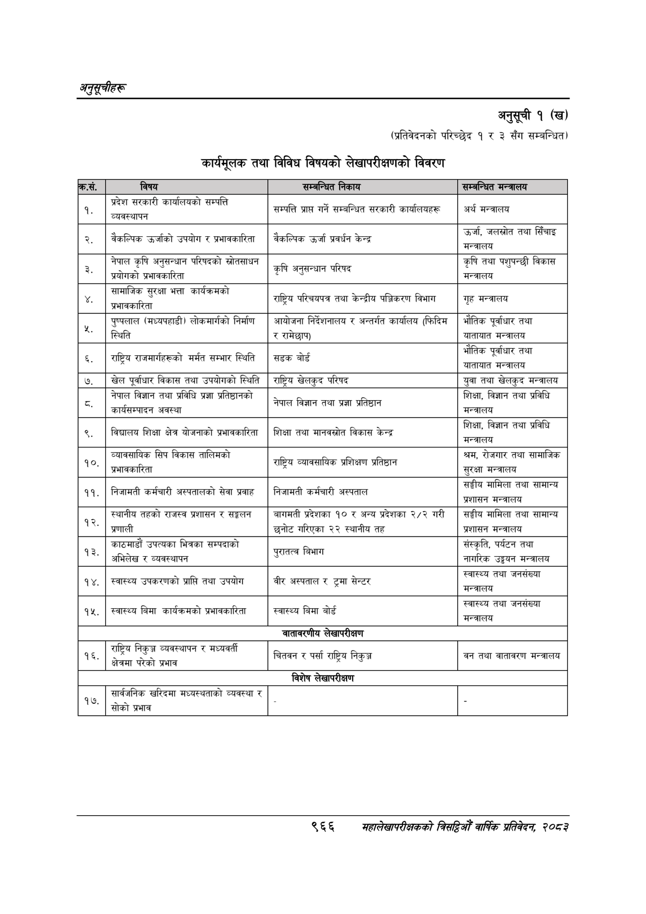

# Page 1028 QA

## Rendered page


## Extracted text

```text
अनुतूचीहरू
अनुसूची १ (ख)
(प्रतिवेदनको परिच्छेद १ र ३ सँग सम्बन्धित)
कार्यमूलक तथा विविध विषयको लेखापरीक्षणको विवरण
९६६
महालेखापरीक्षकको बितदिओँ वाषिक प्रतिवेदन २०८२

| कस. | कक | जन्नान्चत | सन्जन्धित |
| --- | --- | --- | --- |
| १. | प्रदेश सरकारी कार्यालयको सम्पत्ति व्यवस्थापन | < - सम्पत्ति प्राप्त गर्ने सम्बन्धित सरकारी कार्यालषहरू | अर्थ मन्त्रालय |
| २. | बैकल्विक उर्जाको उपयो बेकल्पिक उर्जाको उपयोग र प्रभावकारिता | बैकल्पिक उर्जा केन्द्र बेकल्पिक उर्जा प्रवर्धन केन | उर्जा, जलस्रोत तथा सिँचाइ मन्त्रालय |
| ३. | नेपाल कृषि अनुसन्धान परिषदको स्रोतसाधन प्रयोगको न को प्रभावकारिता | कृषि अनुसन्धान परिषद | कृषि तथा पशुपन्छी विकास अन्तालय = - |
|  | सामाजिक सुरक्षा भत्ता कार्यक्रमको र प्रभावकारिता | . राष्ट्रिय परिचयपत्र तथा केन्द्रीय पञ्जिकरण विभाग = | गृह मन्त्रालय |
| ५, ५ १ १ १ १५ २ ६२ २८१ ३७ १६ ७५.३६७२७१ स्थिति ५ १ १ १ १५ ३ ३६२ २८६ ९ ११ ९५.३४३०६३ र ५ १ १ १ १५ ४ ३७८ २८१ ५३ १९ ९४.५३३९२८ रामेछाप) ५ १ १ १ १५ ५ ७१२ २८६ ५२ ११ ६२.२९२१७१ यातायात ५ १ १ १ १५ ६ ७७१ २८६ ५६ ११ ९४.१५३२३६ मन्त्रालय ४ १ १ १ १६ ० १५० ३०४ ६९० ३९ -१ ५ १ १ १ १६ १ १५० ३२२ ४१ ४ ३०.२६३३१९ ५ १ १ १ १६ २ ४०० ३०४ ३५ ३९ ३५.१८४११६ बोर्ड ५ १ १ १ १६ ३ ७१३ ३०७ ४१ १८ ९६.६४४९९७ भौतिक ५ १ १ १ १६ ४ ७६१ ३०९ ४६ २० ९३.९२१४१७ पूर्वाधार ५ १ १ १ १६ ५ ८१४ ३१४ २६ ११ ९६.६६५४९७ तथा ४ १ १ १ १७ ० १५ ३१० ७६३ ३६ -१ ५ १ १ १ १७ १ १५ ३२७ १३ १४ ७९.४४७८०० ६, ५ १ १ १ १७ २ ६२ ३२२ ३७ १७ ९१.४०९८२१ राष्ट्रिय ५ १ १ १ १७ ३ १०८ ३३० ८५ १० ५७.५७४८१० राजमार्गहरूको ५ १ १ १ १७ ४ २०५ ३२२ ३२ १६ ९६.१४८६०५ मर्मत ५ १ १ १ १७ ५ २४४ ३२७ ४१ १२ ९६.१४८६०५ सम्भार ५ १ १ १ १७ ६ २९२ ३२२ ३६ १६ ७८.४१६७६३ स्थिति ५ १ १ १ १७ ७ ३६२ ३२७ ३५ १२ ९६.२४७३८३ सडक ५ १ १ १ १७ ८ ४०४ ३२२ २६ १७ ९४.२३६८७० बोर्ड ५ १ १ १ १७ ९ ७६१ ३१० १७ ३६ ३५.८२६४८५ ५ ४ १ १ १ १८ ० ८१ ३४० ७४६ १२ -१ ५ १ १ १ १८ १ ८१ ३४० ६ ४ ५०.११८२७९ = ५ १ १ १ १८ २ ७१२ ३४० ५२ १२ ८४.२५५८९० यातायात ५ १ १ १ १८ ३ ७७२ ३४० ५५ १२ ९५.६४७५३७ मन्त्रालय ४ १ १ १ १९ ० १४ ३६३ ८७३ २२ -१ ५ १ १ १ १९ १ १४ ३७० १४ १२ ९६.३१७७६४ ७. ५ १ १ १ १९ २ ६३ ३६३ २६ १७ ९६.४०२६७९ खेल ५ १ १ १ १९ ३ ९६ ३६३ ४६ २१ ९६.४५४७७३ पूर्वाधार ५ १ १ १ १९ ४ १४९ ३६३ ४२ १७ ९५.०९६०४६ विकास ५ १ १ १ १९ ५ १९८ ३६८ २६ १२ ९३.२४८७७२ तथा ५ १ १ १ १९ ६ २३३ ३६३ ५८ १७ २७.०२६२८१ उपधोगको ५ १ १ १ १९ ७ ३०१ ३६३ ३६ १७ ९६.५०४७१५ स्थिति ५ १ १ १ १९ ८ ३६२ ३६३ ३७ २२ ९१.६८४१४३ राष्ट्रिय ५ १ १ १ १९ ९ ४०६ ३६३ ४९ २२ ९५.६७७४१४ खेलकुद ५ १ १ १ १९ १० ४६२ ३६३ ३९ १७ ९६.३२४७२२ परिषद ५ १ १ १ १९ ११ ७१२ ३६८ २५ १७ ९४.१३९२५९ युवा ५ १ १ १ १९ १२ ७४४ ३६८ २५ १२ ९६.४२८१५४ तथा ५ १ १ १ १९ १३ ७७६ ३६३ ४९ २२ ९६.६२३२२२ खेलकुद ५ १ १ १ १९ १४ ८३२ ३६८ ५५ १२ ७२.४२६९४९ मन्त्रालय ४ १ १ १ २० ० ६३ ३९१ ८०९ १९ -१ ५ १ १ १ २० १ ६३ ३९१ ३५ १६ ९६.८८२६७५ नेपाल ५ १ १ १ २० २ १०६ ३९१ ३८ १७ ९६.०२७६११ विज्ञान ५ १ १ १ २० ३ १५१ ३९६ २५ १२ ९४.७६००९४ तथा ५ १ १ १ २० ४ १८३ ३९१ ३७ १७ ९६.८१४९२६ प्रविधि ५ १ १ १ २० ५ २२८ ३९६ २४ १२ ९३.२३३४९० प्रज्ञा ५ १ १ १ २० ६ २६० ३९१ ६२ १८ २५.१३३७३४ अतिष्ठानको ५ १ १ १ २० ७ ७१२ ३९१ ३६ १९ ९६.२९१०४६ शिक्षा, ५ १ १ १ २० ८ ७५७ ३९१ ३९ १७ ९३.५९४६९६ विज्ञान ५ १ १ १ २० ९ ८०२ ३९६ २६ १२ ९६.५६२५२३ तथा ५ १ १ १ २० १० ८३५ ३९१ ३७ १७ ९४.१९८८६८ प्रविधि ४ १ १ १ २१ ० १५ ४०४ ५४७ १९ -१ ५ १ १ १ २१ १ १५ ४१२ १३ ११ ९.०५७३६०. ५ १ १ १ २१ २ ८६ ४१८ ५ ४ ६२.६०९८३७. ५ १ १ १ २१ ३ ३६२ ४०४ ३६ १७ ९६.८०१७५० नेपाल ५ १ १ १ २१ ४ ४०४ ४०४ ३९ १७ ९५.९२९३१४ विज्ञान ५ १ १ १ २१ ५ ४५० ४१० २६ ११ ९६.७९६२११ तथा ५ १ १ १ २१ ६ ४८२ ४१० २५ ११ ९३.७१३६८४ प्रज्ञा ५ १ १ १ २१ ७ ५१४ ४०४ ४८ १८ ९३.६१७२७१ प्रतिष्ठान ४ १ १ १ २२ ० ६४ ४२३ ७०३ १२ -१ ५ १ १ १ २२ १ ६४ ४२६ ७६ ९ ७.४१८८१४ कार्यसन्चादन ५ १ १ १ २२ २ १५० ४२३ ४३ ११ ९६.५४७५५४ अवस्था ५ १ १ १ २२ ३ ७१२ ४२३ ५५ ११ ९५.६९१९६३ मन्त्रालय ४ १ १ १ २३ ० १६६ ४४६ ७०६ १८ -१ ५ १ १ १ २३ १ १६६ ४५९ ८१ ४ २२.७६०३१५ ५ १ १ १ २३ २ ३०९ ४५९ ७ ५ ५८.२९६३९४ ~ ५ १ १ १ २३ ३ ४७७ ४५९ ५ ४ ६५.०१६२६६ < ५ १ १ १ २३ ४ ५५३ ४५९ ५ ४ ४२.३०५२२९ ५ १ १ १ २३ ५ ७१२ ४४६ ३६ १८ ९६.७२८२३३ शिक्षा, ५ १ १ १ २३ ६ ७५७ ४४६ ३८ १६ ९४.९६३३९४ विज्ञान ५ १ १ १ २३ ७ ८०२ ४५१ २६ ११ ९४.१०६०३३ तथा ५ १ १ १ २३ ८ ८३५ ४४६ ३७ १६ ९४.१०६०३३ प्रविधि ४ १ १ १ २४ ० १४ ४५९ ७५३ ३० -१ ५ १ १ १ २४ १ १४ ४६५ १४ १३ ८९.९४१३९९ ९. ५ १ १ १ २४ २ ६३ ४५९ ५१ १६ ९५.०९८६४८ विद्यालय ५ १ १ १ २४ ३ १२१ ४५९ ३४ १७ ९४.८७५४८८ शिक्षा ५ १ १ १ २४ ४ १६३ ४६४ २३ ११ ९६.१७९६८८ क्षेत्र ५ १ १ १ २४ ५ १९३
```

## Flags
- table_page
- medium_quality_table
