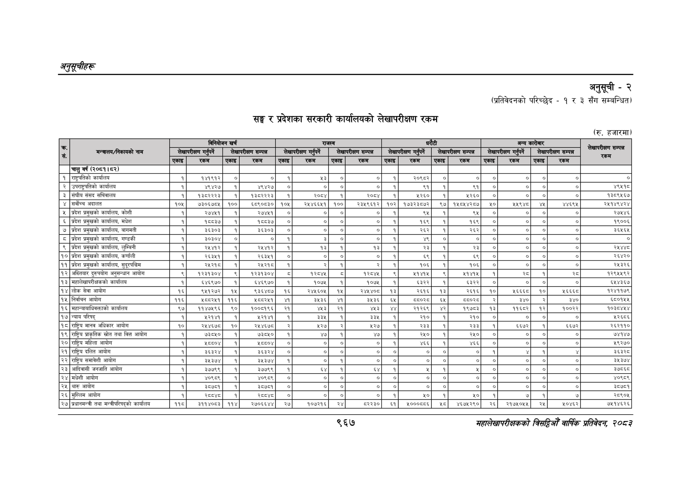

# Page 1029 QA

## Rendered page


## Extracted text

```text
अनुतूचीहरू
सङ्घ र प्रदेशका सरकारी कार्यालयको लेखापरीक्षण रकम
अनुसूची -२
(प्रतिवेदनको परिच्छेद - ३ सँग सम्बन्धित)
(रु. हजारमा)
सहालेखापरीक्षकको बिदिओँ वार्षिक प्रतिवेदन २०८२

| ॥ सं                                                        | लेखापरीक्षण &#124;   | GG            | GG          | GG            |               |                     |             | &5 1               | &5 1               | &5 1               | &5 1              | &5 1          |            | लेखापरीक्षण सम्पन्न रकम   |
|-------------------------------------------------------------|----------------------|---------------|-------------|---------------|---------------|---------------------|-------------|--------------------|--------------------|--------------------|-------------------|---------------|------------|---------------------------|
| मन्त्रालय/निकायको नाम                                       | लेखापरीक्षण &#124;   | गर्नुपर्ने    | लेखापरीक्षण | सम्पन्न       | L लेखापरीक्षण | गर्नुपर्ने          | लेखापरीक्षण | सम्पन्न रकम &#124; | &#124; लेखापरीक्षण | &#124; लेखापरीक्षण | गर्नुपर्ने &#124; | लेखापरीक्षण   | सम्पन्न    | लेखापरीक्षण सम्पन्न रकम   |
| ॥ सं                                                        | लेखापरीक्षण &#124;   | रकम           | [एकाइ]      | रकम           | एकाइ          | रकम                 | एकाइ        | सम्पन्न रकम &#124; | &#124; लेखापरीक्षण |                    |                   | [             | रकम &#124; | लेखापरीक्षण सम्पन्न रकम   |
| चालु वर्ष (२०८१। ८२)                                        |                      |               |             |               |               |                     |             |                    |                    |                    |                   |               |            |                           |
| १ [राष्ट्रपतिको कार्यालय                                    | &#124; 4]            | १४१९१२        |             |               |               |                     |             |                    |                    |                    |                   |               | I          | ०]                        |
| २ &#124; उपराष्ट्रपतिको कार्यालय                            | &#124; ]             | ४९४२७         |             | ४९४२७         | &#124;        | ०]                  |             |                    |                    |                    |                   | &#124;        | ]          | ४९५१८                     |
| ३ &#124; संघीय संसद सचिवालय                                 | [1]                  | १३८२२२३       |             | १३८२२२३       |               | २०८४                |             | २०८४               |                    |                    |                   | &#124;        | o          | १३८९५१६७                  |
| ४ [सर्वोच्च अदालत                                           |                      | ७३०६७८५       |             | ६८९०८३०       |               | २५४६६४५१            |             | २३५९६१२            |                    |                    |                   |               | ४४६९५      | २४५१४९४२४                 |
| ५ प्रदेश प्रमुखको कार्यालय, कोशी                            |                      | २७४५१         |             | २७४५१         |               |                     |             |                    |                    |                    |                   | ।             | ०]         | २७५४६                     |
| ६ प्रदेश प्रमुखको कार्यालय, मधेश                            |                      | १८८३७         |             | १८८३७         |               |                     |             |                    |                    |                    |                   | ।             | ०]         | १९००६                     |
| ७ &#124; प्रदेश प्रमुखको कार्यालय, बागमती                   |                      | ३६३०३         |             | ३६३०३         |               |                     |             |                    |                    |                    |    
```

## Flags
- table_page
- low_quality_table
