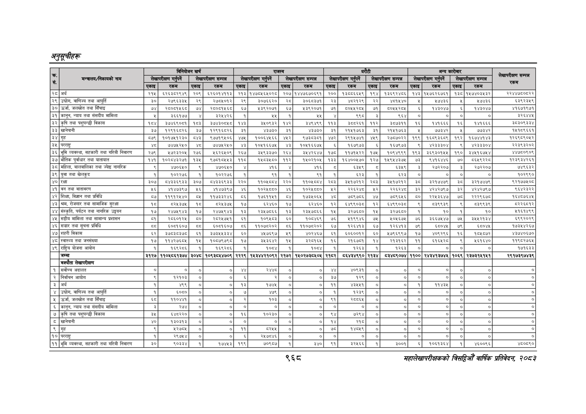

# Page 1030 QA

## Rendered page


## Extracted text

```text
अनुतूचीहरू
९६८
सहालेखापरीक्षकको बिदिओँ वार्षिक प्रतिवेदन २०८२

|                                                  |        | बिनियोजन खर्च          | बिनियोजन खर्च          | बिनियोजन खर्च       | [ =                 | [ =                   | [ =                   | [ =                   | पेटी ।।               | पेटी ।।                       | पेटी ।।                    | पेटी ।।                    | अन्य कारोबार           | अन्य कारोबार   | अन्य कारोबार        | अन्य कारोबार        | लेखापरीक्षण सम्पन्न   |
|--------------------------------------------------|--------|------------------------|------------------------|---------------------|---------------------|-----------------------|-----------------------|-----------------------|-----------------------|-------------------------------|----------------------------|----------------------------|------------------------|----------------|---------------------|---------------------|-----------------------|
| मन्त्रालय/निकायको नाम                            |        | लेखापरीक्षण गर्नुपर्ने | लेखापरीक्षण गर्नुपर्ने | लेखापरीक्षण सम्पन्न | लेखापरीक्षण सम्पन्न | लेखापरीक्षण गर्नपर्ने | लेखापरीक्षण गर्नपर्ने | । लेखापरीक्षण सम्पन्न | । लेखापरीक्षण सम्पन्न | लेखापरीक्षण गर्नुपर्ने &#124; | लेखापरीक्षण सम्पन्न &#124; | लेखापरीक्षण सम्पन्न &#124; | लेखापरीक्षण गर्नुपर्ने | &#124;         | लेखापरीक्षण सम्पन्न | लेखापरीक्षण सम्पन्न | लेखापरीक्षण सम्पन्न   |
|                                                  |        | रकम                    | एकाइ                   | रकम                 | एकाइ                | रकम                   | एकाइ                  | रकम                   | एकाइ&#124;            | रकम                           | ।&#124;एकाइ&#124;          | रकम                        | ।&#124;एकाइ&#124;      | रकम            | ।&#124;एकाइ]        | रकम                 | रकम                   |
| रे अर्थ                                          | एकाइ   |                        |                        |                     |                     |                       |                       |                       |                       | १३००६६४९&#124;                | १९४                        | १३६९२४०६                   |                        |                |                     | १३०[१५७४०३५३२&#124; | २२४४७००८२२            |
| २९ &#124; उद्योग, बाणिज्य तथा आपूर्ति            |        |                        | २९]                    | २७०५०१२]            | २९]                 | ३०७६६२०]&#124;        | २८                    |                       |                       | ४८२१२९&#124;                  | २२]                        | ४०१५४०                     |                        |                | ¥                   | ५७४३६               | ६३९२३५९               |
| 30 &#124; G, जलस्रोत तथा सिँचाइ                  |        | २८०८१५६८&#124;         |                        | २८०८१५६८            |                     | ५३९२०७१               |                       | ५३९२०७१&#124;         |                       | ८०५५२८४५                      |                            |                            |                        | १४३०४७         | ।                   | १४३०४७              | ४१६७१९७१              |
| ३१ &#124; कानून, न्याय तथा संसदीय मामिला         |        | ३६६१७७                 |                        | ३२५४२६              |                     | २४५                   |                       | २५                    |                       | ९९८                           |                            |                            |                        | ०]             |                     | ०]                  | ३२६४४४                |
| ३२]कृषि तथा पशुपन्छी विकास                       |        | ३७४६९०८१               |                        | ३७४३०८५८            |                     | ३५०९३२                |                       | ३४९४९९                |                       | ३००२६१                        |                            | 356399  
```

## Flags
- table_page
- low_quality_table
