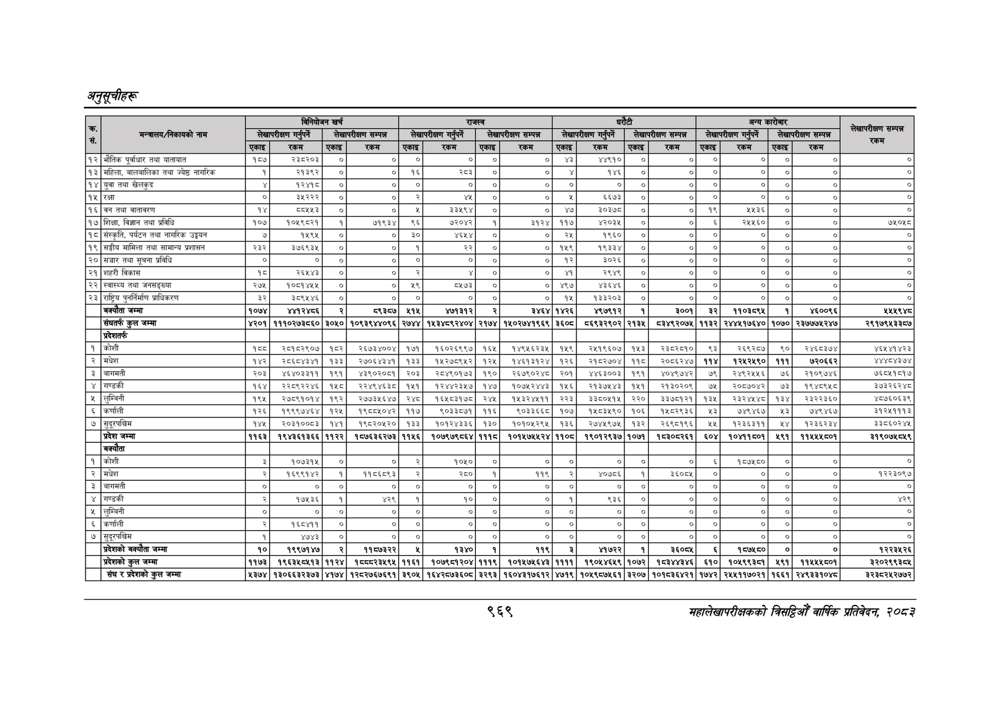

# Page 1031 QA

## Rendered page


## Extracted text

```text
अनुतूचीहरू
९६९
सहालेखापरीक्षकको बिदिओँ वार्षिक प्रतिवेदन २०८२

| - सं                                          | मन्त्रालय/निकायको नाम लेखापरीक्षण   | बिनियोजन खर्च             | बिनियोजन खर्च   | बिनियोजन खर्च       |                     |                       |                       | [ = ।               | [ = ।               | [ = ।                    | [ = ।             | [ = ।                                | पेटी ।। अन्य                         | पेटी ।। अन्य                 | पेटी ।। अन्य                 | पेटी ।। अन्य               | S — रकम                    |
|-----------------------------------------------|-------------------------------------|---------------------------|-----------------|---------------------|---------------------|-----------------------|-----------------------|---------------------|---------------------|--------------------------|-------------------|--------------------------------------|--------------------------------------|------------------------------|------------------------------|----------------------------|----------------------------|
| - सं                                          | मन्त्रालय/निकायको नाम लेखापरीक्षण   | गर्नुपर्ने                | गर्नुपर्ने      | लेखापरीक्षण सम्पन्न | लेखापरीक्षण सम्पन्न | लेखापरीक्षण गर्नपर्ने | लेखापरीक्षण गर्नपर्ने | लेखापरीक्षण सम्पन्न | लेखापरीक्षण सम्पन्न | लेखापरीक्षण              | लेखापरीक्षण       | गर्नपर्ने &#124; लेखापरीक्षण सम्पन्न | गर्नपर्ने &#124; लेखापरीक्षण सम्पन्न | &#124; लेखापरीक्षण गर्नपर्ने | &#124; लेखापरीक्षण गर्नपर्ने | &#124; लेखापरीक्षण सम्पन्न | &#124; लेखापरीक्षण सम्पन्न |
| - सं                                          | मन्त्रालय/निकायको नाम लेखापरीक्षण   | रकम                       | एकाइ            | रकम                 | एकाइ                | रकम                   | एकाइ                  | रकम                 | एकाइ &#124;         | रकम                      | ।&#124;एकाइ&#124; | रकम                                  | ।&#124;एकाइ&#124;                    | रकम                          | ।&#124;एकाइ&#124;            | रकम                        |                            |
| 93 &#124; भौतिक पूर्वाधार तथा यातायात         | एकाइ १८७                            | २३८२०३                    |                 |                     |                     |                       |                       | o]                  | =                   | weto&#124;               | ०]                | ०                                    | ०                                    | ०                            | o                            | ०                          | ०]                         |
| १३ &#124; महिला, बालबालिका तथा ज्येष्ठ नागरिक | &#124; १]                           | २१३९२                     |                 |                     |                     |                       | &#124;                |                     |                     | १४६                      |                   |                                      | &#124; ०] &#124;                     | ०] &#124;                    | ०] &#124;                    | ०] &#124;                  | ०                          |
| 9 Y&#124; युवा तथा खेलकुद                     | ¥                                   | १२४१८                     |                 |                     |                     |                       |                       |                     |                     |                          |                   |                                      | &#124; o                             | नु                           | ०                            | ०                          | 8०]                        |
| १५ &#124; रक्षा                               | o]                                  | ३५२२२                     |                 |                     |                     |                       |                       |                     |                     |                          |                   |                
```

## Flags
- table_page
