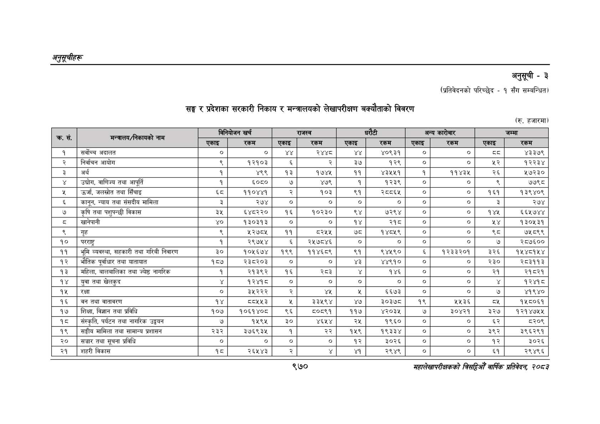

# Page 1032 QA

## Rendered page


## Extracted text

```text
अनुतूचीहरू
सङ्घ र प्रदेशका सरकारी निकाय र मन्त्रालयको लेखापरीक्षण बक्यौताको विवरण
अनुसूची -३
(प्रतिवेदनको परिच्छेद -१ सँग सम्बन्धित)
(रु. हजारमा)
९७०
सहालेखापरीक्षकको बिदिओँ वार्षिक प्रतिवेदन २०८२

| ) क्र. सं.   | मन्त्रालय; न्त्रालय/निकायको नाम        | विनियोजन खर्च   | विनियोजन खर्च   | राजस्व     | राजस्व   | धरौटी   | धरौटी   | अन्य कारोबार   | अन्य कारोबार   | [____जम्मा   | [____जम्मा   |
|--------------|----------------------------------------|-----------------|-----------------|------------|----------|---------|---------|----------------|----------------|--------------|--------------|
| ) क्र. सं.   | मन्त्रालय; न्त्रालय/निकायको नाम        | एकाइ &#124;     | रकम             | एकाइ       | रकम      | एकाइ    | रकम     | एकाइ ।         | रकम            | एकाइ         | रकम          |
| १            | सर्वोच्च अदालत                         | ०]              | ०]              | ४४         | २४४८     | र       | ४०९३१   | ०]             | ०]             | दद           | ४३३७९        |
| R            | निर्वाचन आयोग                          | N               | १२१०३           | &          | R        | ३७      | १२९     | । ०]           | ०]             | L&           | १२२३४        |
| 2            | अर्थ                                   | १               | ४९९             | १३         | १७४४     | ११      | ४३२५२५१ | १              | ११४३५          | २६           | २७२३०        |
| ४            | उद्योग, वाणिज्य तथा आपूर्ति            | १               | ६०८०            | ७          | ४७९      | १       | १२३९    | । ०]           | ०]             | ९            | ७७९८         |
| Y            | उर्जा, जलस्रोत तथा सिँचाइ              | ६८              | ११०४४१          | २          | १०३      | ९१      | २८०६५   | &#124; ०]      | ०]             | १६१          | १३९४०९       |
| ६            | कानून, न्याय तथा संसदीय मामिला         | ३               | २७४             | &#124; ०]  | । ०]     | । ०] ।  | ०]      | &#124; ०]      | ०]             | ३            | २७४          |
| ७            | कृषि तथा पशुपन्छी विकास                | ३५              | ६४८२२०          | १६         | १०२३०    | ९४      | ७२९४    | o]             | ०]             | १४५          | ६६५७४४       |
| [            | खानेपानी                               | ४०              | १३०३१३          | । ०]       | । ०]     | १४      | २१८     | । ०]           | ०]             | 1Y           | 130439       |
| ९            | गृह                                    | R               | Yoy             | ११         | ८२५५     | L1      | १४८५९   | । ०]           | ०]             | ९८           | ७५८९९        |
| १०           | &#124; परराष्ट्र                       | १               | २९७५४           | &          | २५७८४६   | । ०] ।  | ०]      | । ०]           | ०]             | ७            | २८७६००       |
| ११           | भूमि व्यवस्था, सहकारी तथा गरिबी निवारण | ३०              | १०५६७४          | &#124; १९९ | ११४६८९   | ९१      | ९४५९०   | ६              | १२३३२०१        | ३२६          | १५४८१४५४     |
| १२           | भौतिक पूर्वाधार तथा यातायात            | १८७             | २३८२०३          | &#124; ०]  | ०]       | ४३      | ४४९१०   | । ०]           | ०]             | २३०          | २८३११३       |
| 93           | महिला, बालबालिका तथा ज्येष्ठ नागरिक    | १               | २१३९२           | १६         | २८३      | ¥       | १४६     | । ०]           | ०]             | २१           | २१८२१        |
| १४           | &#124; युवा तथा खेलकुद                 | ¥               | १२४०१८&#124;    | ०]         | ०        | ०]      | ०]      | ०]             | ०]             | ¥            | १२४१८        |
| १५           | रक्षा                                  | &#124; ०]       | २३५२२२          | R          | Y%       | S       | ६६७३    | । ०]           | ०]             | ७            | ४१९४०        |
| १६           | वन तथा वातावरण                         | १४              | ८५५३            | %          | ३३५९४    | ४७      | ३०३७८   | १९             | ५५२६       
```

## Flags
- table_page
- medium_quality_table
