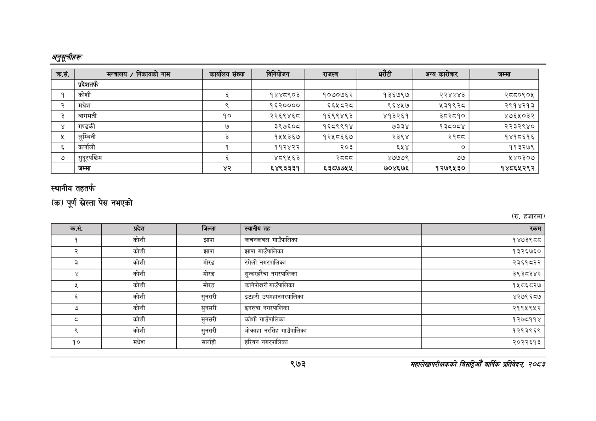

# Page 1035 QA

## Rendered page


## Extracted text

```text
अनुतूचीहरू
स्थानीय तहतर्फ
(क) पूर्ण पेस नभएको
(रु. हजारमा)
९७३
सहालेखापरीक्षकको बिदिओँ वार्षिक प्रतिवेदन २०८२

| क्रस. | मन्त्रालय / निकायको नाम | कार्यालय संख्या | विनियोजन | राजस्व | धरेटी | अन्य कारोबार | जम्मा |
| --- | --- | --- | --- | --- | --- | --- | --- |
|  | प्रदेशतर्फ |  |  |  |  |  |  |
| १ | कोशी | ६ | १४४८९०३ | १०७०७६२ | १३६७९७ | २२४४४३ | २८८०९०४५ |
| २ | मधेश |  | ९८३०००० | ६६५८२८ | ९६४५७ | ५३१९२८ | २९१४२१३ |
| ३ | वागमती | १० | २२६९४६८ | १६९९४९३ | ४१३२६१ | ३८२८१० | ४७६५०३२ |
| ४ | गण्डकी | ७ | ३९७६०८ | १६८९९१४ | ७३३४ | १३८०८४ | २२३२९४० |
| ५ | लुम्बिनी | ३ | १५५३६७ | १२५८६६७ | २३९४ | २१८८ | १४१८६१६ |
| ६ | कर्णाली | १ | ११२४२२ | २०३ | ६५४ | ० | ११३२७९ |
| ७ | सुदूरपश्चिम | ३ | ४८९५६३ | स्व्व्व | ४७७७९ | ७७ | ५४०३०७ |
|  | जम्मा |  | ६४९३३३१ | ६३८७७५४५ | ७०४६७६ | १२७९५३० | १४८६५२९२ |

| ताक |  |  | १६- |  |
| --- | --- | --- | --- | --- |
|  |  |  |  |  |
| १ | कोशी | झापा | 'कचनकवल गाउँपालिका | १४७३९८८ |
| र | कोशी | झापा | झापा गाउँपालिका | १३२६७६० |
| ३ | कोशी | मोरङ | रंगेली नगरपालिका | २३६१८२२ |
|  | कोशी | मोरङ | सुन्दरहरँचा नगरपालिका | ३९३८३४२ |
|  | कोशी | मोरङ | 'कानेपोखरी गाउँपालिका | १५८६८२७ |
| ३ | कोशी | सुनसरी | इटहरी उपमहानगरपालिका | ४२७९६८७ |
| ७ | कोशी | सुनसरी | इनरुवा नगरपालिका | २११५९४५२ |
| ३ | कोशी | 'सुनसरी | कोशी गाउँपालिका | १२७८११४ |
| ९ | कोशी | सुनसरी | भोकाहा नरसिंह गाउँपालिका | १२१३९६९ |
| १० | मधेश | सर्लाही | 'हरिवन नगरपालिका | २०२२६१३ |
```

## Flags
- table_page
- medium_quality_table
