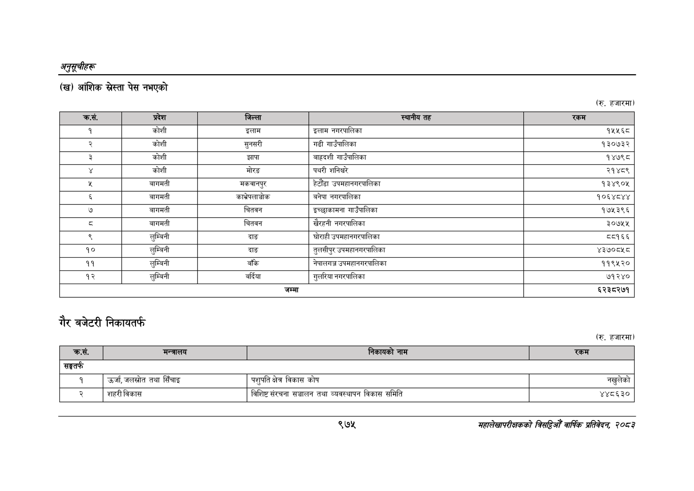

# Page 1037 QA

## Rendered page


## Extracted text

```text
अनुतूचीहरू
() आंशिक स्रेस्ता पेस नभएको
(रु. हजारमा)
गैर बजेटरी निकायतर्फ
(रु. हजारमा)
९७२
सहालेखापरीक्षकको बिदिओँ वार्षिक प्रतिवेदन २०८२

| नागा; |  |  |  |  |
| --- | --- | --- | --- | --- |
| १ | कोशी | इलाम | इलाम नगरपालिका | १५५६८ |
| र | कोशी | सुनसरी | गढी गाउँपालिका | १३०७३२ |
| ३ | कोशी | झापा | 'बाह्रदशी गाउँपालिका | १४७९८ |
|  | कोशी | मोरङ | पथरी शनिश्चरे | २१४८९ |
| [डि | बागमती | मकवानपुर | हेटौँडा उपनहानगरपालिका | १३४९०४५ |
| ३ | बागमती | काभ्रेपलाञ्चोक | बनेपा नगरपालिका | १०६४८४४ |
| ७ | बागमती | चितवन | इच्छाकामना गाउँपालिका | १७५३९६ |
|  | बागमती | चितवन | खैरहनी नगरपालिका | ३०७५५ |
| ९ | लुम्बिनी | दाङ | घोराही उपनहानगरपालिका | ८१६६ |
| १० | लुम्बिनी | दाङ | तुलसीपुर उपनहानगरपालिका | ४३७००५८ |
| ११ | लुम्बिनी | बाँके | नेपालगञ्ज उपमहानगरपालिका | ११९५२० |
| १२ | लुम्बिनी | बर्दिया | गुलरिया नगरपालिका | ७१२४० |
|  |  | जम्मा |  | ६२३८२७१ |

|  |  | छी |  |
| --- | --- | --- | --- |
| हग) | गाड |  | च्या |
| सङ्घतर्फ |  |  |  |
| १ | उर्जा, जलस्रोत तथा सिँचाइ | पशुपति क्षेत्र विकास कोष | नखुलेको |
```

## Flags
- table_page
- medium_quality_table
