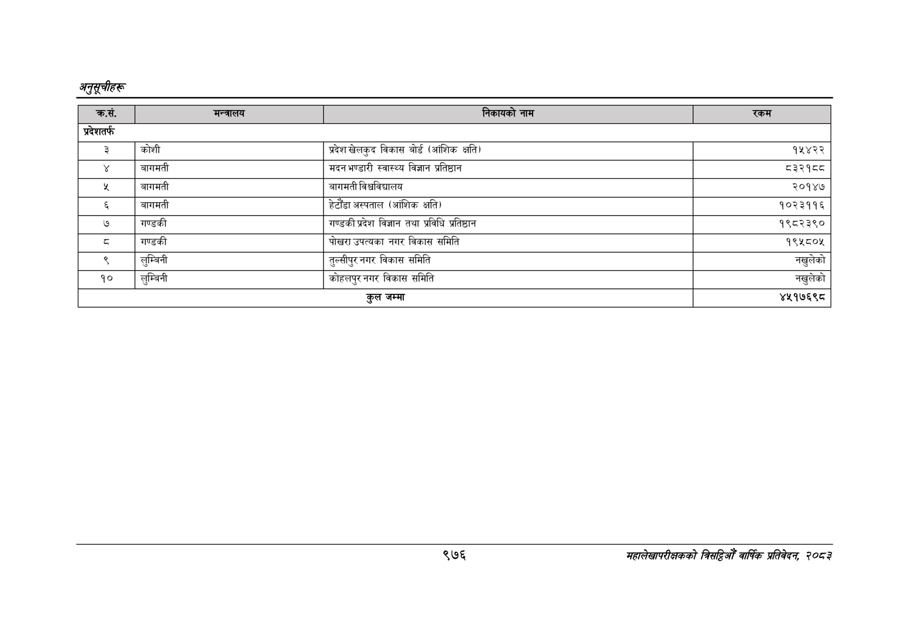

# Page 1038 QA

## Rendered page


## Extracted text

```text
अनुतूचीहरू
९७६
महालेखापरीक्षकको चित वार्षिक प्रतिवेदन २०८२

|  |  |  |  |
| --- | --- | --- | --- |
| प्रदेशतर्फ |  |  |  |
| ३ | कोशी | प्रदेश खेलकुद विकास वोर्ड (आंशिक क्षति) | १५४२२ |
|  | बागमती | मदन भण्डारी स्वास्थ्य विज्ञान प्रतिष्ठान | ८३२१व८ |
| श | बागमती | बागमती विश्वविद्यालय | २०१४७ |
| ३ | बागमती | हेटौँडा अस्पताल (आंशिक क्षति) | १०२३११६ |
| ७ | गण्डकी | गण्डकी प्रदेश विज्ञान तथा प्रविधि प्रतिष्ठान | १९८२३९० |
| ३ | गण्डकी | पोखरा उपत्यका नगर विकास समिति | १९५८०४५ |
| ९ | लुम्बिनी | तुल्सीपुर नगर विकास समिति | नखुलेको |
| १० | लुम्बिनी | कोहलपुर नगर विकास समिति | नखुलेको |
```

## Flags
- table_page
- medium_quality_table
