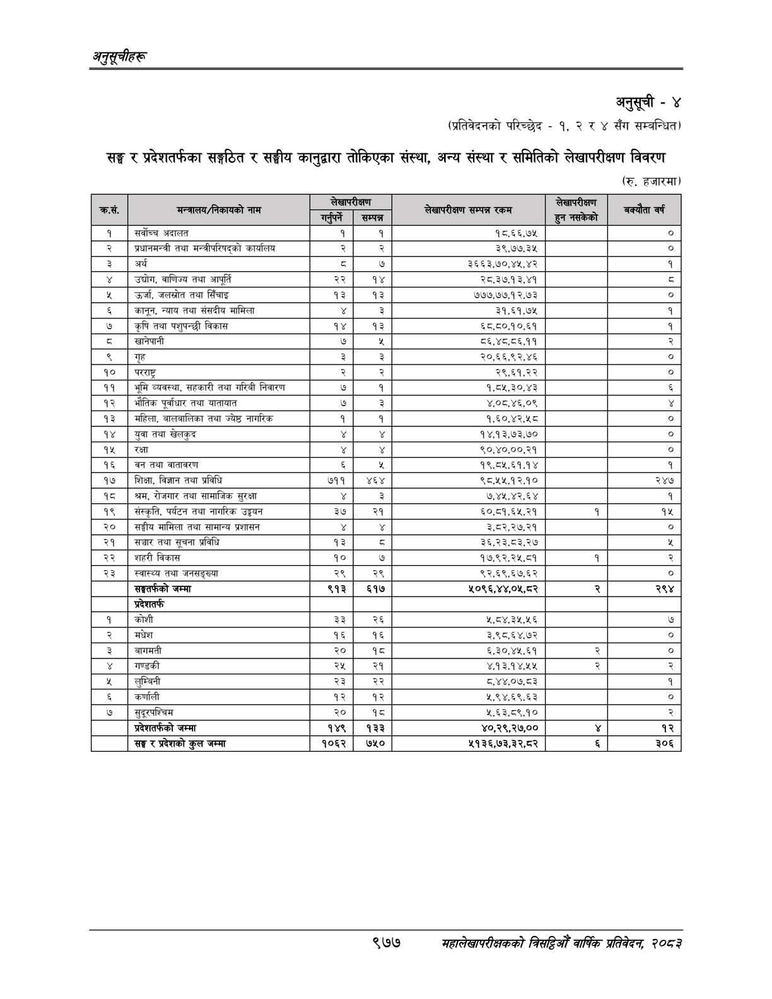

# Page 1039 QA

## Rendered page


## Extracted text

```text
अनुतूचीहरू
अनुसूची -४
(प्रतिवेदनको परिच्छेद -१, २ र ४ सँग सम्बन्धित)
सङ्घ र प्रदेशतर्फका सङ्गठित र सङ्घीय कानुद्वारा तोकिएका संस्था, अन्य संस्था र समितिको लेखापरीक्षण विवरण
(रु. हजारमा)
९७७
सहालेखापरीक्षकको वार्षिक प्रतिवेदन २०८२

|  |  |  |  |  |  |  |
| --- | --- | --- | --- | --- | --- | --- |
|  | सी | अेष्यापेकण |  | पप ००१ ७। |  |  |
|  |  | पुन ५ १ १ १ २ २ ४२९ ३४ ३७ १२ ८७.९२३५४६ सम्पन्न ५ १ १ १ २ ३ ७३७ ३७ ६७ १० ३८.६९१०३२ बि ४ १ १ १ ३ ० २७ ५५ ८९८ १६ -१ ५ १ १ १ ३ १ २७ ५८ ६ १३ ९६.२१६४५४ १ ५ १ १ १ ३ २ ७० ५५ ३९ १४ ७६.५६०५१६ सर्वोच्च ५ १ १ १ ३ ३ ११६ ५९ ४० १० ९६.६३१५९२ अदालत ५ १ १ १ ३ ४ ३९७ ५८ ६ १३ ९४.७२४३०४ १ ५ १ १ १ ३ ५ ४५८ ५८ ६ १३ ९४.९२६४७६ १ ५ १ १ १ ३ ६ ६४३ ५८ ६६ १३ ६७.८६२७७८ १८.६६.७५ ५ १ १ १ ३ ७ ९१७ ६० ८ ७ ८९.७८९४३६ ० ४ १ १ १ ४ ० २७ ७९ ८९८ १८ -१ ५ १ १ १ ४ १ २७ ८३ ६ ११ ८५.३७८७६९ र ५ १ १ १ ४ २ ७० ७९ ५८ १४ ९५.७४०८१४ प्रधानमन्त्री ५ १ १ १ ४ ३ १३४ ८३ २२ १० ९३.१६२०२५ तथा ५ १ १ १ ४ ४ १६४ ७९ ७५ १८ २५.२७१८८९ भन्तरीचरिषद्को ५ १ १ १ ४ ५ २४७ ७९ ४७ १४ ९६.१९१५३६ कार्यालय ५ १ १ १ ४ ६ ३९८ ८३ ६ ११ ८१.१५९४७० र ५ १ १ १ ४ ७ ४५९ ८३ ६ ११ ७९.५६४९७२ र ५ १ १ १ ४ ८ ६४४ ८२ ६५ १३ ८६.४४६३९६ ३९,७७,३५ ५ १ १ १ ४ ९ ९१७ ८४ ८ ७ ९२.३६६२४१ ० ४ १ १ १ ५ ० २७ १०४ ८९६ १५ -१ ५ १ १ १ ५ १ २७ १०७ ७ १२ ९५.२३१९६४ ३ ५ १ १ १ ५ २ ७२ १०४ १८ १४ ६२.४१३९८२ अर्थ ५ १ १ १ ५ ३ ३९८ १०८ ८ ९ ८०.०५९०५२ ३ ५ १ १ १ ५ ४ ४५८ १०९ ९ ८ ९५.१२७८०८ ७ ५ १ १ १ ५ ५ ५९९ १०७ १०९ १२ ५४.०२०८५१ ३६६३,७०,४५,४२ ५ १ १ १ ५ ६ ९१७ १०७ ६ १२ ९४.०११२६९ १ ४ १ १ १ ६ ० २६ १२८ ८९९ १९ -१ ५ १ १ १ ६ १ २६ १३२ ९ ११ ९१.९५५६१२ ४ ५ १ १ १ ६ २ ७० १२८ ३६ १६ ५६.७०००५४ उद्चोग, ५ १ १ १ ६ ३ ११३ १२८ ४२ १४ ८५.०५५५६५ वाणिज्य ५ १ १ १ ६ ४ १६१ १३३ २२ ९ ९६.७५४०६६ तथा ५ १ १ १ ६ ५ १९१ १२८ ३३ १९ ९२.८६४६३२ आपूर्ति ५ १ १ १ ६ ६ ३८७ १३२ १७ ११ ९६.४६६९०४ २२ ५ १ १ १ ६ ७ ४४८ १३२ १९ १२ ९३.२८८९३३ १४ ५ १ १ १ ६ ८ ६२० १३२ ८७ १२ ६८.१५७५०९ २८,.३७.१३,४१ ५ १ १ १ ६ ९ ९१७ १३३ ८ ९ ४२.१८४३७६ ३ ४ १ १ १ ७ ० २७ १५३ ८९८ १६ -१ ५ १ १ १ ७ १ २७ १५७ ७ ११ ८५.९६१०२९ ५ ५ १ १ १ ७ २ ७० १५३ ३० १६ ९२.२७०११९ उर्जा, ५ १ १ १ ७ ३ १०७ १५३ ४४ १४ ९५.५०८४९९ जलस्रोत ५ १ १ १ ७ ४ १५७ १५७ २२ १० ९६.९२६७१२ तथा ५ १ १ १ ७ ५ १८५ १५३ ३५ १५ ९०.५९६३१३ सिँचाइ ५ १ १ १ ७ ६ ३८७ १५६ १७ १२ ९६.८०१६२८ १३ ५ १ १ १ ७ ७ ४४८ १५६ १७ १२ ९६.१८०७१० १३ ५ १ १ १ ७ ८ ६०९ १५६ ९९ १३ ४६.२३७६२५ ७७७,७७.१२,७३ ५ १ १ १ ७ ९ ९१७ १५८ ८ ७ ९४.२८५८४३ ० ४ १ १ १ ८ ० २७ १७७ ८९६ १८ -१ ५ १ १ १ ८ १ २७ १८१ ७ १२ ९३.८३६३७२ ६ ५ १ १ १ ८ २ ७० १८२ ३६ १३ ९५.६१७७८३ कानून, ५ १ १ १ ८ ३ ११३ १८२ २७ १० ९४.७०९२३६ न्याय ५ १ १ १ ८ ४ १४६ १८२ २३ १० ९६.६४६५१५ तथा ५ १ १ १ ८ ५ १७५ १७८ ४० १४ ९५.१६३०७८ संसदीय ५ १ १ १ ८ ६ २२१ १७७ ४० १५ ९६.७८६३०१ मामिला ५ १ १ १ ८ ७ ३९८ १८२ ८ १० ९१.६६७९५३ ५ १ १ १ ८ ८ ४५९ १८१ ६ १२ ७१.६५७६०८ ३ ५ १ १ १ ८ ९ ६४४ १८१ ६५ १२ ६१.३८४८३४ ३१,६१,७५ ५ १ १ १ ८ १० ९१७ १८१ ६ १२ ९४.५४४२२० १ ४ १ १ १ ९ ० २६ २०२ ८९७ १९ -१ ५ १ १ १ ९ १ २६ २०६ ९ १० ९५.६५६७३१ ७ ५ १ १ १ ९ २ ७० २०२ २४ १९ ९३.५६७२२३ कृषि ५ १ १ १ ९ ३ १०० २०७ २२ ९ ९६.७०९५९५ तथा ५ १ १ १ ९ ४ १२८ २०३ ४८ १८ ९६.४३१७१७ पशुपन्छी ५ १ १ १ ९ ५ १८२ २०२ ३७ १४ ९३.६०८९७८ विकास ५ १ १ १ ९ ६ ३८७ २०६ १९ १२ ९३.६५६१८९ १४ ५ १ १ १ ९ ७ ४४८ २०६ १७ १२ ९६.३२३१९६ १३ ५ १ १ १ ९ ८ ६२० २०६ ८७ १२ ४४.५१४८३२ ५,५०,९०,८९ ५ १ १ १ ९ ९ ९१७ २०६ ६ १२ ९४.९८७२३६ १ ४ १ १ १ १० ० २६ २२० ८९८ ३१ -१ ५ १ १ १ १० १ २६ २३१ ८ ९ ७७.०६८०३९ छ ५ १ १ १ १० २ ७० २२७ ४८ १३ ९४.६७१९९७ खानेपानी ५ १ १ १ १० ३ ३९७ २३१ ९ ९ ९६.१५१५४३ ७ ५ १ १ १ १० ४ ४५४ २२० १६ ३१ ०.२००५९६ [बि ५ १ १ १ १० ५ ६२० २३० ८७ १२ ७२.९५८८०१ ८६,४८,८६.११ ५ १ १ १ १० ६ ९१७ २३० ७ ११ ९२.७५०७४८ २ ४ १ १ १ ११ ० २७ २५४ ८९८ १६ -१ ५ १ १ १ ११ १ २७ २५५ ७ ११ ९३.०७५७९८ ९ ५ १ १ १ ११ २ ७० २५५ १८ १५ ९१.६१९७६६ गृह ५ १ १ १ ११ ३ ३९८ २५४ ६ १२ ६९.५८२२२२ २ ५ १ १ १ ११ ४ ४५९ २५४ ६ १२ ७५.०८९२९४ २ ५ १ १ १ ११ ५ ६१९ २५४ ८९ १२ ४९.१३९३३६ २०,६६,९२,४६ ५ १ १ १ ११ ६ ९१७ २५६ ८ ७ ९५.८७८६७० ० ४ १ १ १ १२ ० २२ २७९ ९०३ १६ -१ ५ १ १ १ १२ १ २२ २७९ १८ १२ ९६.६३९२२१ १० ५ १ १ १ १२ २ ७० २८० ३५ १५ ६५.४४०५१४ परराष्ट्र ५ १ १ १ १२ ३ ३९८ २७९ ६ ११ ७७.२७७६४१ २ ५ १ १ १ १२ ४ ४५९ २७९ ६ ११ ७८.२०५१२४ २ ५ १ १ १ १२ ५ ६४४ २७९ ६४ १२ ४९.४२३१८३ २९,६१.२२ ५ १ १ १ १२ ६ ९१७ २८० ८ ८ ९६.२२४८६९ ० ४ १ १ १ १३ ० २२ २९९ ९०२ १९ -१ ५ १ १ १ १३ १ २२ ३०३ १६ १२ ९६.७९१३०६ ११ ५ १ १ १ १३ २ ७० २९९ २२ १९ ३३.११०६७२ भूमि ५ १ १ १ १३ ३ ९८ ३०४ ४७ ११ ९३.७०९१६७ व्यवस्था, ५ १ १ १ १३ ४ १५
```

## Flags
- table_page
- low_quality_table
