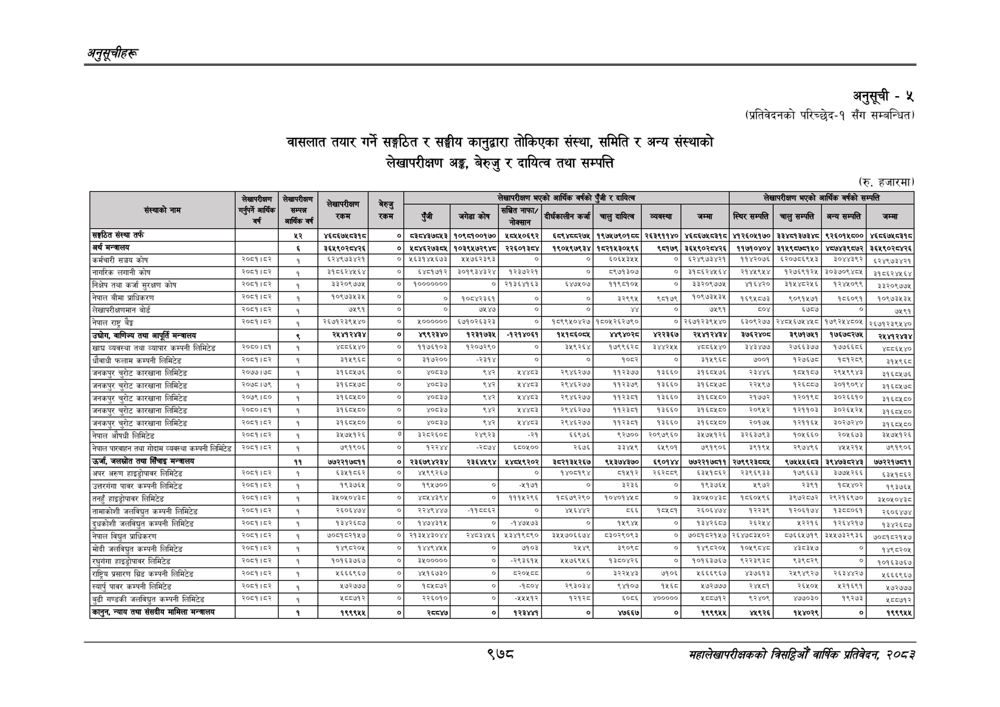

# Page 1040 QA

## Rendered page


## Extracted text

```text
अनुतूचीहरू
वासलात तयार गर्ने सङ्गठित र सङ्घीय कानुद्वारा तोकिएका संस्था, समिति र अन्य संस्थाको लेखापरीक्षण अङ्ग, बेरुजु र दायित्व तथा सम्पत्ति
अनुसूची -५
(प्रतिवेदनको परिच्छेद-१ सँग सम्बन्धित)
(रु. हजारमा)
९७८
सहालेखापरीक्षकको बिदिओँ वार्षिक प्रतिवेदन २०८२

|  |  |  |  |  |  |  |  | लाएको बर्षको | पक बाला |  |  |  |  | बर्षका | लाला |
| --- | --- | --- | --- | --- | --- | --- | --- | --- | --- | --- | --- | --- | --- | --- | --- |
|  |  | हा | । १ |  |  |  | नाखालासेकाणा |  | ९ |  |  |  | भाइको |  |  |
|  | बर्ष, |  | १ | [१ |  | ५ |  | की १।कार्लन कज | चालु | व्यवस्था | जम्मा |  | चालु सम्पर' | अन्य सम्प | जम्मा |
| सङ्गठित सँस्था तर्फ |  | ५२ | २६८६७४८३१८ | ० |  | १०९०१००१७० |  |  | १९७४७९०१८८ | २६३९११४० | ४६८६७४८ब१८ | ४१२६०४१७० | ३३४०१३७३४८ | ९२६०१४८०० |  |
| अर्थ मन्त्रालय |  | ६ | ३६४१९०२८४२६ | ० | अ८४६२७३८५ | १०३९४७२९४८ | २२६०प३८४ | १९०४९७९३४ | १८२१४३०४९४ | ९८१७९ | ३६५९०२८४२६ | ११७१०४०४ | ३१४९८७८१५० | ४८७४३९८७२ | ३६४९०२८४२६ |
| कर्मचारी सञ्जय कोष | २०६८१।६२ | १ | ब२४९७३४२१ |  | ४६३१४४६७३ | २४७६२३९३ | ० | ० | इ०्इ५५ | ० | ६२४९७३४२१ | ११४२०७६ | ६२०७०६९४३\| | ३०४४३९२ | ६२४९७३४२१ |
| नागरिक लगानी कोष |  |  | ३१०६२४४६४ |  | इकय१७१२ | ३०१९३४३२४ | १२३७२२१ | ० | ८९७१३०७ |  |  | स४५९४४ | १२७६९१२४५। | ३०३७०९४०५ | ३१८६२४४६४ |
| निक्षेप तथा कर्जा सुरक्षण कोष | २०६१।६२ |  | ३३२०९७७४ | ७] | १००००००० |  | २१३६४७१६३ | ६४७५०७ | ११९०७१०५ | ० | इ३२०९७७८ | ६४२० | ३१४४८२४६। | १२४४०६९ | इइ२०९७७४ |
| नेपाल बीमा प्राधिकरण | रे०८१।०२ | १ | १०९७३४३४ | ०] | ० | १०८४२३६१ | ० | ० | २२९९५ | ९०१७९ | १०९७३५३४५ | १६९४५८७३ | ९०६१५७१ | १८६०६१ | १०६७३५३५ |
| लेखापरीक्षणमान बोर्ड | २००५ | ३ | ७५९१ |  |  | ७४४ | ० | ० |  |  | ७५९१ |  |  | ० | ७५९१ |
| जेपाल राष्ट्र बह | र०७।७२ | ३१ |  | ० | ३ | ६७१०२६३२३ |  | १०९९४०४२७ | १००४२६२७९० | ० | २६७१२३९४४० | ६३०९२७७, | २४०४६७४४०। | १७९२५४००५ | २६७१२३९४४० |
| उद्योग, वाणिज्य तथा आपूर्ति मन्त्रालय |  |  | २५४१२४३४ | ० | ४९९२३४० | १२३१७३५ | -१२१४०६१ | १४१८६००७ | ९४०२ | ४२२३६७ | र२४४१२४३४ | ३७६२४०७ | ३९७१७८१ | १७६७८२७५ | र२४१४१२४३४ |
| खाध्य व्यवस्था तथा व्यापार कम्पनी लिमिटेड | २०५०।६१ | १ | ४८८६४४० | ० | ११७६१०३ | १२०७२६० | ० |  | १७३६६२८ | डर | ०४४० | ३४३४७७ | २७६६३७७ | १७७६६०६ | ०५४० |
| घौवाधी फलाम कम्पनी लिमिटेड | २०५९१५३ | १ | इ३१५९६८ | ०. | ३९६३००, | -्२३१४ | ० | ० | १०८२ | ० | ३१५६६८ | ७००१ | १२७६७८ | कच्वर्यर | ३१५९६८ |
| जनकपुर चुरोट कारखाना लिमिटेड | २०७७।७० | १ | इ१६०४७६ | ० | ०८३७, | ६४२ |  | २९४६२७७ | २३७७ | ३६६० | उ३१६०४७६ | रइ३/४६ | पाप | २९४९९४३ | ३१६०४७६ |
| जनकपुर चुरोट कारखाना लिमिटेड | २०७०।७९ | १ | ३१६०४७८ | ० | ०८३७ | ९४२ | अध | २९४६२७७ | २३७९ | ३६६० | इ४६न७ङछ | र२२४९७ | ९३] | ३०१९०९४ | उइ१६०४७८ |
| जनकपुर चुरोट कारखाना लिमिटेड | २०७६।६० | ३ | इ१६०४८० | ० | ०६३७ | ६४२ | अहा | २९४६२७७ | बर | ३६६० | ३१६०४६० | र१७७२ | प२०१९८ | ३०२६६१० | ३१६०५६० |
| जनकपुर चुरोट कारखाना लिमिटेड |  | १ | ३१६०५८० | ० | ४००३७, | ९४२ | अध | २९४६२७७ | बबरइध | ३३६० | इ१६०६८७० | र२०६६२ | २१०३ | ३०२६५२५ | इ१६०४८० |
| जनकपुर चुरोट कारखाना लिमिटेड | २०५१।५२ | १ | ३१६०४८० |  | ना | द४२ | अहय | र२९४६२७७ | ब१रइय | बइइ६० | इक६४८० |  |  | इ०२७२४० | इ१६०१०० |
| नेपाल औषधी लिमिटेड | २०७१।६२ | १ |  | ० | इ२८२६० | २४९२३ |  | ६६९७६ | ६२७०० | २०९७९६० | इ४०७४१२६ | इ२६३७९६३ | ब०४६६० | र२०४६७३ | ३८७७१२६ |
| नेपाल पारवाहन तथा गोदाम व्यवस्था कम्पनी लिमिटेड | २०८१।८२ | १ | ७९१९०६ | ० | १२२४४ | न्स्च्छछ | ६८०५०० | २६७६ | ३३४४५९ | ६५९०१ | ७९१९०६ | ३९१९४ | २९७४९६ | ४५५२१५ | ७९१९०६ |
| उर्जा, जलस्रोत तथा सिँचाइ मन्त्रालय |  | ११ | ७७२२१७११ | ० | २३६७९४२३४ | र३६४४९४ |  | ३८२१३४२६७ | ९४३७४३७० | ६९०१४४ | ७७२२१७८११ | २७९९२३८०७४ | ९७४४४६८३ | ३९४७३८२४३ | ७७२२१७०८११ |
| अपर अरुण हाइड्रोपावर लिमिटेड | २०८९१५२ | १ | इ३४१८६२ | ० | ४५९९२६७ |  | ० | ४०६१९४ | ८४१२ | २६२०८९ | द३४१०६२ | र२३९६९३३ | ७९६३ | ३७७६२६६ | द३४१८६२ |
| उत्तरगंगा पावर कम्पनी लिमिटेड |  | १ | १९३७६४ | ० | १९४७०० | ० | १७१ | ० | ३२३६ | ० | १९३७६४ | ४९७२ | २३९१ | ब०४४०२ | २९३७६४ |
| तनहुँ हाइड्रोपावर लिमिटेड | २०७१।६२ | १ | ३४०४०४३८ | ० | अ०८४३९४ | ० | प११४२९६। | १८६७६२६० | १०४०१४४८ | ० |  | १७६०४९६६ |  | २९२१६९७० | ३५०४०४३८ |
| तामाकोशी जलविद्युत कम्पनी लिमिटेड | २०७१।६२ | १ | २६०६४७४ | ० | 
```

## Flags
- table_page
- medium_quality_table
