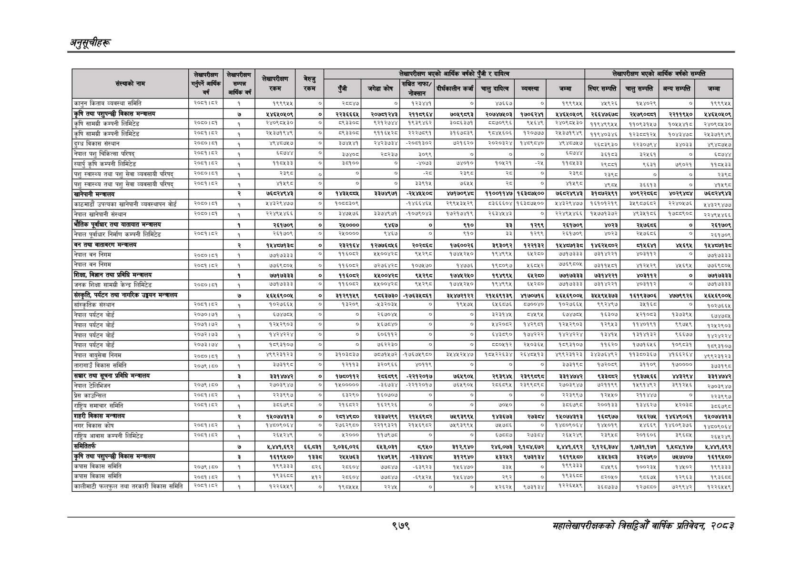

# Page 1041 QA

## Rendered page


## Extracted text

```text
अनुतूचीहरू
९७९
सहालेखापरीक्षकको वार्षिक प्रतिवेदन; २०८२

|  |  |  |  |  |  |  |  |  |  |  |  |  |  |  |  |
| --- | --- | --- | --- | --- | --- | --- | --- | --- | --- | --- | --- | --- | --- | --- | --- |
|  |  |  |  |  |  |  | जापान नको | वर्षको | देको ६ का |  |  |  | गाको | जादा वाको |  |
|  |  | आर्चछन | रकम | रकम | बबी | ८१८ |  | होइकाही। | एमा पा | मग | १८] | बिर हो | नुर | भर |  |
| कानुन किताव व्यवस्था समिति | २००२ | १ | १९९९५४ | ० | र२८६८४४। | ० | १२३ | ० | ४७६६७ | ० | बढ | न |  | ० |  |
| कृषि तथा पशुपन्छी विकास मन्त्रालय |  | ७ | २४६४०४०९ | ० | र२२३६६६४ | २०७०१२४३ | २११८९६४ | ७०४९८९३ | २०७४७४०३ | १७०६२४७१ | १४६४०५०९ | २६६४७६७८ | २४७९०६८१ | र२२११९५० | ४४६४०५०९ |
| काप मामसी कम्पनी लिमिटेड | २०५०१५४ | १ | २४०९८४३० | ० |  | दखुरङ | ब९३९४६२ | इ०७६३७१ | बठड०९९६ | द४इ४९ | र२४०९०४३० | ब१९४९९४४ | ११०९३१४७। | १०४७ | २४०९०४३० |
| कम्पनी लिमिटेड | २००१।६२ |  | २४८३७१९४९ |  |  | ९११६५२८ | २२२७०९१ | इ१६७०३९ | द०७७६०६ | २०७७ | २८३७१९४९ | ११९४०३४६ | ब२३००१२४। | १०४३४७५८ | र२४३७१९४९ |
| दुग्ध विकास संस्थान | २०००।७ | ३ | ४९४०८७४७ | ० | इ७७० | र२४२३७३४ | -२००१३०२ | २१६२० | २०२०३२४ | १४०९८४० | ४९४०७४७ | २६०३९३० | र२३०७९४। | इ४०३३ | ९४०७४७ |
| जपाल पशु चिकित्सा परिपद | २०७।७२ | ३ |  | ० |  | र२३७ | इ०९९ | ० | ० | ० | बा | ३१९३ | २४६१ | ० | ६८७४४ |
| स्यार्प कृषि कम्पनी लिमिटेड |  | ४ | ११०४५३३ | ० | ३१०० | ० | ४०७३ | ७४०१० | ४ |  | ०४३३ |  | द६३१। | ७९०१ | ०७३३ |
| पशु स्वास्थ्य तथा पशु सेवा व्यवसायी परिषद | २०६०।७१ | १ | सक्दछ |  |  |  | २= | (० |  | ० | इद | र३९८ | ० | ० | ९८ |
| पशु स्वास्थ्य तथा पशु सेवा व्यवसायी परिषद्‌ | २०५%।०२ | ३ | अ१४९८ | ० | ० | ० | ३३९५ | ७५५४ |  | ० |  | ४९०४ | ६६१३ |  | १४६८ |
| खानेपानी मन्चालय |  | र्‌ | ७६८२४९४३ | ० | बच | ३३७४९७१ | -२४४४५४०४ | ४७१७०९४८ | ११००११४७ | १६३०७४०० | ७६८२४९४३ | ३१५७२४९१ | ४०९२२८६५८ | ४०२९४८४ | ७६८२४९४३ |
| काठमाडौं उपत्यका खानेपानी व्यवस्थापन वाड | २०००।०१ | १ | ४३२९४७७ | ० | ०३०९ |  | -४६६४६४ | २९९४३४२९। | ड३६६६०४ | १६३०७५०० | अ४३२९४७७ | १६१०१२१९ | ३४९०७६८२ | २२४०५७६ | ,४३२९४७७ |
| नेपाल खानेपानी संस्थान | २०६०।६१ | १ | २२४९४४६६ | ० | ३४७५७६ | ३३७४९७१ | -१०७९०४३\| | १७२१७४१९ | र२६३४५४३ | ० | २२४९४४६६ | १५७७१३७२ | ४९३४५१८६। | १७८८९०८ | २२४९५४६६ |
| भौतिक पूर्वाधार तथा यातायात मन्त्रालय |  | १ | २६१७०९ | ० | ३०००० | ९४६७ | ०. | ९१० |  | १२९९ | २६१७०९ |  | २४७६८६ | ० | २६१७०९ |
| नेपाल पूर्वाधार निर्माण कम्पनी लिमिटेड | २०५१।६२ | १ | २६१७०९ | ० | र२४०००० | ९४६७ | ० | ९१० | इ३इ | ब२६९९ | र२६१७०९ | ४०२३ | २७६८ | ० | र२६१७०९ |
| 'बन तथा वातावरण मन्त्रालय |  | र | १४४च७प३८ | ० | रइर१६४ | १२७७६५८६ | र०्स्क | १७६००२६ |  |  | ४४७३ | १४६२४५०२ | चा | ७६९६ |  |
| नेपाल बन निगम | २०७०।६१ | १ | ७७१७३३३ | ७० | बन्द | अ४००४२८ | द८२९३८० | १७४७६२६० | ९४९९ |  | ७७१७३३३ |  | ४०३११२ | गा | ७७१७३३३ |
| ज्ेपाल बन निगम | २००१।८२ | १ | ७७६९८०४ | ० | ६०६२ | ७२७४४२८ | १०७४७० | क४७७६ | ब९७०९७ | ६०६२ | ७६९० | ७५७५ |  | ४६९५ | ७७६९००४५ |
| 'शिक्षा, विज्ञान तथा प्रविधि मन्चालय |  | १ | ७७१७३३३. | ० | ११६०७२ | ४४००४२८ | ९५२९ |  | १९४९९५ |  | ७७१७३३३ | ७३१४२२१ | ४०३११२ | ० | ७७१७३३३ |
| 'जनक शिक्षा सामग्री केन्द्र लिमिटेड | २०६०।८१ | १ | ७७१७३३३ |  | ११६०६२ | १४५००४२८ | ९५२९ | १७४५२५० | १९४६९५ | ६२८० | ७७१७३३३ | ७३१४२२१ | ४०३११२ | ० | ७७१७३३३ |
| सँस्कृति, पर्यटन तथा नागरिक उड्डयन मन्त्रालय |  | ७ | ५६५६९००५ | ० | इ१२९१५९ | ९८६३७३० | -१७६३४८६१ | इ३४४७२१२२ | २१४५६९१३९ | ४१७०७१६ | ४६४६९००४ | ३४४९४३७३ | १६१९३७०६ | ४७७९९२६ | ४६४६९००५ |
| सांस्कृतिक संस्थान | २०६१।८२ |  | १०२७६६४ | ० | बइ२०६ | जन३२०३४ | ० | प९४७४ | ६५६०७६ | ००४० | १०२७६६८ | ९९२४९७ | १६८ | ० | क०२७६६४ |
| नेपाल पर्यटन बोर्ड | २०७०।७१ | १ | ६७४७०४ |  | ० | २६७०४४५ | ० | ० | ३२३१४५ | ८४५९४५ | ६७४७८४५ | १६३०७ | ५२१०८३ | १३७३९५ | इ७४७८४५ |
| नेपाल पर्यटन बोर्ड | २०७१।७२ | १ | १२४२९०३ |  |  | ४६७८४० | ० | ० |  | १४२९०१ | १२४५२६०३ | १२९४५३ | ११४०१९१ | ९९७५९ | १२४२९०३ |
| नेपाल पर्यटन बोर्ड | २०७२।७३ | १ | १४२४२२४ | ० | ० | इ०इ११२ | ० | ० | बिब९० | १७४२२२ | बढ्रहररश | ब३७१५ | बाइ | ९६६७७ | न४२४२२४ |
| पाल पर्यटन वोर्ड | २०७३।७४ | २१ | १०९३१०७ |  |  | ७६२२३० |  | ० | ०२ | २४०३६४ | ब०९३१०७ | ४६२० | १७७१६५६\| | १०१ | ०९३१०७४ |
| नेपाल वायुसेवा निगम | २०६०।६
```

## Flags
- table_page
- medium_quality_table
