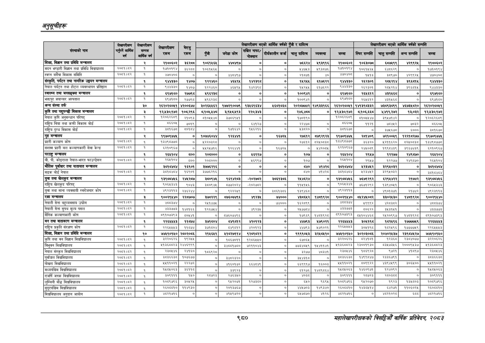

# Page 1042 QA

## Rendered page


## Extracted text

```text
अनुतूचीहरू
९८०
सहालेखापरीक्षकको वार्षिक प्रतिवेदन; २०८२

|  |  |  |  |  |  |  |  | नएको | चमार, |  |  |  |  |  |  |
| --- | --- | --- | --- | --- | --- | --- | --- | --- | --- | --- | --- | --- | --- | --- | --- |
|  | सेखाईकषण | रक्षा | १ | ड्ड |  |  |  |  |  |  |  |  |  |  |  |
|  | हु १ | बिमा आर्षहउ | रकम | = रकम | बबी | ३ बि भे | बह ॥ ० | ०) हडकाही। ७ | १११ गनु | १ | \| १ १८ | ११ ॥ बिह | \| बुस | \| भर भा | ११ ॥। |
| 'शिक्षा, विज्ञान तथा प्रविधि मन्त्रालय |  | र | २१५०६०२ |  |  |  | ० |  |  | अ९३९१६ | र७०६०२ | १०६३०७डङ | इच७९९ | २९९२ | र२१६०६०२ |
| मदन भण्डारी विज्ञान तथा प्रविधि विश्वघालय | २०८९१५३ | १ | १७१०१९४ | इ्र्छड | १०६१५६४ | ० | ० | ० | २४७५३ | ५९३८७६ | १७१०१९४ | १०६१५६५ | ६४८६२९ | ० | १७१०१९४ |
| स्वप्न बगैँचा विकास समिति | २०६१।८२ | १ | ४७०४०८ | ०. |  | ४४८४९७ | ० |  | २१८७१ |  | ४७०४०८ | १४१३ | ८९७० | ४२९९२४ | ४७०४०८ |
| सँस्कृति, पर्यटन तथा नागरिक उड्डयन मन्त्रालय |  | १ | ९४४३३० | १४०७ | १२२४६० | ४६४९ | १४२३९८ | ०. |  | ६१७६२२ | ९४४३३० | र२६२३०१ |  |  | ९४४३३० |
| नेपाल पर्यटन तथा होटल व्यवस्थापन प्रतिष्ठान | २०६१।८२ | १ | ९४४३३० | १४०७ | १२२४६० | ४६५९ | १४२३९८ | ० | १५२४५ | ६१७६२२ | ९४४३३० | २६२३०१ |  | ३ | ९४४३३० |
| स्वास्थ्य तथा जनसङ्ख्या मन्त्रालय |  | १ | ६९७१६० | २७९८ | ९६२८ | ० |  | ० | १००९७२ | ० | ९७१० |  | १४६८ | ० |  |
| अक्तपुर क्यान्सर अस्पताल | २०७७ | १ | ६९७१६० | २७७९८ | ९६२३८ | ० | ० | ० | ००९४ | ० |  | २६४६१२ | ३१६८ | ० | इ९७१५० |
| अन्य संस्था तर्फ |  | ३० | २६२०२८०४१ | ४२००६७४ | ३०२६४४६२ | १७७२९००७९ | १३४६९६३४ |  | २०२८७७४२ | १४९३३१६६ | २६२०२८०७१ | १४१३९८३३२ | ७३८९३८९९ | ४६७३४८२० | २६२०२८०४१ |
| तथा पशुपन्छी विकास मन्त्रालय |  |  | १२,४३०,९७२ | १०६२९६ |  |  | र२२०,३४३ | ० |  | ० | १२/४३०९७२ | ५१०६६६८ | ४१,२७२ | १०३२ | १२/४३०१७२ |
| नेपाल कृषि अनुसन्धान परिषद्‌ | २०६१।६२ | १ |  | २०६३ | न१०४७७८ | इ७०६९४१ | ० | ० | ५०१९० |  | ब२०६२६०६ | ब०४५४७ | इ९५७१४२ |  | १२०६२६०९ |
| राष्ट्रिय चिया तथा कफी विकास बोर्ड |  | १ |  | ७०१९ | ० |  |  | ० | २२४७८ | ० | ५६०४ | बकर | ७०७४२ | ७०३२ | ८६६०५ |
| राष्ट्रिय दुग्ध बिकास बोर्ड | २००१।७२ | १ | ३८१६७८ | ८०१४ | ० | क७१६४२ | ४६२१६ | ० | ५३८२० | ० | ३६७८ | ० | ३७५६७८ | ६००० | इन१६७८ |
| 'गृह मन्त्रालय |  | र्‌ | १९७०९७४४८ | ० | ब०७४६०४७४ | १२६४ |  | १६७२४ |  | ७७९२९२३ | १९७०९७४७६ | रच४०९ | ७२१००१९ | १२२१५२७७ | १९७०९७४४ |
| प्रहरी कल्याण कोष | २०६१।८२ | १ | १३४९८७७८ | ० | २२०३२८ | ० | ० | ० | २७६१२ | ८२४०८३८ | १३४९०७७८ | ६३२० | २११६२० | दर१०८३८ | १३४९०७७८ |
| सशस्त्र प्रहरी बल कल्याणकारी सेवा केन्द्र | २०६१।६२ | १ | ५२१०९६७ | ० | १४५२५७१६ | १२६४४१ | ० | १६७२४५ | ० | $४४२००४५ | ६२१०९६७ | २४५०५९ | १९९८४३९, | ३९६७४३९ | ६२१०९६७ |
| परराष्ट्र मन्चालय |  | १ | २६४१०४ | ब०० | र०६००० | ० | ६९९७ |  | १०७ | ० | र२६७१०४ | २९५७ | १२२७७ |  |  |
| बी. पी. कोइराला नेपाल-भारत फाउन्डेसन | २०६१।८२ | १ | २६४१०४ | ५०० | २०५०००, | ० | ५६९९७ | ० | १०७ | ० | २६५१०४ | २९५७ | १२२७४ | २४९८७० | २६५१०४ |
| 'भोतिक पूर्वाधार तथा यातायात मन्त्रालय |  | १ |  | १६९०१ | ३७७६२१६ | ० |  |  |  |  | इद | १२३४५२ | ३२९४५०३२ | ० |  |
| सडक बोर्ड नेपाल | २०५१।६२ | १ |  | १६९०१ | ३७७६२१६ |  | ० | ० | ५४० | भइ |  | २३४२ | ३२९४०३२ | ० | ३०१०७०४ |
| युवा तथा खेलकुद मन्त्रालय |  | र | १३९८०४४६ | २४४२८७ | ३५०९४५ | ९६९४२८३ | -२०२७५२ |  | २४४६२४ | ० | १३९५५४६६ | ७६७१२९२ | ।६२९४४२२ | २१७४२ | १३९०८८४४५६ |
| राष्ट्रिय खेलकुद परिषद्‌ | २०६७१।६२ | १ | द०६४३४३ |  | ३००९७६ |  | -२०२७५२ | ० |  | ० | ब०्छाइाइ | ७६७१२९२ | १३९४०४१ | ० | द०६७३४३ |
| युवा तथा साना व्यवसायी स्वरोजगार कोष | २०६१।६२ | १ | ४९२३११३ | २३६२४४ | ० | द२२२४९ | ० | इदब३६ | १३९४६८ | ० | ४९२३११३ | ० | ४९०१३७१ | २१७४२ | ४९२३११३ |
| रक्षा मन्त्रालय |  | २ | ९००२९४४० |  | ३७६२२९ | ७७६०७४९६ | ९२३४ | ७४००० |  | पच्त९र्ध | ९००२९४४० |  | ३३३०२४३० |  | ९००२९४४० |
| नेपाली सेना बहुव्यवसाय उचोग |  |  | ३७४ | ० | २१४७ | ० |  | ७४००० | १६२८९९ | ० |  | ९९९२ |  | ० | ८०३७४ |
| नेपाली सेना सुपथ मूल्य पसल |  | १ | ४३३७७३ | १४०१६६ | १२६७४४ | ० | ९२३५ | ० | र७७०४ | ० | भइ | प०इ२२ | ३८३१४१ | ० | ३७७३ |
| सैनिक कल्याणकारी कोष | २०८९१८३ | १ | ८९१०७३९३ | ८०४५४१ | ० | ८७६०७४९६ | ० | ० | १७९६९ | ब४०१९२८ | ५९१०७३९३ | ८५१०४४६८ | र४२०९९७। | १४८१९२८० | ८९१०७३९३ |
| 'बन तथा वाता
```

## Flags
- table_page
- medium_quality_table
