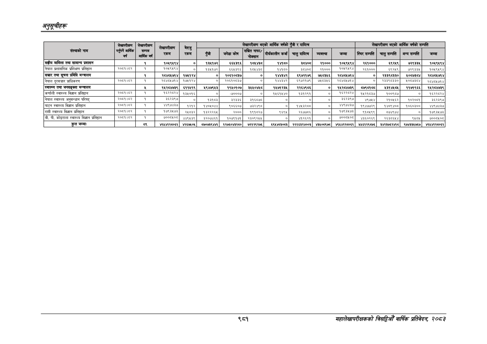

# Page 1043 QA

## Rendered page


## Extracted text

```text
अनुतूचीहरू
९८१
सहालेखापरीक्षकको वार्षिक प्रतिवेदन; २०८२

|  |  |  |  |  |  |  |  |  |  |  |  |  |  |  |  |
| --- | --- | --- | --- | --- | --- | --- | --- | --- | --- | --- | --- | --- | --- | --- | --- |
|  | बार | हा | १ जा |  |  |  |  | नएको लागेका बो |  |  |  |  |  | नका लागेको |  |
|  |  |  |  | डेड |  |  | हा |  |  |  |  | । | । | । १ | ।' |
| सङ्घीय मामिला तथा सामान्य प्रशासन |  | १ | १०४९४९४ | ० | १३५१७२ | ६६५३९६ | १०४५४३८ | १४१८० |  | २१००० | १०४९४९४ | र२६१००० | ६९२१९ | ७२९३३५ | १०१९४१९४ |
| जाल परासनिक प्रशिक्षण परतिदान |  |  |  |  |  |  |  |  |  | २००० |  | २१०० | बइ९्९। | ७२९३ | १०४९९४ |
| सञ्चार तथा सूचना प्रविधि मन्त्रालय |  | १ | २८४८५७१४ | १७५१२४ | ० | २०६१०८३७ | ० | १४४३४२ | ६९७२१७९ | ७५८३५६ | २०८४८५७१४ | ० | २३३९८३३० | १०८७३८४ | २०४८४५७१४ |
| नेपाल प्राधिकरण | भान | १ | र८४०४७१४ | १५४१२४ | ०]. | २०६१०५३७ |  |  | ६९७२१७९ | ७६७३५६ | २८/०४७१४ |  | २३३९०३३०। | ४००७३०४ | २८४८४७१४ |
| स्वास्थ्य तथा जनसङ्ख्या मन्त्रालय |  | ४ | १५२८४७३९ | ६११५९९ | १९४७९५३ | १९५०१०७ | ३५४५०४५८ | १५७१२३५ | २२६४९८६ | ० | १५२८४७३९ | ८७९०१६८ |  | ११७१९६६ | १५२८४७३९ |
| कर्णाली स्वास्थ्य विज्ञान प्रतिष्ठान | २०८९१८३ | १ | १६२२८२४ | १३५०१६ |  | -७०००७ | ० | १५६१५४० | १३१२९१ |  | १६२२८२४ | १५२१८३७ | १००९८७ |  | १६२२८२४ |
| नेपाल अनुमन्तान | काच्र | १ |  |  |  |  |  |  |  | छ | अधर | पछा | स०ाइर | बठरवना | ३२३७ |
|  |  |  |  | २१२ | पराग | ९०६६०७ | छरेर | ० | करन |  |  | १९४७७२९ | पहयर४०। | १०६०३०० | ७४३७ |
| राम्री स्वास्थ्य विज्ञान प्रतिष्ठान | री |  |  | रबर | प्ररर६४)। | २००० | ९१५२७ |  | २७७५ | ० |  | १५९९ | ७९७४ |  | १७९३४७३ |
| बी, पी. कोइराला स्वास्थ्य विज्ञान प्रतिष्ठान | १५२ | १ | १०८ | ४४७३ |  | १०७७१७ | २३०९२७५ | ० | भरहर |  |  |  | २६३४] |  | ७००० |
| कुल जम्माः |  |  | अप४२२००६१ | ४२६७४०६ | ०७३९ | १२७६०४३२५० | ७२१२९२७६ | इ९४४च०५३ | १९९६३२४००३ | ४३४०५९७९ | ४९४४२२८०६१ | ४४६१२९०७६ | इ४२३७६२४१८ | ९७४/३३४७६७ | ४९४४२२८०६१ |
```

## Flags
- table_page
- medium_quality_table
