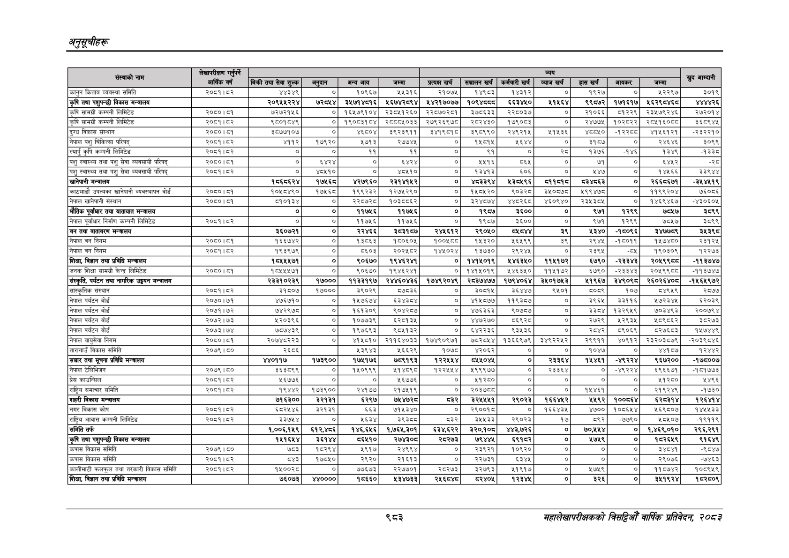

# Page 1045 QA

## Rendered page


## Extracted text

```text
अनुतूचीहरू
९८३
महालेखापरीक्षकको बिहा वार्षिक प्रतिवेकक २०५३

| संस्थाको नाम                                 | जि छ उ आर्थिक वर्ष   |                             |             |                |                 | = - - - ] आम्दानी &#124; &#124; &#124; &#124;   | = - - - ] आम्दानी &#124; &#124; &#124; &#124;   | = - - - ] आम्दानी &#124; &#124; &#124; &#124;   | = - - - ] आम्दानी &#124; &#124; &#124; &#124;   | = - - - ] आम्दानी &#124; &#124; &#124; &#124;   | = - - - ] आम्दानी &#124; &#124; &#124; &#124;   | = - - - ] आम्दानी &#124; &#124; &#124; &#124;   | = - - - ] आम्दानी &#124; &#124; &#124; &#124;   |
|----------------------------------------------|----------------------|-----------------------------|-------------|----------------|-----------------|-------------------------------------------------|-------------------------------------------------|-------------------------------------------------|-------------------------------------------------|-------------------------------------------------|-------------------------------------------------|-------------------------------------------------|-------------------------------------------------|
| संस्थाको नाम                                 | जि छ उ आर्थिक वर्ष   | बिक्री तथा सेवा शुल्क&#124; | अनुदान      | अन्य आय &#124; | जम्मा           | r प्रत्यक्ष खर्च                                | - &#124; सञ्चालन खर्च [                         | कर्मचारी खर्च &#124;                            | व्याज खर्च                                      | हास खर्ष                                        | आयकर                                            | जम्मा                                           | खुद                                             |
| 'कानन किताव व्यवस्था समिति                   | २०८१।८२              | ४४३४९]                      | ०]          | १०९६७          | &#124; २५३१६    | २१०७४५                                          | १४९८३                                           | १४३१२]                                          | ०]                                              | १९२७]                                           | ०]                                              | ५२२९७                                           | ३०१९                                            |
| कृषि तथा पशुपन्छी विकास मन्त्रालय            |                      | २०९५५२२४&#124;              | ७२५४]       | ३५७१४८१६]      | ५६७४२८९४]&#124; | ५४२१७०७७                                        |                                                 |                                                 |                                                 | ९९८७२]                                          | १७१६१७]                                         | ५६२९८४६८&#124;                                  | _ ४४४४२६                                        |
| F सामग्री कम्पनी लिमिटेड                     | २०८०।८१              | ७२७२१५६]                    | ०]          | १६५७९१०४&#124; | २३०५१२६०&#124;  | २२८७०२८१]                                       | ३७८६३३]                                         | २२००३५                                          | ०                                               | २१०६६&#124;                                     | ८०१२२९]&#124;                                   | २३५७९२४६                                        | २७२०१४                                          |
| कृषि सामग्री कम्पनी लिमिटेड                  | २००१।८२              | ९८०१८४९                     | ०]          | १९०८३१८४&#124; | २८००८०५०३३]     | २७९२६९७८]                                       | २८२४३०]                                         | १७९०८३                                          |                                                 | २४७७५                                           | १०२८२२]                                         | २८५१६०८०८                                       | ३६०९४५                                          |
| दुग्ध विकास संस्थान                          | २०८०।८१              | ३८७७१०७]  
```

## Flags
- table_page
- medium_quality_table
