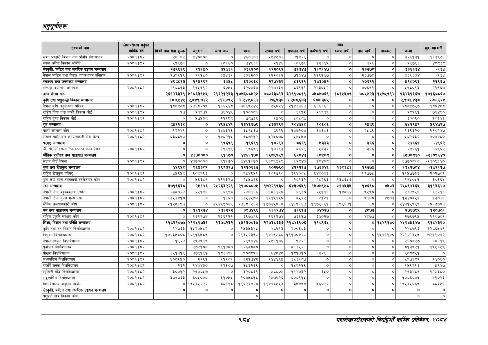

# Page 1046 QA

## Rendered page


## Extracted text

```text
अनुतूचीहरू
९८४
महालेखापरीक्षकको बिहा वार्षिक प्रतिवेकक २०५३

| संस्थाको s                                   | लेखापरीक्षण गर्नुपर्ने आर्थिक वर्ष   |                             |                              |                |                 | &= जज &#124; &#124; &#124; जम्मा &#124;   | &= जज &#124; &#124; &#124; जम्मा &#124;   | &= जज &#124; &#124; &#124; जम्मा &#124;   | &= जज &#124; &#124; &#124; जम्मा &#124;   | &= जज &#124; &#124; &#124; जम्मा &#124;   | &= जज &#124; &#124; &#124; जम्मा &#124;   | &= जज &#124; &#124; &#124; जम्मा &#124;   | &= जज &#124; &#124; &#124; जम्मा &#124;   |
|----------------------------------------------|--------------------------------------|-----------------------------|------------------------------|----------------|-----------------|-------------------------------------------|-------------------------------------------|-------------------------------------------|-------------------------------------------|-------------------------------------------|-------------------------------------------|-------------------------------------------|-------------------------------------------|
| संस्थाको s                                   | लेखापरीक्षण गर्नुपर्ने आर्थिक वर्ष   | बिक्री तथा सेवा शुल्क&#124; | अनुदान                       | अन्य आय        | जम्मा           | [ प्रत्यक्ष खर्च                          | &#124; सञ्चालन खर्च [                     | कर्मचारी खर्च &#124;                      | व्याज खर्च                                | हास खर्ष                                  | आयकर                                      | S                                         |                                           |
| मदन भण्डारी विज्ञान तथा प्रविधि e            | २०८१।८२                              | २०१०२]                      | wyoooo&#124;                 | &#124; ०]      | &#124; ४६०१०२   | २५४७०२                                    | ७१४२९।                                    | ०                                         | ०                                         | ०                                         | ०]                                        | ३२६१३१ १३३९७१                             |                                           |
| स्वप्न बगैँचा विकास समिति                    | २०८१।८२                              | ]                           | ०]                           | १८६६०          | ७४६३१           | २१४६                                      |                                           |                                           |                                           | ३२६।                                      | ०]                                        | २५७९३                                     | श्ठयइ्य                                   |
| संस्कृति, पर्यटन तथा नागरिक उड्डयन मन्त्रालय |                                      | २७९६१९&#124;                | २११५०                        | ३५४३१&#124;]   | ३३६२००।         | १२२०६२                                    |                                           |                                           |                                           | २३७७]                                     | ०]                                        | ३३६३३४                                    | -१३४                                      |
| नेपाल पर्यटन तथा होटल व्यवस्थापन प्रतिष्ठान  | २०८१।८२                              | २७९६१९                      | २११५०                        | ३५४३१          | ३३६२००          | १२२०६२                                    | ७१३४७&#124;                               | ११९१४७                                    |                                           | २३७७८                                     | ०                                         | ३३६३३४                                    | -१३४                                      |
| स्वास्थ्य तथा जनसंख्या मन्त्रालय             |                                      | ४९८०१३]                     | ११४५१९२                      | ६०५५           | ६२००६०          | २२७
```

## Flags
- table_page
- medium_quality_table
