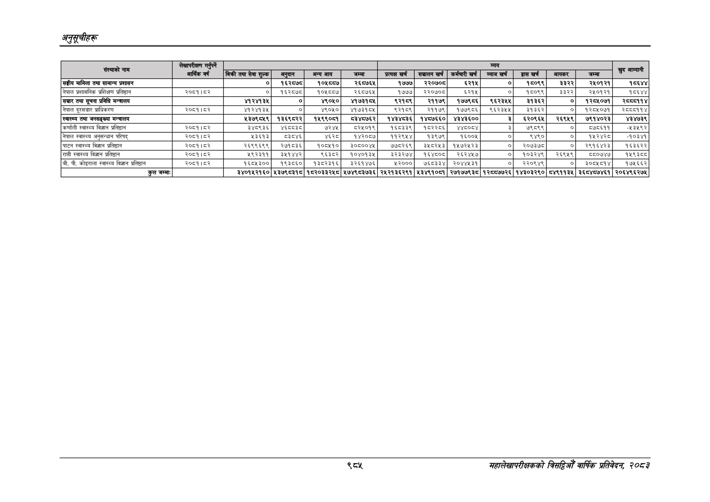

# Page 1047 QA

## Rendered page


## Extracted text

```text
अनुतूचीहरू
सहालेखापरीक्षकको वार्षिक प्रतिवेदन; २०८२

| संस्थाको s                                   | लेखापरीक्षण गर्नुपर्ने आर्थिक वर्ष   |                               |                 |                |                 | [ &= जज &#124; &#124; &#124;   | [ &= जज &#124; &#124; &#124;   | [ &= जज &#124; &#124; &#124;   | [ &= जज &#124; &#124; &#124;   | [ &= जज &#124; &#124; &#124;   | [ &= जज &#124; &#124; &#124;   | [ &= जज &#124; &#124; &#124;   |          S |
|----------------------------------------------|--------------------------------------|-------------------------------|-----------------|----------------|-----------------|--------------------------------|--------------------------------|--------------------------------|--------------------------------|--------------------------------|--------------------------------|--------------------------------|------------|
|                                              |                                      | बिक्री तथा सेवा शुल्क&#124; । | अनुदान          | अन्य आय        | जम्मा           | प्रत्यक्ष खर्च                 | सञ्चालन खर्च                   | कर्मचारी खर्च                  | &#124; व्याज खर्च ।            | हास खर्ष                       | आयकर                           | जम्मा &#124;                   |            |
| सङ्घीय मामिला तथा सामान्य प्रशासन            |                                      | ०                             | १६२८७८          | &#124; १०५८८७  | &#124; २६८७६५   | &#124; १७७७                    | [ २२०७०८                       | ६२१५                           | ०]                             | १८०९९                          | ३३२२                           | २५०१२१                         |      १८६४४ |
| नेपाल प्रशासनिक प्रशिक्षण प्रतिष्ठान         | २००१।०२                              | &#124; नु                     | १६२०७्]         | १०५००८७]       | २६०७६१          | १७७७                           |                                |                                |                                |                                | ३३२२                           | २५०१२१                         |      १८६४४ |
| सञ्चार तथा सूचना प्रविधि मन्त्रालय           |                                      | ४१२४१३५&#124;                 | ०]              | ४९०५०&#124;    | ४१७३१८५         | ९२१८९                          | R996%&#124;                    | १७७९८६]                        | ९६२३५४५                        | ३१३६२&#124;]                   | ०]                             | १२८५०७१]                       |    २८५८११४ |
| नेपाल दुरसञ्चार प्राधिकरण                    | २००१।८२                              | ४१२४१३५]                      | ०]              | ४९०५०]         | ४१७३१८०५        | ९२१८९                          | २११७९&#124;                    | १७७९८६                         |                                |                                | ०]                             | १२८५०७१]                       |    २८०८११४ |
| स्वास्थ्य तथा जनसङ्ख्या मन्त्रालय            |                                      | X3RN’                         | &#124; १३६९८२२] | १५९९०८१]&#124; | ८३४८७६२]        | १४३४८३६]                       | १४८७६६०&#124;                  | ४३४३६००                        |                                |                                | २६९५९&#124;                    | ७९१४०२३                        |     ४३४७३९ |
| कर्णाली स्वास्थ्य विज्ञान प्रतिष्ठान         | २००१।८२                              | ३४८९३६&#124;                  | ४६वव३८          | ७२४५           | ८२५०१९          | १६८३३९&#124;                   | १८२२८६&#124;                   | _४४८०८४                        |                                | ।                              | न                              | ब७०६११                         |     -१२५९२ |
| नेपाल स्वास्थ्य अनुसन्धान परिषद्‌            | २०८१।८२                              | २३६१३                         | ८३८४६           | ४२]            | १४२०८७]         | ११२९५४]              
```

## Flags
- table_page
