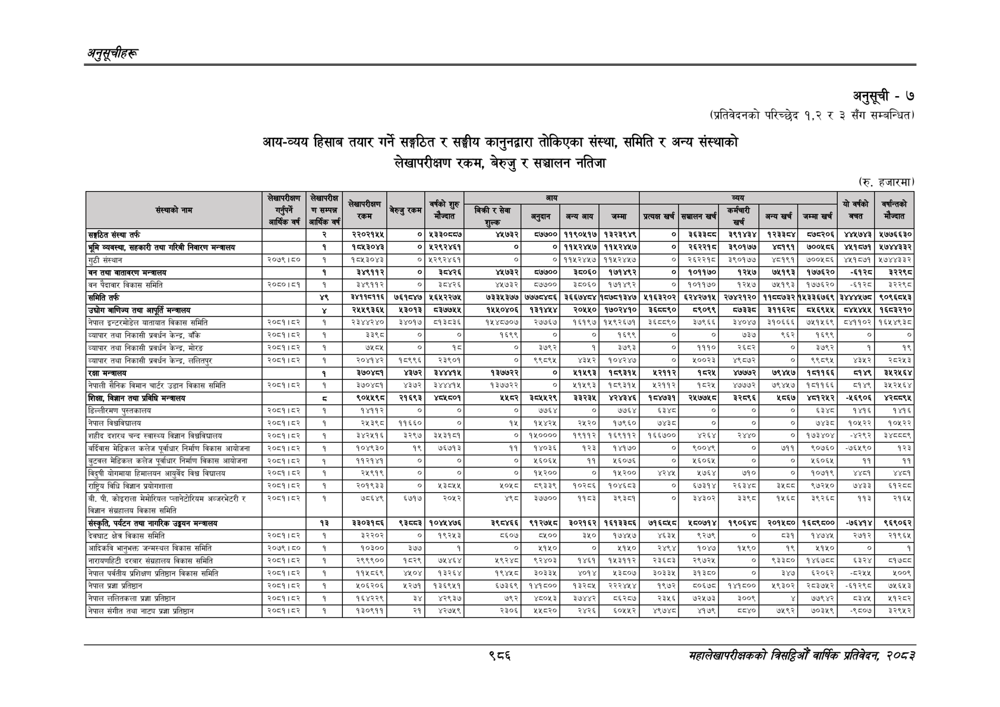

# Page 1048 QA

## Rendered page


## Extracted text

```text
अनुतूचीहरू
अनुसूची -७
(प्रतिवेदनको परिच्छेद १,२ र ३ सँग सम्बन्धित)
आयन-व्यय हिसाब तयार गर्ने सङ्गठित र सङ्घीय कानुनद्वारा तोकिएका संस्था, समिति र अन्य संस्थाको लेखापरीक्षण रकम, बेरुजु र सञ्चालन नतिजा
(रु. हजारमा)
९८६
सहालेखापरीक्षकको वार्षिक प्रतिवेदन; २०८२

|  |  |  |  |  |  |  |  |  |  |  |  |  |  |  |  |  |
| --- | --- | --- | --- | --- | --- | --- | --- | --- | --- | --- | --- | --- | --- | --- | --- | --- |
|  | ॥॥ |  |  |  |  |  |  |  |  |  |  |  |  |  |  |  |
|  |  |  |  |  | ८१ |  |  |  |  |  |  |  | ५ १ १ १ १ १२ १२५८ १४ ५९ २५ २३.८१७८४८ पी ५ १ १ १ १ १३ १३६४ १४ १६ १३ ३८.८६४५८६ ४ १ १ १ २ ० ३२२ २५ १०५४ ४२ -१ ५ १ १ १ २ १ ३२२ ३८ ८० २१ २१.६१६८५६ ५ १ १ १ २ २ ४६७ ३९ ३ ८ ४६.३९२६७७ ' ५ १ १ १ २ ३ ५९९ ३५ १ १३ ६६.६४९०४८ \| ५ १ १ १ २ ४ ६१८ ३९ १ ८ ६६.६४९०४८। ५ १ १ १ २ ५ ६७१ २५ ३० ४२ ०.०००००० ५ १ १ १ २ ६ ७५८ ३९ २४ १४ २७.५१८००९ ५ १ १ १ २ ७ ९०२ ३९ १० १० २४.२११४४१ ५ १ १ १ २ ८ ९६२ ३९ १ १० १३.३८०६६१ ५ १ १ १ २ ९ ९८२ ३६ ९ १३ २२.७९१६२४ ५ १ १ १ २ १० १०२६ ३९ ३५ १० १४.०९१७११ ५ १ १ १ २ ११ ११४७ ३९ ४१ १० ३५.००३६०५ ५ १ १ १ २ १२ १२४४ ३९ १२ १० १४.९८५४६६ ॥ ५ १ १ १ २ १३ १२८८ ४२ १ ३ १४.९८५४६६, ५ १ १ १ २ १४ १३४६ ३९ ३० ९ ४९.०३८०९४ ३ १ १ २ ० ० ६ ६७ १३८८ ४७७ -१ ४ १ १ २ १ ० ७ ६७ १३८६ १४ -१ ५ १ १ २ १ १ ७ ६७ ३५ १४ ६२.८३२१११ सङ्गठित ५ १ १ २ १ २ ४६ ६८ २६ १२ ९०.४२८३९८ संस्था ५ १ १ २ १ ३ ७६ ६७ २० १३ ९४.६४४५२४ तर्फ ५ १ १ २ १ ४ ४०२ ६९ ६ १० ५३.१५०७६८ ५ १ १ २ १ ५ ४५२ ६९ ५३ ११ ४७.०३२९८६ २२०२१५४ ५ १ १ २ १ ६ ५६२ ७० ७ ७ ९०.८३५३९६ ० ५ १ १ २ १ ७ ५८२ ६९ ५४ १० २७.१४९२८६ ४३३०६५७ ५ १ १ २ १ ८ ६९३ ६९ ३८ १० २१.३२६११३ ४४७३२ ५ १ १ २ १ ९ ७५८ ६९ ३९ ९ ६९.३३७२५० ५७७०० ५ १ १ २ १ १० ८०९ ६९ ५४ ११ ८३.९५५९६३ ११९०५१७ ५ १ १ २ १ ११ ८७६ ६९ ५४ ११ ८९.५६८९३२ १३२३९४९ ५ १ १ २ १ १२ ९९० ७० ७ ७ ९१.९८६७४० ० ५ १ १ २ १ १३ १०१८ ६९ ४७ १० २५.८६२२५५ ५ १ १ २ १ १४ १०८५ ६९ ४७ ११ ९१.३८९८७० ३९१४३४ ५ १ १ २ १ १५ ११५१ ६९ ४७ ११ ३९.७३७८६९ पर३३५४ ५ १ १ २ १ १६ १२१७ ६९ ४६ १० ६५.९२९१४६ ५७५२०६ ५ १ १ २ १ १७ १२८० ६९ ४५ १० ४०.६५२३४८ ४४४७४३ ५ १ १ २ १ १८ १३३९ ६९ ५४ १० ५६.८७६६२१ ५७७६६३० ४ १ १ २ २ ० ७ ८८ १३८६ १७ -१ ५ १ १ २ २ १ ७ ८८ २० १७ ५५.१५४४५७ भूमि ५ १ १ २ २ २ ३० ९१ ४० १२ ९४.६३५५९० व्यवस्था, ५ १ १ २ २ ३ ७५ ८८ ३९ १४ ९५.५८४३८१ सहकारी ५ १ १ २ २ ४ ११८ ९१ २० १० ९६.३८११८० तथा ५ १ १ २ २ ५ १४२ ८८ २८ १३ ९६.७७४५२९ गरिबी ५ १ १ २ २ ६ १७४ ८८ ३६ १३ ९३.२९९०४२ निवारण ५ १ १ २ २ ७ २१३ ९१ ४३ १० ८४.७५८९३४ मन्चालय ५ १ १ २ २ ८ ४०२ ९० ५ ११ ७७.११३७३९ १ ५ १ १ २ २ ९ ४५२ ९० ५३ ११ ५९.४६७११७ १८४३०४३ ५ १ १ २ २ १० ५६२ ९१ ७ ७ ७५.४७४६४८ ० ५ १ १ २ २ ११ ५८२ ९० ५२ ११ ५१.३०७६७८ ४२९२४६१ ५ १ १ २ २ १२ ७२४ ९१ ७ ७ ९५.५८८८०६ ० ५ १ १ २ २ १३ ७९० ९१ ७ ७ ८३.६६७०३८ ० ५ १ १ २ २ १४ ८०९ ९० ५४ ११ ७९.५३१०५२ ११४२४४७ ५ १ १ २ २ १५ ८७६ ९० ५५ ११ २०.४१६९१८ ११५२४४७ ५ १ १ २ २ १६ ९९० ९१ ७ ७ ९५.६२९९२१ ० ५ १ १ २ २ १७ १०१८ ९० ४७ ११ १९.११५६०१ ५ १ १ २ २ १८ १०८५ ९० ४७ ११ ९०.४६४२१८ ३९०१७७ ५ १ १ २ २ १९ ११५९ ९० ३७ ११ ०.०००००० ४१९१ ५ १ १ २ २ २० १२१७ ९० ४६ ११ ६०.३०६९३१ ७००४६६ ५ १ १ २ २ २१ १२८० ९० ४४ ११ ५८.६६७५८३ ४४१५७१ ५ १ १ २ २ २२ १३३९ ९० ५४ १० ४९.८६७३४० ५७४४३३२ ४ १ १ २ ३ ० ७ ११० १३८५ १६ -१ ५ १ १ २ ३ १ ७ ११० २० १६ ६८.३२२२७३ 'गुटी ५ १ १ २ ३ २ ३२ ११३ ३३ ९ ९१.८३४८३१ संस्थान ५ १ १ २ ३ ३ ३१० ११२ ५४ १० १.२४८९७० २०७९।६५० ५ १ १ २ ३ ४ ४०२ ११२ ५ १० ९१.०१६८१५ १ ५ १ १ २ ३ ५ ४५१ ११२ ५३ १० ५५.२५८११० १०४३०४३ ५ १ १ २ ३ ६ ५६२ ११३ ६ ६ ८४.१३६५९७ ० ५ १ १ २ ३ ७ ५८१ ११२ ५२ १० २६.७६४३८९ ४२९२४६१ ५ १ १ २ ३ ८ ७२५ ११३ ६ ६ ९३.०३५०३४ ० ५ १ १ २ ३ ९ ७९० ११३ ६ ६ ८७.१४९२२३ ० ५ १ १ २ ३ १० ८०८ ११२ ५४ १० ३७.५११०८६ ११४२४५७ ५ १ १ २ ३ ११ ८७६ ११२ ५३ १० ५२.००१५०३ ११४२४५७ ५ १ १ २ ३ १२ ९९० ११३ ६ ६ ९०.५९०१६४ ० ५ १ १ २ ३ १३ १०१७ ११२ ४६ १० ५४.५०६६४५ २६२२१८ ५ १ १ २ ३ १४ १०८५ ११२ ४६ १० ३२.०४६५६२ इ३९०१७७ ५ १ १ २ ३ १५ ११५८ ११२ ३७ १० ०.०००००० ४१९१ ५ १ १ २ ३ १६ १२१७ ११२ ४५ ९ ६४.०८५०४५ ७००५८६ ५ १ १ २ ३ १७ १२८० ११२ ४३ १० ३६.१२१२०८ ४५१५७१ ५ १ १ २ ३ १८ १३३८ ११२ ५४ ९ २०.१७३७८८ ४७४४३३२ ४ १ १ २ ४ ० ६ १२४ १३८८ २९ -१ ५ १ १ २ ४ १ ६ १३४ १७ ९ ६४.०१२००९ 'चन ५ १ १ २ ४ २ २८ १२४ १८ ३० ९६.८९९६८९ तथा ५ १ १ २ ४ ३ ५० १२४ ४२ ३० ९४.९०५७४६ वातावरण ५ १ १ २ ४ ४ ९५ १२४ ४८ ३० ९१.९४७७७७ मन्त्रालय ५ १ १ २ ४ ५ ४०२ १३३ ५ १० ९१.९५८७४० १ ५ १ १ २ ४ ६ ४५९ १२४ ४६ २९ ८४.६७८२४६ ३४९११२ ५ १ १ २ ४ ७ ५६२ १३४ ७ ७ ९१.८५०६२४ ० ५ १ १ २ ४ ८ ५९७ १३३ ३८ १० ०.०००००० इ्४२६ ५ १ १ २ ४ ९ ६९३ १३३ ३८ १० ०
```

## Flags
- table_page
- medium_quality_table
