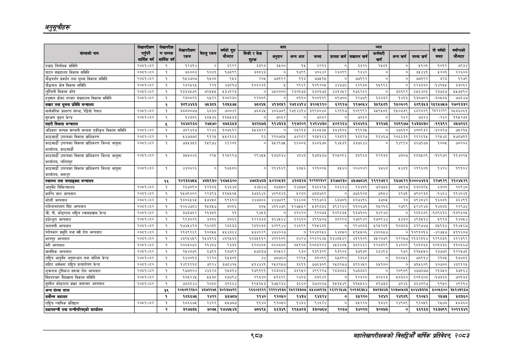

# Page 1049 QA

## Rendered page


## Extracted text

```text
अनुतूचीहरू
९८७
सहालेखापरीक्षकको वार्षिक प्रतिवेदन; २०८२

|  |  |  |  |  |  |  |  |  |  |  |  |  |  |  |  |  |
| --- | --- | --- | --- | --- | --- | --- | --- | --- | --- | --- | --- | --- | --- | --- | --- | --- |
|  |  |  | काफी |  |  |  |  |  |  |  |  |  |  |  | १ की |  |
|  |  |  | ' रकम | नु पमा | ज्ात |  |  | उ | म | र |  | बहाब | जि |  | उ | गन्तको |
| पञ्चाङ्ग निर्णायक समिति | २०६१।८२ | १ | ९३८९ | ० | ६९२२ | ३३९८ | ३५०० | १५ | ६९१३ | ० | ३३२० | २५८१ | ० | ५९०१ | १०१२ | ७९३४ |
| पाटन संग्रहालय विकास समिति | २०८१।८२ | १ | ७६०८३ | १०४१ | १७३६९ | ३८४३ | ० | १७९९ | ४०६४२ | २६०६९ | ६३४२ | ० | ० |  | थ२०१ | २२६०० |
| बौँडदर्शन प्रवर्धन तथा गुम्बा विकास समिति | २०७।६२ | १ | १४४७०७ | १५०७ | ४६ | २०४ | ७७९२ | ११८ | ७७७५ | ० | ७७१९२ | ० | ० | ७७९२ | इर३ | १२७९ |
| बौद्धनाथ क्षे विकास समिति | २०८१।८२ | १ | २३२४६५ | २२१ | ४७२१७ | १०६२३१ | ५ | २९६९ | १०९२०५ | ४४३७६ | ६२९८ | १४९९६ | ० | १२३३६० | -१४१५४५ | ३३०६२ |
| लुम्बिनी विकास कोष | २००१।४२ | १ | ब३इ३६४५७९ | २४५५ | ३१२३ | ० | ४८०००० | २३०१७३ | ६८०१७३ |  | १७६२६२ | ० | इ३८६९२ | ६४६४०६ | २३७६७ | ४४७८९० |
| हनुमान ढोका दरवार संग्रहालय विकास समिति | २०६१।५२ | १ | २३०६२१ | ६४२२ | १०७२३० | ९२००९ | ० | १० | १००११९ | ९७०७ | २२७४ | ६०३२ | ब४पइ | १३०७०२ | ३०४३ | ७५६४७ |
| सञ्चार तथा सूचना प्रविधि मन्त्रालय |  | र्‌ | इ८९४४६३ | ७१३८६ | १०४५४७४५ | ७८४४ |  | २७१४४१४ | ३२०५११० | २११७ | ११७०४४ | इ३४९४८१ | १४०६०१ | इ८९३४३ | २५१४५७४७ | २७०१३३२ |
| सार्वजनिक प्रशारण संस्था, रेडियो नेपाल | २०६१।६४२ | १ | इ६५००७७ | ६८४० | ७००४२ | ७६८४५ | ४०६७८९ | २७१४४१४ | ३१९८०४७ | ६२११७ | १०९९९२ | इ४९४०१ | १४५०३३९ | ६८२०२९ | २४१६०१९ | २४८६०६१ |
| सुरक्षण मृदण केन्द्र | २०६१।६२ | १ | ४३०६ | ६०४४६ | ११४४३३ | ० | ७०६२ | ० | ७०६२ | ० | ७०६२ | ० | र६२ | ७इर४ | २६२ | १११२७१ |
| 'शहरी विकास मन्त्रालय |  |  |  | २७४७० | ८७६६५३ |  | ९१४३६३ | ११७२०२ | १४१४४३८ | ४५०१२६४ | ६१०४७१६ | इ३२१७३ | २८१९७७ | १४३३८३० | -१९३९२ | ८४७२६१ |
| अधिकार सम्पन्न वाग्मती सभ्यता एकीकृत विकास समिति | २००१।५६२ | ११ | ७६९४६७ | २२४६ | १०७६१२ | ३४३३२२ | ० | ४२१३ |  | इ३४१५६ | ९१३४ | ० | ७६१० | ४००९३२ | -३२३९७ | ७८२१४५ |
| काठमाडौं उपत्यका विकास प्राधिकरण | २०८१।८२ | १ | ४४७७७८ | ६१२५ | ५४५६१६३ | ६६ | २१०७८५ | ७४२८२ | २०८४५१६३ | र२३८९१ | १८६२७ | १३४६७ | २०६६३१ | २६२६१५ |  | ४५७८७११ |
| 'काटमाडौं उपत्यका विकास प्राधिकरण जिल्ला आयक्त कार्यालय, काठमाडौं | २०८१।६२ | १ | ७३४३५१ | १५९७४ | इ९२०१ | ० | ३४२१७४ | ६००३ | ३६७१७८ | १४३१ | ३३७६४४ | ० | ब४९९८ | ३६७१७३ | १००६ | ७०२०६ |
| काठमाडौं उपत्यका विकास प्राधिकरण जिल्ला आयुक्त कार्यालय, ललितपुर | २०७।६२ | १ | ३४०७ | २२५ | १२५९९४ | २९४५४५ | १३७२३४ |  | १७१५३७ | १२५०६६ | ३८९६८ | २१३४ | ७३०७ | १०३४०९ | -११९७२ | ११४०२४५ |
| काठमाडौं उपत्यका विकास प्राधिकरण जिल्ला आयुक्त कार्यालय, भक्तपुर | २०८१।४२ | १ | ४४०६२६ | ० | १७६५० |  | सक | बड१६ | २२१०२४ | ३५६० | २०४०४२ | ब४६ड | ४४३१ | २९६० | ४२४ | १९१०४ |
| स्वास्थ्य तथा जनसङ्ख्या मन्त्रालय |  | १६ | २०२३६७४४ | ४८४९३० | १८७६६०० |  | ४०२०४३१ |  | १०२३२३४२ | ३२७७२३० | ४४७७०४९ | १९९१७१२ |  | १४७६२२।०००४७१३ | २२७९२९ | २१०४४२९ |
| आयुर्ेद चिकित्सालय | २०६१।४२ | १ | २६७०९० | १२६३ | १४६४८ | ३४५६७ | ०७३५० | १४७७८० | १३६६९५ | र२६६२४ | रइ३४प | ७२७३ | ७८१७ | १३०३९५४ | ६३०० | २०९४ |
| कान्ति बाल अस्पताल | २०५९१५३ | १ | १५७६००२ | २२३९३ | ११५४५०४५ | ३७३६४६ | ४०९८४३ | ५२८० | ७८६८७६९ | ० | ७७६१०८ | ७१५४ | ६९७१ | ७९०२३३ | -१४६४ | ११४०४१ |
| कोशी अस्पताल | २०८१।८२ | १ | १८०६५६५ | ७४५८ | १९६१० | ४४टछ३८६ | ४४७७२९ | १६६० | ९११७२३ | ६३७०१ | ८२७४१६ | ३७०५ | २० | ८९४८४२ | ६८०१ | ३६४९१ |
| गजेन्द्रनारायण सिंह अस्पताल | २०८१।८२ | १ | १०६४७८४ | १४५०८५७ | ८०६६ | ८०५ | ४११४७६ | १२७४५२ | थ३९८३६ | ३९६२६० | ११०६७१ | १५२१८ | २७९९ | १२४९४८ | ४८८ | २२९७४ |
| जी. पी. कोइराला राष्ट्रिय स्वासप्रश्वास केन्द्र | २०६१।६२ | १ | ३७३७६२ | २१३५१ | ११ | ९४४३ | ० | ब२६२० | ९२०७३ | १०९६३४ | १३७१०६ | इ४९४८ |  | २८१६९ | -१८९६१६ | -१८९६०५ |
| डडेल्धुरा अस्पताल | २०६१।६२ | १ | ९९३०२१ |  | ८८६१ | १२२३३३ | ३६४४६४ | १२६१० | ४९९४०७ | इ८२९८ | २७८९४२ | १७०९४४ | ३३० | ४९३५१४ | १९९३ | ४८४४ |
| नारायणी अस्पताल | २०५९१५३ | १ | १७४५४२८० | ९६०८ | २०६३३ | २०१०३८ | ६०६९४४ | २४६९९ | ९१५६५१ | ० | २९४०८३ | भ२५२८५ | १०३८३ | ५२९७४७ | ०४५९३४ | 
```

## Flags
- table_page
- medium_quality_table
