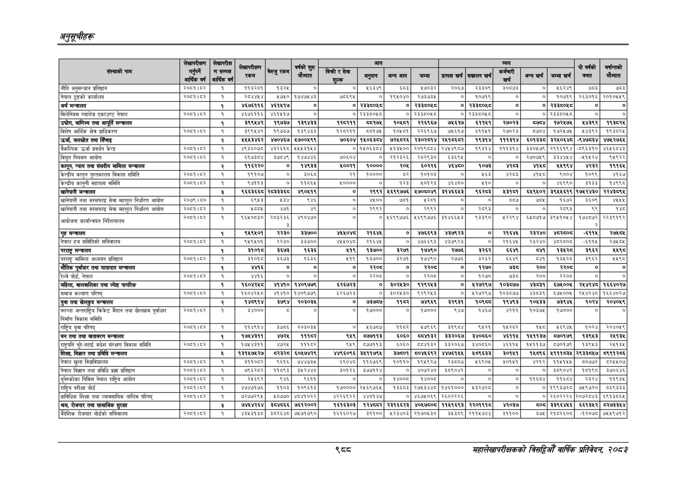

# Page 1050 QA

## Rendered page


## Extracted text

```text
अनुतूचीहरू
९्व्व
सहालेखापरीक्षकको वार्षिक प्रतिवेदन; २०८२

|  | वाणी! |  |  |  |  |  |  |  |  |  |  |  |  |  |  |  |
| --- | --- | --- | --- | --- | --- | --- | --- | --- | --- | --- | --- | --- | --- | --- | --- | --- |
|  | र |  |  |  |  |  |  |  |  |  |  |  |  |  | १ |  |
|  |  |  | रकम |  | ज्ात |  | हु | पमा | पर | त | सा |  |  | पा उार्ब | बचत |  |
| नीति अनुसन्धान प्रतिष्ठान | २०६१।६२ | १ | कपइस्थ। | पइ२४ | ० | ० |  | हडइ | २७०३२ | २०६७ | र२३३०९ | ३०७३ |  | २६२४ | ७५३ | छएइ |
| नेपाल ट्रष्टको कार्यालय | २०६१।४२ | १ | २८४४४४ | २७४० | १७४७८४३ |  | ० | १९४०४० | २७३७३४ | ० | ०७१९ | ० | ० | १०७१९ | २६३०१६ | २०१०४४९ |
| अर्थ मन्त्रालय |  | १ | ४६७६११६ | ४६१४५१७ | ० | ० | र३३५०५८ | ० | २३३८०४५८ | ० | २३३५०५८ | ० | ० | २३३६०५८ | ० | ० |
| 'मिलेनियम च्यालेन्ज एकाउण्ट नेपाल | २०८१।८२ | १ | ४६७६११६ | ४६१५१७ | ० | ० | २३३८०५८ | ० | २३३६०५८ | ० | २३३६०५८ | ० |  | २३३८०५८ | ० |  |
| ' उधोग, वाणिज्य तथा आपूर्ति मन्चालय |  | १ | ३९९४४२ | १९७३७ | १३९४३३ | ब्२२११ | ८१७५ | ०६८१ | २२६९६७ | ७४६१७ | ६११४१ | र२७०२३ | बढ्दा | १७२४७५ | ४३९२ | १९३८२४ |
| विशेष आर्थिक क्षेत्र प्राधिकरण | २०८१।८२ | १ | ३९९४५४२ | १९७३७ | १३९४३३ | १२८२११ | ५१७५ | १०६८१ | २२६९६७ | ७४५६१७ | ६११५१ | २७०२३ | ५७८४ | १७२५७५ | ४३९२ | १९३८२५ |
| उर्जा, जलस्रोत तथा सिँचाइ |  | र्‌ | ४४४३४६२ | ४७०४६७ | ५७००१९९ | ७००४ | १५०६३८४ | ७२४८२६ | २३०२८१४ | २४१८६८२ | १९३१४ | १११३१४ | ६०१३३८ | ३२४०६४८ | -९४७८३४ | ४७८२७६४ |
| बैकल्पिक उर्जा प्रवर्धन केन्द्र | २०८१५३ | १ | ४९३६०७८ | ४३२६१८ | ५४५५३१५३ | ० | १५०६३८४ | ९३०० | २०१९८८४ | २४४५४९८०७ | ९३१४ | १११३१४ | ३३०५७९ | २९१६१९४ | -८९६३१० | ४६४५६८४३ |
| विधुत नियमन आयोग | २०७।६४२ | १ | ६१७३८४ | ३७५४९ | १४७४४६ | ७०६०४ | ० | २१२३२६ | २८२९३० | ६३६९४ | ० | ० | २७०७६९ |  | -१५२४ | ९४९२२ |
| 'कानून, न्याय तथा संसदीय मामिला मन्त्रालय |  |  | ११६२२० | ० | १४९३३ | ५००२१ | १०००० | र०४६ | ०२२६ | ६४५० | १०७३ | हर्‌ |  | ४९९४ | २३२ | १९१६४ |
| केन्द्रीय कानुन पुस्तकालय विकास समिति | २०५१।५२ | १ | १९१०७ | ० | इ०६ड | २१ | ०००० | ८२ | ०१०३ | ० | १४६३ | हर |  | ९००४ | १०९९ | २६४ |
| केन्द्रीय कानुनी सहायता समिति | २०६१।६४२ | १ | ९७११३ | ० | ११६६५ | ४०००० | ० | १२३ | १०१२३ | ४६४८० | ४१० | ० | ० | ४६९० | इ१३३ | १४९९८ |
| खानेपानी मन्त्रालय |  | ३ | ९६६३६६८ |  | ४९०४१९ | ० | २९९२ | ४६९९७७६ | ५७०८०४९ | ३१४६६४३ | द९६२८३ | ३१८१ | ६४९४०२ | ३९४४६१९ | १७४२४३० | २२४३८९४ |
| खानेपानी तथा सरसफाइ सेवा महशुल निर्धारण आयोग | २०७९।६५० | १ | ६९४३ | १३४ | ह४६ | ० | ४४०० | ७५३ | १२५१ | ० | ० | ५५ | ७८४६ | १६७२ | ३६०९ | ४७५ |
| खानेपानी तथा सरसफाइ सेवा महशुल निर्धारण आयोग | २०७१।६२ | १ | ४७७४ | ४७१ |  | ० | २९९२ | ० | २९९२ | ० | २०९३ | ० |  | २६९३ | ९९ | १४८ |
| आयोजना कार्यान्वयन निर्देशनालय | २०६१।४२ | १ | ६६५०८३० | बा | ४९०४७० |  | ० | ४६६९९७७६ | ५६९९७७६ | ३१४६६४३ | ४३० |  |  | ३९४१०४४ | १७४०७२ | २२३९१९२ |
| गृह मन्चालय |  | १ | ९५९५०१ | २२३० | ३३७०० | ४४०४ | २१६४४ | ० | ४७६६९३ | ४३७९२३ | ० | २१६४६ | र३२४० |  | -६११५ |  |
| नेपाल हज समितिको सचिवालय | २०८१।८२ | १ | ६५९५०१ | २२३० | ३३००० | ४५५०४८ | २१६४५ | ० | ४७६६९३ | ४३७९२३ | ० | २१६४५ | २३२४० | २८०८ | -६११५ | २७५८४५ |
| परराष्ट्र मन्चालय |  | १ | इ१०१ड | ३६७३ | १६३६ | ४१९ | १३७०० | ३२७१ | १७४९० | र७७६ |  | ६६४९ | ८ | ३२८ | इ९६२ | १४९८ |
| परराष्ट्र मामिला अध्ययन प्रतिष्ठान | २०८१।४२ | १ | इ१०१८ | ३६७३ | १६३६ | ५१९ | १३७०० | इ२७१ | १७४९० | २७७६ | इ२६२ | ६६४९ | छ्न | प३४२८ | ३९६२ | १५९८ |
| भौतिक पूर्वाधार तथा यातायात मन्त्रालय |  | १ | ४४१६ | ० | ० | ० | र२०८ | ० | र२०६८ | ० | १२७० |  | २०० | ३३०५ | ० | ० |
| रेल्वे बोर्ड, नेपाल | २०८१।८२ | १ | ४४१६ | ० | ० | ० | २२०८ | ० | ३३०८ | ० | १२७० | छ्इ्द | २०० | २२०८ | ० |  |
| 'महिला, बालबालिका तथा ज्येष्ठ नागरिक |  | १ | १६०४२१८ | ४१४१० | १४०९७७९ | ६२६७२३ | ० |  | ९२९२४३ | ० | ४२७२९७ | १०३५७७ |  | ६७४००६ | २४४२४८ | १६६४०२७ |
| समाज कल्याण परिषद्‌ | २००१।४२ | १ | ६०४२४८ | १४१० | १४०९७७९ | ६२६७२३ |  | ३०२४३० | ९२९२४३ | ० | ४२७२९७ | १०३८७७ | ४३८३१ | ६७५००५ | २४४२४८ | १६६४०२७ |
| युवा तथा खेलकुद मन्त्रालय |  | र्‌ | १४८९१४ | ३७९४ | २०३०३४ | ० | ७३७८७ | ११६२ | ७४९६९ | ३२९३१ | १०९८ | १९४९३ | १०५३३ | ७३९४५ | १०२४ | २०४०५९ |
| फाप्ला अन्तराष्ट्रिय किकेट मैदान तथा खेलग्राम पूर्वाधार निर्
```

## Flags
- table_page
- medium_quality_table
