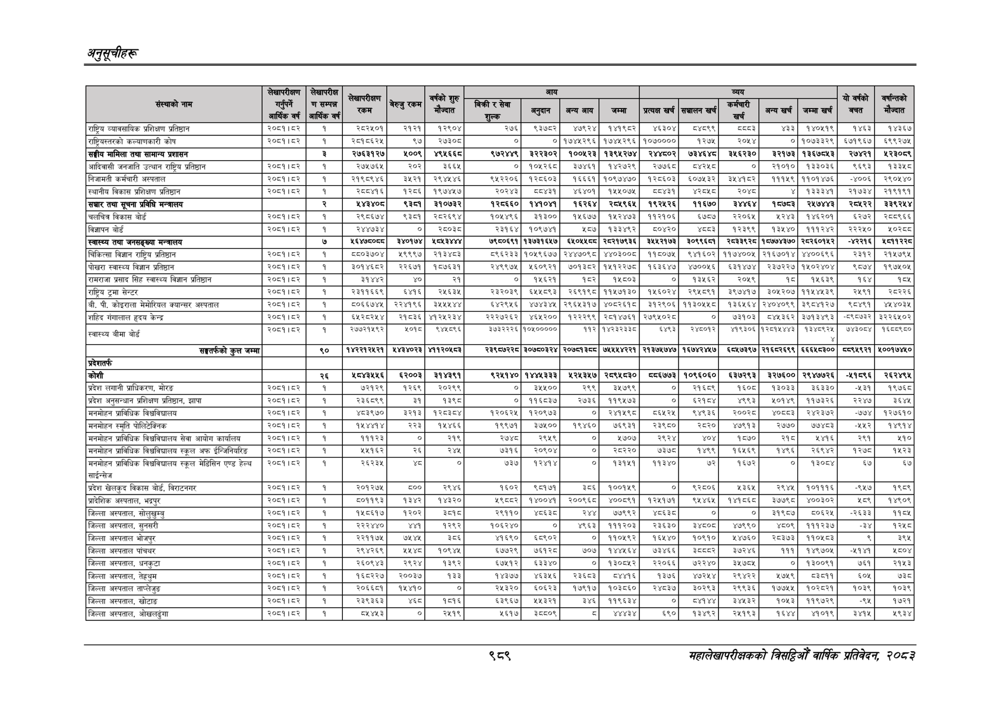

# Page 1051 QA

## Rendered page


## Extracted text

```text
अनुतूचीहरू
९८९
सहालेखापरीक्षकको वार्षिक प्रतिवेदन; २०८२

|  |  | लेगापरीक्ष |  |  |  |  |  |  |  |  |  |  |  |  |  |  |
| --- | --- | --- | --- | --- | --- | --- | --- | --- | --- | --- | --- | --- | --- | --- | --- | --- |
|  |  |  |  |  |  |  |  |  |  |  |  |  |  |  |  |  |
|  |  | आरेकका | रकम |  | में ज्यात |  | मु | पा | बन | र | हा | बा | म | ७ | बचत | मंन्दात |
| राष्ट्रिय व्यावसायिक प्रशिक्षण प्रतिष्ठान | २०६१।४२ | १ | २८२४०१ | २१२१ | १२९०४ | २७६ | ९३७८२ | ४७९२४ | १४१९८२ | ४६३०४ |  |  | ४३३ | १४०५१९ | १४६३ | ४३६७ |
| राष्ट्रियस्तरको कल्याणकारी कोष | २००१।४२ | १ | २०१८६२५ | ९५७ | २७३० | ० | ० | १७४५२९६ | १७४४२९६ | १०७०००० | १२७६ | २०५४ | ० | १०७३३२९ | ६७१९६७ | ६९९२७५ |
| सङ्घीय मामिला तथा सामान्य प्रशासन |  | २ | २७६३१२७ | १००९ | ४९४६६८ | ९७२४४९ | ३२२३०२ | १००६२३ | १३९४२७४ | २४४८०२ | ७३४६४८ | ३४६२३० | ३२१७३ | १३६७८४३ | २७४२१ | ५२३०६९ |
| आदिवासी जनजाति उत्थान राष्ट्र प्रतिष्ठान | २०५१।५२ | १ | २७४७६५ | २०२ | ३६६५ | ० | १०४६२६८ | ३७४६ | १४२७२९ | र२७७६८ | ४२४८ | ० | २१०१० | १३३०३६ | ९६९३ | १३३४८ |
| निजामती कर्मचारी अस्पताल | २०८१।८२ | १ | २१९८९४६ | ड५२१ | २९४४५४६ | ६५२२०६ | १२८६०३ | १६६६१ | १०९७४७० | १२८६०३ | ६०७४५३२ | ३४४१८२ | १११५९ | ११०१४७६ | -४००६ | २९०५४० |
| स्थानीय विकास प्रशिक्षण प्रतिष्ठान | २०८१।८२ | १ | २्८०४१६ | १२८६ |  | २०२४३ | वया४इ१ | ४६४०१ | १५४०७४ | बव०ा४३१ | ४२८५८ | २०४८ | ४ | १३३३४१ | २१७३४ | २१९१९१ |
| सञ्चार तथा सूचना प्रविधि मन्त्रालय |  | र्‌ | ४४३४०८ | ९३८१ | ३१०७३२ | १२८६६० | १४१०४१ | १६२६४ | २०४९६५ | १९२४२६ | ११६७० |  | १७०३ | २५७४४३ | २०६२२ | ३३९२५४ |
| चलचित्र विकास बोर्ड | २०८१५३ | १ | २९८६७४ | ९३८१ | २८२६९४ | १०५४९६ | ३१३०० | १४६७७ | १५२४७३ | ११२१०६ | ६७८७ | २२०६५ | २२४३ | १४६२०१ | ६२७२ | २८८९६६ |
| विज्ञापन बोर्ड | २०६१।८२ | १ | २४४७३४ | ० | २६०३८ | २३१६४ | १०९७५१ | ५८७ | १३३४९२ | ५८०४२० | ४३ | १२३९९ | १३४४० | १११२४२ | २२२५० | ०२८८ |
| स्वास्थ्य तथा जनसङ्ख्या मन्त्रालय |  | ७ |  | ३४०१७४ | ४०४३४४४ | ७९८०६९१ | १३७३१६४७ | ६४०४४८८ | २८२१७९३६ | ३४४२१७३ | ३०९९६०१ | २८३३९२८ | १०७७४३७० | २८२६०१४२ | -४२२१६ | ४च११२२८ |
| चिकित्सा विज्ञान राष्ट्रिय प्रतिष्ठान | २००१।८२ | १ | ब५०३७०४ | ४९९९७ | २३४३ | ८९६२३३ | १०४९६७७ | २४४७०९८ | ४४०३००६ | ११५०७४ | ९४१६०२ | ११७४००५ | २१६७०१४ | ४४००६९६ | २३१२ | २१५७९५ |
| पोखरा स्वास्थ्य विज्ञान प्रतिष्ठान | २०८१।८२ | १ | ३०१४६८२ | २२६७१ | १८७६३१ | २४९९७५ | २५६०९२१ | ७०१३८२ | १५१२२७८ | १६३६४७ | ४७००५६ | ६३१४७४ | २३७२२७ | १५०२४०४ | ९८७४ | १९७५०४५ |
| रामराजा प्रसाद सिंह स्वास्थ्य विज्ञान प्रतिष्ठान | २०८१।८२ | १ | ३१४४२ | ० | २१ | ० | १५६२१ | १५२ | १४५८०३ | ० | १३४५६२ | २०५९ | १८७ | १५६३९ | १६४ | १०५ |
| राष्ट्रिय ट्रमा सेन्टर | २००१।२ | १ | २३११६६९ | ६४१६ | र२४६३४ | २३२०३९ | ६५४८९३ | २६९१९८ | ११४५७१३० | १४६०२४ | २९४८९१ | ३९७४१७ |  | ३०४२०७/११४४४३९ | २४९१ | २८२२६ |
| बी. पी. कोइराला मेमोरियल क्यान्सर अस्पताल | २०८१।८२ | १ | ५०६६७४५ | २२४१९६ | ३४५५४५४४ | ६४२९५६ | ४७४३४५ | २९६४५३१७ | ४०८२६१८ | ३१२९०६ | ११३०५५८० | १३६४५६४ | २४०४०९९ | ३९८४१२७ | ९८४६१ | ४५४०३५ |
| शहिद गंगालाल हृदय केन्द | २००७१।६२ | १ |  |  | ४१२४२३४। | २२२७२६२ | ४६४२०० | १२२२९९ | २०१४७६१ | २७९४०२८ | ० | ७३१०३ | प३६२ | ३७१३४९३ |  | ३२२६४०२ |
| स्वास्थ्य बीमा बोर्ड | २००१।५२ | १ | र७७२१४९२ | ०१८ | ९४६८९६ | ३७३२२२६ | १०४००००० | भर | पराइ | बर |  |  | पसल |  |  |  |
| 'सङ्घतर्फको कुल जम्मा |  | ९० | १४२२१२४२१ | ४४३४०२३ | ४११२०४५८३ | २३९८७२२८ | ३०७८०३२४ | २०७८प३८८ | ७५४५४४२२१ | २१३७४७४७ | १६७४२४४७ | ६८४७३९७ | २१६८२६९९ | ६६६४८३०० | ८८९४९२१ | ४००१७४/५० |
| प्रदेशतर्फ |  |  |  |  |  |  |  |  |  |  |  |  |  |  |  |  |
| कोशी |  | २६ | ४८४३५५६ | ६२००३ | ३१४३९१ | ९२४१४० | १४४६३३३ | ५२४३४७ | २८९४८३० | ८८६७७३ | १०९६०६० | ६३७२९३ | ३२७६०० | २९४७७२६ | -४१६९६ | २६२४९४ |
| प्रदेश लगानी प्राधिकरण, मोरङ | २०८१।८२ | १ | ७२१२९ | १२६९ | ३०३८८ | ० | ३४५४१०० | २६९ | ३४१७९६९ | ० | २१६९ | १६०० | १३०३३ | ३६३३० | ४३ | १९७६८ |
| प्रदेश अनुसन्धान प्रशिक्षण प्रतिष्ान, झापा | २०८१।६२ | १ | २३६८९९ | ३१ | १३९८ | ० | ११६५३७ | २७३६ | ११९४७३ | ० | ६१५४ | ४९९३ | ४०१४ | ११७३२६ | २२४७ | ३६४८ |
| मनमोहन प्राविधिक विश्वविधालय | २०८१।८२ | १ | ४८३९७० | ३२१३ | १२८३८४ | १२०६२५ | १२०९७३ | ० | २४१५९८ | ८६५२५ | ९४९३६ | २००२८ | ४०८८३ | २४२३७२ | ७७४ | १२७६१
```

## Flags
- table_page
- medium_quality_table
