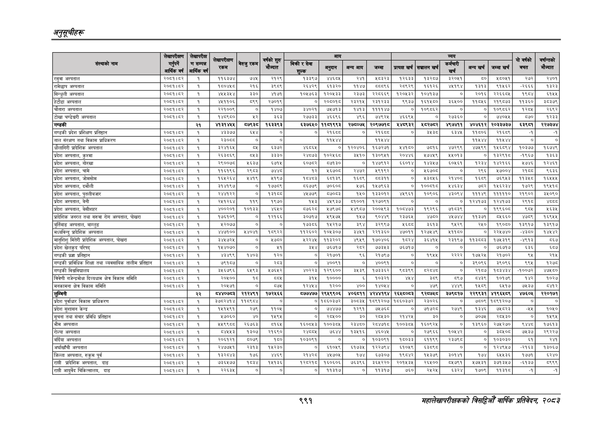

# Page 1053 QA

## Rendered page


## Extracted text

```text
अनुतूचीहरू
९९१
सहालेखापरीक्षकको वार्षिक प्रतिवेदन; २०८२

|  |  |  |  |  |  |  |  |  |  |  |  |  |  |  |  |  |
| --- | --- | --- | --- | --- | --- | --- | --- | --- | --- | --- | --- | --- | --- | --- | --- | --- |
|  |  |  | काफी ' |  |  |  |  |  |  |  |  |  |  |  | \| उ की |  |
|  | पाकिक, |  | रकम | नु पमा | ज्ात |  | ममी | पा | न | गा | सा | ब्ह्बा बा | ना | त साब | बचत | गन्तको मेन्दात |
| रसुवा अस्पताल | २०६१।४२ | १ | १३७४ | ७४५ | २१२६ | १३३९७ | ४४६५ | २४१ | ०३२३ | २६३३ | ३२८७ | ३२०५१ | ० | ८०४१ | र२७२ | २४०१ |
| रामेछाप अस्पताल | २०८१।८२ | १ | १८०४५८ | २१६ | ३६८९ | २६४२६ | १३२० | ११४७ | ५८८९६ | २८९२९ | १६१२६ | ४५१९४ | १३१३ | ९१५६२ | -२६६६ | १३२३ |
| सिन्धुली अस्पताल | २०७।६२ | १ | ४४३४४ | ३३० | २१७१ | १०४७६३ | १२०४३३ | र२३७३ | २२८६६९ | १२०४३२ | १०४१३७ | ० | २०१६ | २२६६ | ब९८५४ | ब१४४ |
| हेटोडा अस्पताल | २०६१।८२ | १ | ४४५११०६ | ८९९ | २७०१९ | ० | २०६०१८ | २३२१५ | २३१२३३ | ९९३७ | १६१५८० | ३६५०० | ११८५६ | २१९८७३ | ११३६० | ३८३७९ |
| 'चोतारा अस्पताल | २०८१।८२ | १ | २२१००९ |  | १४०७ | ३४०२१ | ७५७१३ | १४१३ | ११११४७ | ० | १०६८६२ | ० | ० | १०६८६२ | १२०५ | २६९२ |
| टोखा चण्डेश्वरी अस्पताल | २०६१।८२ | १ | १४८९८० | %२ | ३६३ | २७७३३ | ४६६९६ | ४९६ | ७४९२५ | ४६६९४५ | ० | २७३६० | ० |  | ५७० | १२३३ |
| 'गण्डकी |  | २१ | भ१३१४५४ | ७९३८ | १६३३९३ | ६३७६४० | ११८१९९३ | २७६०७४ | २०९७७१८ | ५४८९३२ | ५८२७५२ | ४९७४११ | ४०४६१२ | २०३३७३७ | ६इ९८१ | २२७३७४ |
| गण्डकी प्रदेश प्रशिक्षण प्रतिष्ठान | २०८१।८२ | १ | ४३३७४ | ०३१ | ० | ० | २१६६८ |  | र२१६६८ | ० | ३५३८ | ६३४५ | ११८०६ | २१६९ |  |  |
| ताल संरक्षण तथा विकास प्राधिकरण | २०६१।६२ | १ | २३०८८ | ० | ० |  | ११४५४४, |  | ११४४४ |  |  |  | ११५४४ | ११५४४ | ० | ० |
| धौलागिरी प्रादेशिक अस्पताल | २०८१।८२ | १ | ३२४१६४५ |  | ६३७२ | ४६८६४५ | ० | १२०४०६ | १६७२७१ | ४१८० | ७०१६ | ४७२९९ | ४७५९९ | १४५६८९४ | १०३७७ | १६७४९ |
| प्रदेश अस्पताल, कुश्मा | २०६१।६२ | १ | २६३५६९ |  | इ३३० | २४७७३ | १०२६ | ३४१० | १३०९७१ | र०४४६ | ७४७९ | ४०१३ |  | बइ२९ड | -९६७ | १३६३ |
| प्रदेश अस्पताल, गोरखा | २०८१।८२ | १ | २९००७८ | २६३७ | ५७१५ | ६०७८२ | ८७१३० | ० | १४७६१२ | ६०१४ | १४३५७ | ०५६१ | १२३४ | १४२१६६ | २७४६ | १२४६१ |
| प्रदेश अस्पताल, चामे | २०८१।८२ | १ | ११६१९६ | २६८३ | ण्श्श्द | १२ | १६७०८ | २४७२ | १९१९२ | ० | ४६७०८ | ० | २९६ | १२७००४ | २१६८ | ९६३६ |
| प्रदेश अस्पताल, जोमसोम | २०५९१५३ | १ | १६४५२६४ | २४१९ | ५१९७ | ४३ | ६०३९ | १६५६ | ५८३११ | ० | ३८५६ | र२१४०८ | १६८६ | ५६९५३ | ११३५० | १६५४५५ |
| प्रदेश अस्पताल, दमौली | २०६१।८२ | १ | ३१४१९७ | ० | १७७५९ | ८६७७९ | ७०६०८ | ५७६ | १४५७९६३ | ० | १००७ | १४६३४ | ७५८२ | १५६२३४ | १७२९ | १९५१८ |
| प्रदेश अस्पताल, पुतलीबजार | २०७१।६२ | १ | २४४१२२ | ० | १३१६ | ४४७९ |  | ४० | १३३०१२ | ४९६१ | ०९०६ | ४३०९४ | १११४९ | १११११० | २९०२ | इ५०९० |
| प्रदेश अस्पताल, बेनी | २००१।४२ | १ | २४१२६४४ | ११६९ | १९७० | १५३ | ४४९३४७ | ०००१ | १२७०९१ | ० | ० | ० | १२४१७३ | १२४१७३ | र९१छ |  |
| प्रदेश अस्पताल, वेसीशहर | २०८१।८२ | १ | ४००२०१ | १०१३३ | ४६५० | ८५२८ | १७९७८ | १४९८७ | २००५९३ | १०८४७३ | १९२९६ | ७१८३९ | ० | १९९६०८ | ६०५ | २६३४ |
| प्रादेशिक जनरल तथा सरुवा रोग अस्पताल, पोखरा | २०८९१५३ | १ | १७६१०९ | ० | १२१६६ | ३०७१७ | १९४५७४५ | १५७ | ९०४४६ | र२३७६५ | ४८८० | रड | ११३७१ | ०६६० | बट | १६९५४ |
| बुर्तिबाङ अस्पताल, बाग्लुङ | २०८१।८२ | १ | ५२०७७ | ० | ० | १७३८६ | १५२१४ | ३९४ | २६९७ | ४६८८ | ३६१३ | ९५२९ | २५० | १९०८० | १३९१७ | १३९१७ |
| मध्यविन्दु प्रादेशिक अस्पताल | २०६१।६४२ | १ | ४४७१०० | १४०४१ | १८९२२ | ११२६०२ | १०४३०७ | ३४६१ | २२१३६० | ४७०११ | १२७४४९ | १११० |  | २२८७४० | -४३६० | १४४२ |
| मातृशिशु मितेरी प्रादेशिक अस्पताल, पोखरा | २०६१।४२ | १ | ३४४७२५ | ० | ४७६० | ४२२४ | ११३२०२ | ४९५९ | १७०४०६ |  | इ६४७१४५ | २३१९७ | प१३चइ | १७८३१९ | -४९१३ | ८६७ |
| प्रदेश खेलकुद परिषद्‌ | २०७३।६२ | १ | १५४०७० | ० | ५१ |  | ७६७१७ | र८२ | ७७३५३ | ७६७१७ | ० | ० | ० | ७६७७ | ६३६ | ६८७ |
| 'गण्डकी प्रज्ञा प्रतिष्ठान | २०८१।८२ | १ | ४३४६९ | १४०३ | १२० | ० | २१७०१ | ९६६ | २१७९७ | ० | १९४४ | २२२२ | १७५२५ | २१७०२ | ३ | २९४ |
| 'गण्डकी प्राविधिक शिक्षा तथा व्यवसायिक तालीम प्रतिष्ठान | २०८१।८२ | १ | ७९१८५७ | ० | २८३ | ० | ४००९१ | ० | ४००९१ | ० | ० | ० | ९०६६ | ३९०९६ | ६९५ | १२७८ |
| 'गण्डकी विश्वविद्यालय | २०८१।८२ | १ | ३५६७६५५ | ४५६३ | ७६५२
```

## Flags
- table_page
- medium_quality_table
