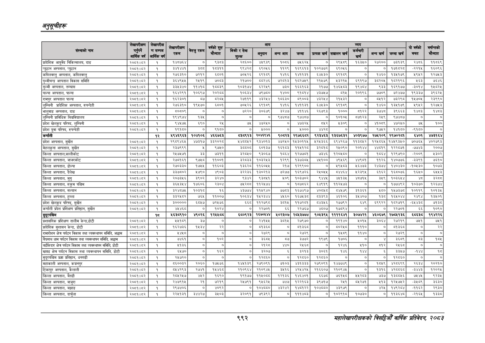

# Page 1054 QA

## Rendered page


## Extracted text

```text
अनुतूचीहरू
९९२
सहालेखापरीक्षकको वार्षिक प्रतिवेदन; २०८२

|  |  |  |  |  |  |  |  |  |  |  |  |  |  |  |  |  |
| --- | --- | --- | --- | --- | --- | --- | --- | --- | --- | --- | --- | --- | --- | --- | --- | --- |
|  |  |  |  |  |  |  |  |  |  |  |  |  |  |  | \| उ बारी |  |
| छ |  |  | रकम |  | लिग ज्ात | १५ १६ \|\|\| | ममी | पा | न | गा | सा | काका बा | ना | त साब | बचत | पन्तको मेन्दात |
| प्रादिशिक आयुर्वेद चिकित्सालय, दाङ | २०७१।६२ | १ | १४०७६४ | ० | ६३६३ | २७०० | ४९३९ | १०६६ | ७६२४ | ० | २९५८९ | ६३४० | २७२००। | ७३१३९ | २४६६ | १५६९ |
| प्युठान अस्पताल, प्युठान | २०६१।६२ | १ | ३४१४४१ |  |  | ९९४२८ | ६९०५ | ११२९ | १६९६१३ | १०२७७२ | ६९०५६ | ० | ० | १७१८२८ | -२२१५ | १६०९६ |
| कपिलवस्तु अस्पताल, कपिलवस्तु | २०६१।६४२ | १ | २७६३१० | ७२१२ | ६८०१ | ७०५२६ | ६९०९ | १४१६ | १४११३१ | ४४३० | ६९१९ | ० | १४६० | १३४१७९ | १९४२ | २७५३ |
| अस्पताल विकास समिति | २०७३।६४२ | १ | ३६४९५५ | २७१९ | ७०८३ | २१७०० | ८०२४६ | ७२०१३ | १८२७५९ | २१४७९ | ३२१५ | ९१९७ | इ८२०५ | १८२१९६ | ६३ | ७६४६ |
| गुल्मी अस्पताल, तम्घास | २००१।६२ | १ | ३३४३४० | १४१८ | ००३९ | ब०इपछ४ | हरर | ७३० | १६६१६३ | २१७४ | १४६४०३ | ब९४८४ | ४३३ | १६९१७७ | -३०१४ | ५८२४ |
| पाल्पा अस्पताल, पाल्पा | २०६१।२ | १ | १६४२९१ | १०६९७ |  | १०६३४ | ७९७५० | १४०० | बु१६१४ | ४३४७४७ | १५ | २०१९६ | ७७०९ | ७२४७७ | १९३३७ | ३९६२४ |
| रामपुर अस्पताल पाल्पा | २०६१।४२ | १ | १६२३०१ | ५७ | ८२०४ | २७११९ | ४३२४४ | १८६३० | ९००३ | ४३२५४ | २१४३२ | ० | १२ | ७३२९८ | १५७०४५ | र२३९९० |
| लुम्बिनी प्रादशिक अस्पताल, रुपन्देही | २०७३।६२ | १ | २७६३१० | १९४७० | ६५०१ | ७०४२६ | ६९१० | १४१६ | १४११३१ | ४४३० | इ९१५९ | ० | १४६० | १३४१७९ | ४९५२ | १२७३ |
| भालुवाङ अस्पताल, दाङ | २०६१।६२ | १ | ०६०९ |  | ० | ७२२० | इ०६७९ | इर४७छ | ११४६ | २६७९३ | १००० | १२२ | इढ४८ | इ९६इ६इ | ४८३ | १४८३ |
| लुम्बिनी प्राविधिक विचवविचालय | २०७१।६४२ | १ | १९४९७४ | १३४ | ० |  | ० | ९७४८७ |  | ० | १००५ |  | र४९ | ९७४० |  | ० |
| प्रदेश खेलकुद परिषद, लुम्बिनी | २००१।५२ | १ | ९४७७ |  | २४ | ७५६ | ४७२४० | ० |  | बर | ३०९ | ० | भग्थ | ४७२४० | ७ | १०० |
| प्रदेश युवा परिषद, रुपन्देही | २००१।४२ | १ | १९१६० | ० | ९१६० | ० | ४००० | ० | ४००० | ४४२८ | ० | ० | ९७५२ | १४१५० | -९१५० | ० |
| कर्णाली |  | १२ | ४९४६९६३ | १०४७१०६ | ४६६७६३ |  | २०४६९४६ | ९०८२३ | २९७६६८२ | ९२३४६३ | १३६७६३२ | ४०३९७७ | २७४२०९ | २९७०२८१ | ६४०१ | ४७३१६४ |
| प्रदेश अस्पताल, सुखेत | २०६१।६४२ | १ | २९८९४६५ | ४७३१७ | इ३२०२८ | श४८०४२ | ९३४०१३ | ४२४० | १४३०११५ | अ२४३६६ | ६९४२६७ | ११३०५२ | १२४८६४ | १४५९३४० | ७०७६ | ४०२७९३ |
| अस्पताल, सुर्खेत | २००१।२ | १ | २३७९९९ | ५ | ९७५० | झच्छण्ङ | ६०१३७ | १६१८३ | १५२८ | ३९ | २४०९० | २०४४ |  | १२२८७१ | ७७४३ | २००७ |
| जिल्ला अस्पताल,कालीकोट | २०५९१५३ | १ | २५७५७१ | ड्इ | ७३११ | ३२८५० | ९३०६७ | १८६४ | १२७७१ | ७३४६ | १२०४५८० | ० | १८६४ | १२९७९० | -२००९ | ४३०२ |
| जिल्ला अस्पताल, जाजरकोट | २०८१।८२ | १ | २७८१६१ | ९७५८ | ११००१ | ३२८३३ | १०३२५३ | १२९९ | १३७३०८४५ | ४४५१०० | ४९५६९ | ४४९८१ | ११२६ | १४०७७६ | -३३९१ | ७५१० |
| जिल्ला अस्पताल, डोल्पा | २०६१।८२ | १ | २७०३३० | १७५५ | ११६०३ | १३६२८ | ११६०५५ | २१७ | १२९९०० | ० | १९४८३ | १६४७३ | २४३७४ | १४०४३० | -१०४५३० | १०७३ |
| जिल्ला अस्पताल, दैलेख | २०६१।६२ | १ | ३३७८०२ | १७९० | ४९०३ | ३२२३६ | १३०२१३ | ७२७७ | १६९७२६ | २४०५५ | ८४६४ | १२३९५ | ६१६२ | १६८०७६ | १६१० | ६५५३ |
| जिल्ला अस्पताल, मुगु | २०७३।६२ | १ | २०७३४६ | ३९०२ | इ२४० | €३३ |  | ३०६ | १०३३०२ | ४५५ | ४३६ | ४७१५ | ३५९ | १०३६४४ | भ्ड | ३२८९ |
| जिल्ला अस्पताल, रुकुम पश्चिम | २०६१।६४२ | १ | ३६४३१४ | १७०६ | २३०४ | ७४२८८ | ११२४७४ | ० | १८७५६२ | ६४९१९ | ११२४७३ | ० |  | १७७४९२ | १०३७० | १२६७४ |
| जिल्ला अस्पताल, सल्यान | २०८१।८२ | १ | ३२४८७५ | १०३१८ | १६ | ४३७७४ | ११५९४० | ७८८३ | १६७४९७ | ४००६८ | ८५७६ | ३१३६१ | २८० | १५७३७८ | १०११९ | १०१३४५ |
| जिल्ला अस्पताल, हुम्ला | २०६१।५२ | १ | इइ२६८२ | ७६४ | ११००४ | १०३४ | पशरष | ४४६० | १६७४३८ | ८३९३ |  | ८४०४ | मइ | १६४०४४ | र४९४ | १३४० |
| प्रदेश खेलकुद परिषद्‌, सुर्खेत | २००१।४२ | १ | ३००००० | ६८५७ | ७२४७६ | ५५ | प१२७९८ | इच्प५ | ११७२६१ | ८४५६ | र२७३९२ | बु | ६९९२२ | १८२७१९ | -६४४३८ड | छाइड |
| कर्णाली प्रदेश प्रशिक्षण प्रतिष्ठान, सुखेत | २०७१।६२ | १ | ४४६८ | ० | १०२४ | ० | २२७०१ | ६६ | २२७६७ | ४८०७ | १७९४ | ० | ० | २२७०१ | ६६ | ०९०
```

## Flags
- table_page
- medium_quality_table
