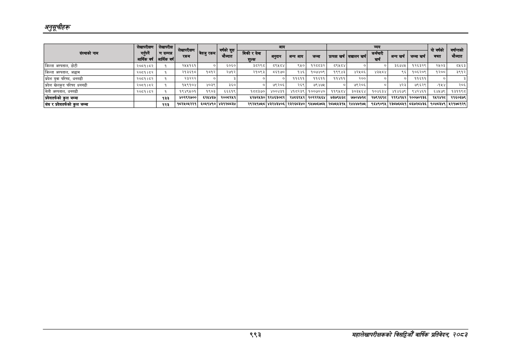

# Page 1055 QA

## Rendered page


## Extracted text

```text
अनुतूचीहरू
९९३
सहालेखापरीक्षकको वार्षिक प्रतिवेदन; २०८२

|                              |          |        |      |            | &#124;              | &#124;         |   &#124; | &#124;        | जन्य &#124;]   | जन्य &#124;]   | जन्य &#124;]   | जन्य &#124;]     | जन्य &#124;]           | यो वर्षको । बचत   | वर्षान्तको मौज्दात   |
|------------------------------|----------|--------|------|------------|---------------------|----------------|----------|---------------|----------------|----------------|----------------|------------------|------------------------|-------------------|----------------------|
| संस्थाको नाम                 |          |        |      |            | बिक्री र सेवा शुल्क |                |          | । जन्म        |                | सञ्चालन खर्च   | e खर्च         | अन्य खर्च &#124; | जम्मा खर्च             | &#124;            |                      |
| जिल्ला अस्पताल, डोटी         |          |        |      |            | ३८२९८               |                |          | &#124; १२८८३२ | ।              | ०              | नु             | ३६७४५&#124;      | १२६३२९]                | २५०३              | ८५६३                 |
| जिल्ला अस्पताल, अछाम         |          |        |      |            | २१०९३               |                |          | १०७४०९        |                | ४२५८६&#124;    | ४३५८४          | ९६&#124;         | १०६२०१३&#124; ।        | १२००              | ३९१२]                |
| प्रदेश युवा परिषद, धनगढी     |          |        |      |            |                     |                |          | ११६११         |                | २००            | ०]             | । ०]             | ११६११                  | ०]                | 2                    |
| प्रदेश खेलकद परिषद धनगढी     | २०८१। ८२ | १५९१०४ | ४०३९ | ३६० &#124; | ०]                  | ७९२०६          |          | ७९४७५         |                | &#124;         |                |                  |                        |                   |                      |
| सेती अस्पताल, धनगढी          |          |        |      | ६६६१९      | १८८३७०              |                |          | १००७०४०       |                | ३०३५६४         | १०४६३४&#124;   | ४१४६७९ &#124;    | ९४२४६१                 | 5४५७९&#124;       | १३११९८               |
| प्रदेशतर्फको कुल जम्मा       |          |        |      | २००८२५१    | २५२७२४५३०           |                |          | २०२२२५६४      |                | ७७०४७१८&#124;  | २७९१६९८&#124;  | २१९४१५२&#124;    | २००७०१३६&#124;         | १५२४२८।           | २१६०६७९              |
| संघ र प्रदेशतर्फको कुल जम्मा |          |        |      | ४३१२८८३४   | २९२५९७५८ &#124;     | ४३२४३४०६&#124; | २३२६८३४० | ९५७७६७८५      |                | २४४४७१७५&#124; | ९६४९०९५        | &#124; २३८७६८५१  | &#124; ८६७२८४३६ &#124; | ९०४८३४९ &#124;    | ५२१७८१२९ &#124;      |
```

## Flags
- table_page
- medium_quality_table
