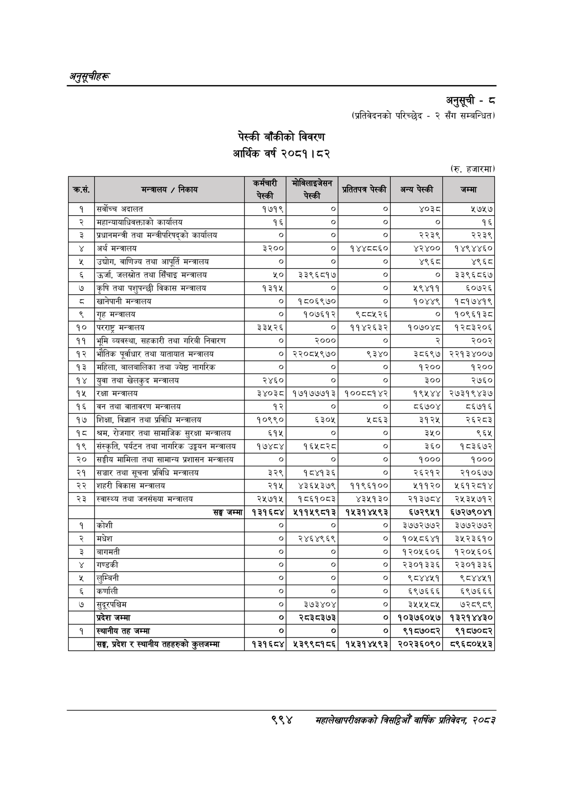

# Page 1056 QA

## Rendered page


## Extracted text

```text
अनुतूचीहरू
पेस्की बाँकीको विवरण आर्थिक वर्ष २०८१। ८२
अनुसूची -८
(प्रतिवेदनको परिच्छेद -२ सँग सम्बन्धित)
(रु. हजारमा)
९९४
सहालेखापरीक्षकको बिद्या वार्षिक प्रतिवेदन २०८३

|  |  |  |  |  |  |  |
| --- | --- | --- | --- | --- | --- | --- |
| उ हस | तर एता रहा” |  | नाक | नानो | उसको |  |
|  |  |  |  |  |  |  |
|  |  |  |  |  |  |  |
| १ | सर्वोच्च अदालत | १७१९ | ० | ० | ४०३८ | ५७५७ |
| २ | नहान्वाधाविवक्ताको कार्यालय | १६ |  | ० | ० | १६ |
| ३ | प्रधानमन्त्री तथा भन्त्रीपरिषद्‌को कार्यालय | ० |  | ० | २२३९ | २२३९ |
| ४ | अर्थ मन्त्रालय | ३२०० | ० | १४४८८६० | ४२४०० | १४९४४६० |
| ५ | उद्चोग, वाणिज्य तथा आपूर्ति मन्त्रालय | ० |  |  | ४९६८ | ४९६८ |
| ६ | उर्जा, जलस्रोत तथा सिँचाइ मन्त्रालय | २० | ३३९६८१७ | ० | ० | ३३९६८६७ |
| ७ | कृषि तथा पशुपन्छी विकास मन्त्रालय | १३१५ | ० | ० | ५९४११ | ६५०७२६ |
| ८ | खानेपानी मन्त्रालय | ० | १८०६९७० |  | १०४४९ | १८१७४१९ |
| ९ | गृह मन्त्रालय | ० | १०७६१२ | ९८८५२६ | ० | १०९६१३८ |
| १० | परराष्ट्र मन्त्रालय | ३३५२६ | ० | ११४२६३२ | १०७०४८ | १२८३२०६ |
| ११ | भूमि व्यवस्था, सहकारी तथा गरिबी निवारण | ० | २००० | ० | २ | २००२ |
| १२ | भौतिक पूर्वाधार तथा यातायात मन्त्रालय | ० | २२०८५९७० | ९३४० | ३८६९७ | २२१३४००७ |
| १३ | महिला, नालबालिका तथा ज्येष्ठ नागरिक | ० |  | ० | १२०० | १२०० |
| १४ | युवा तथा खेलकुद मन्त्रालय | २४६० | ० | ० | ३०० | २७६० |
| १५ | रक्षा मन्त्रालय | ३४०३८ | १७१७७७१३ | १००८८१४२ | १९४५४४ | २७३१९४३७ |
| १६ | वन तथा वातावरण मन्त्रालय | १२ | ० | ० | ८६७०४ | ५६७१६ |
| १७ | शिक्षा, विज्ञान तथा प्रविधि मन्त्रालय | १०९९० | ६३०५ | ५८६३ | ३१२५ | २६२८३ |
| १८ | श्रम, रोजगार तथा सामाजिक सुरक्षा मन्त्रालय | ६१५ | ० | ० | ३५० | ९६५ |
| १९ | संस्कृति, पर्यटन तथा नागरिक उड्डयन मन्त्रालय | १७४८४ | १६४५८२८ | ० | ३६० | १८३६७२ |
| २० | सङ्घीय मामिला तथा सामान्य प्रशासन मन्त्रालय | ० | ० | ० | १००० | १००० |
| २१ | सञ्चार तथा सूचना प्रविधि मन्त्रालय | ३२९ | १८४१३६ | ० | २६२१२ | २१०६७७ |
| २२ | शहरी विकास मन्त्रालय | २१५ | ४३६५३७९ | ११९६१०० | ५११२० | १६१२८१४ |
| २३ | स्वास्थ्य तथा जनसंख्या मन्त्रालय | २५७१५ | १८६१०८३ | ४३५१३० | २१३७८४ | २४५३५७१२ |
|  | सङ्घ जम्मा | १३१६८४ | ५११५९८१३ | १५३१४५९३ | ६७२९५१ | ६७२७९०४१ |
| १ | कोशी |  | ० | ० | ३७७२७७२ | ३७७२७७२ |
| २ | मधेश | ० | २४६४९६९ | ० | १०५८६४१ | ३५२३६१० |
| ३ | बागमती | ० | ० | ० | १२०५६०६ | १२०१६०६ |
| ४ | गण्डकी | ० | ० | ० | २३०१३३६ | २३०१३३६ |
| ५ | लुम्बिनी | ० | ० | ० | ९८४४५१ | ९८४४५१ |
| ६ | कर्णाली |  |  |  | ५९७६६६ | ६९७६६६ |
| ७ | बुदूरपश्चिम | ० | ३७३४०४ | ० | ३५५५ ८४५ | ७२८९८९ |
|  | प्रदेश जम्मा | ० | र८३८३७३ | ० | १०३७६०५७ | १३२१४४३० |
| १ | स्थानीय तह जम्मा | ० | ० | ० | ९१८७०८२र | ९१५७०८२ |
|  | सङ्घ, प्रदेश र स्थानीय तहहरुको वुभसणना | १३१६८४ | ५३९९८१८६ | १५३१४५९३ | २०२३६०९० | ८९६८०५५३ |
```

## Flags
- table_page
- medium_quality_table
