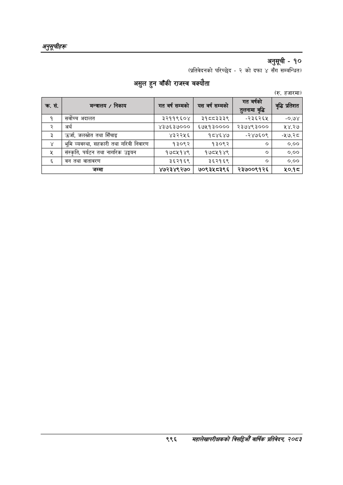

# Page 1058 QA

## Rendered page


## Extracted text

```text
अनुतूचीहरू
अनुसूची -१०
(प्रतिवेदनको परिच्छेद -२ को दफा ४ सँग सम्बन्धित)
असुल हुन बाँकी राजस्व बक्यौता
(रु. हजारमा)
९९६
महालेखापरीक्षकको बाषिक प्रतिवेदन २०८२

|  |  |  |  |  |  |
| --- | --- | --- | --- | --- | --- |
|  |  | पा |  | र |  |
|  |  |  | भुत २४०) १५७ |  | ३% |
|  |  |  |  |  |  |
|  |  |  |  | तुलनामा वृद्ध |  |
| १ | सर्वोच्च अदालत | ३२११९६०४ | ३१८८३३३९ | -२३६२६४ | -०.७४ |
| २ | अर्थ | ४३७६३७००० | ६७४५१३०००० | २३७४९३००० | १४.२७ |
| ३ | उर्जा, जलस्रोत तथा सिँचाइ | ४३२२५६ | १८४६४७ | -२४७६०९ | ४३५ |
| ४ | भूमि व्यवस्था, सहकारी तथा गरिबी निवारण | १३०९२ | १३०९२ | ० | ०.०० |
| ५ | संस्कृति, पर्यटन तथा नागरिक उड्डयन | १७८५१४९ | १७८५१४९ | ० | ०.०० |
|  | वन तथा वातावरण | ३६२१६९ | ३६२१६९ | ० | ०.०० |
|  | जम्मा | ४७२३४९२७० | ७०९३५८३९६ | २३७००९१२६ |  |
```

## Flags
- table_page
- medium_quality_table
