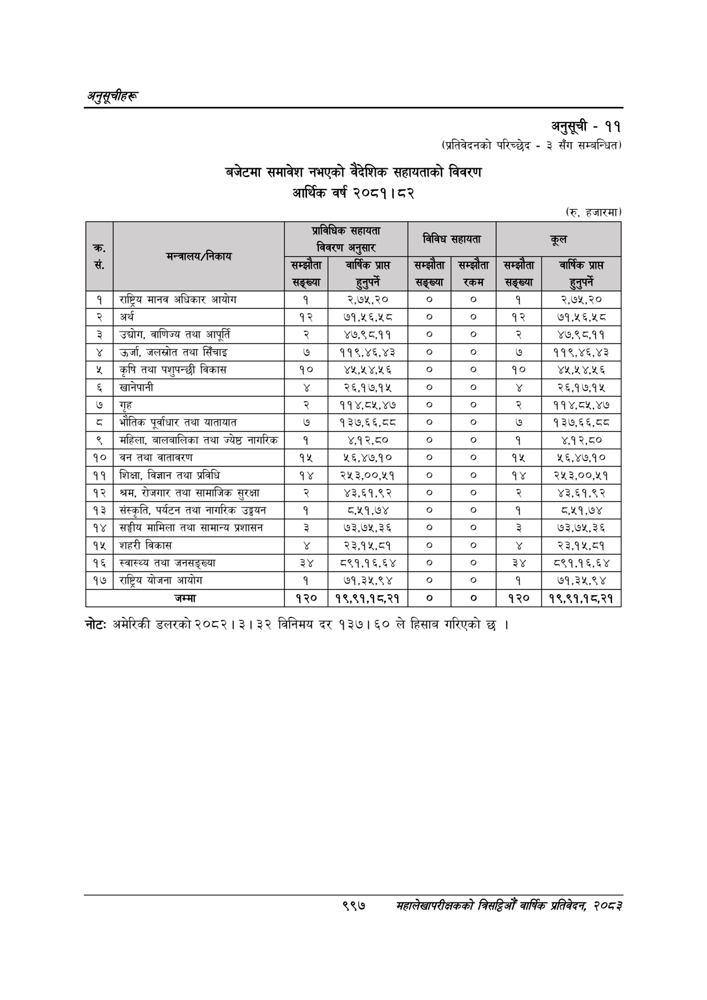

# Page 1059 QA

## Rendered page


## Extracted text

```text
अनुतूचीहरू
अनुसूची -११
(प्रतिवेदनको परिच्छेद -३ सँग सम्बन्धित)
बजेटमा समावेश नभएको वैदेशिक सहायताको विवरण आर्थिक वर्ष २०८१। ८२
(रु. हजारमा)
नोट: अमेरिकी डलरको २०८२। ३। ३२ विनिमय दर १३७। ६० ले हिसाव गरिएको छ |
९९७
सहालेखापरीक्षकको वार्षिक प्रतिवेदन; २०८२

(रु. हजारमा)

| > सं.     | मन्त्रालय/निकाय                     | प्राविधिक सहायता ता   | प्राविधिक सहायता ता     | विविध सहायता        | विविध सहायता     | -                 | -                         |
|-----------|-------------------------------------|-----------------------|-------------------------|---------------------|------------------|-------------------|---------------------------|
| > सं.     | मन्त्रालय/निकाय                     | < सम्झे सङ्ख्या       | वार्षिक प्राप हुनुपर्ने | सम्झ सङ्ख्या &#124; | सम्झे &#124; रकम | झे &#124; सङ्ख्या | वार्षिक प्राप्त हुनुपर्ने |
| १ &#124;  | राष्ट्रिय मानव अधिकार आयोग          | &#124; १              | &#124; २,.७५.२०         | ०                   | &#124; ०         | &#124; १          | २,७५,२०                   |
| २ &#124;  | अर्थ                                | १२                    | ७१,२६,२८                | &#124; ० ।          | &#124; ० &#124;  | १२                | ७१,५२६,२५८                |
| ३         | &#124; उद्योग, वाणिज्य तथा आपूर्ति  | २                     | ४७,९८,११                | &#124; ० ।          | &#124; ० &#124;  | २                 | ४७,९८,११                  |
| ४ &#124;  | उर्जा, जलस्रोत तथा सिँचाइ           | ७                     | ११९,४६,४३               | &#124; ० ।          | &#124; ० &#124;  | ७                 | ११९,४६,४३                 |
| ५         | &#124; कृषि तथा पशुपन्छी विकास      | १०                    | ४५,५४.५६                | &#124; ०            | &#124; o         | &#124; १०         | ४५, ४,५६                  |
| &         | खानेपानी                            | ¥                     | २६,१७,१५                | &#124; ० &#124;     | &#124; ० ।       | ¥                 | २६,१७,१५                  |
| ७ &#124;  | &#124; गृह                          | २                     | ११४,८१.४०७              | &#124; ०            | &#124; o         | &#124; २          | ११४,८५,४७                 |
| ८ &#124;  | भौतिक पूर्वाधार तथा यातायात         | ७                     | १३७,६६,८८               | &#124; ० ।          | &#124; ० &#124;  | ७                 | १३७,६६,०८                 |
| ९ &#124;  | महिला, बालबालिका तथा ज्येष्ठ नागरिक | &#124; १ &#124;       | ४,१२,८०                 | &#124; ० ।          | &#124; ० &#124;  | १                 | ४,१२,८०                   |
| १०        | &#124; वन तथा वातावरण               | १५                    | ५६,४७१०                 | &#124; ०            | &#124; ०         | &#124; १५         | ₹६,४७,१०                  |
| ११        | शिक्षा, विज्ञान तथा प्रविधि         | १४                    | २५३,००,५१               | &#124; ० ।          | &#124; ० &#124;  | १४                | २५३,००,५१                 |
| १२ &#124; | श्रम, रोजगार तथा सामाजिक सुरक्षा    | R                     | ४३,६१,९२                | &#124; ० &#124;     | &#124; ० ।       | २                 | ४३,६१,९२                  |
| १३        | संस्कृति, पर्यटन तथा नागरिक उड्न    | &#124; १ &#124;       | ८.११.७४                 | &#124; ०            | &#124; o         | &#124; १          | ८,११,७४                   |
| १४ &#124; | सङ्घीय मामिला तथा सामान्य प्रशासन   | 3                     | w38                     | &#124; ०            | &#124; o         | &#124; ३          | ७३,७५,३६                  |
| १५        | &#124; शहरी विकास                   | ¥                     | 39481                   | &#124; ०            | &#124; ० [       | ४                 | २३,१५,८१                  |
| १६        | स्वास्थ्य तथा जनसङ्ख्या             | ३४                    | 5९१,१६, ६४              | &#124; ० ।          | &#124; ० ।       | ३४                | ८5९१,१६,६४                |
| १७        | &#124; राष्ट्रिय योजना आयोग         | &#124; १              | &#124; ७१,३५.९४         | 
```

## Flags
- table_page
- low_quality_table
