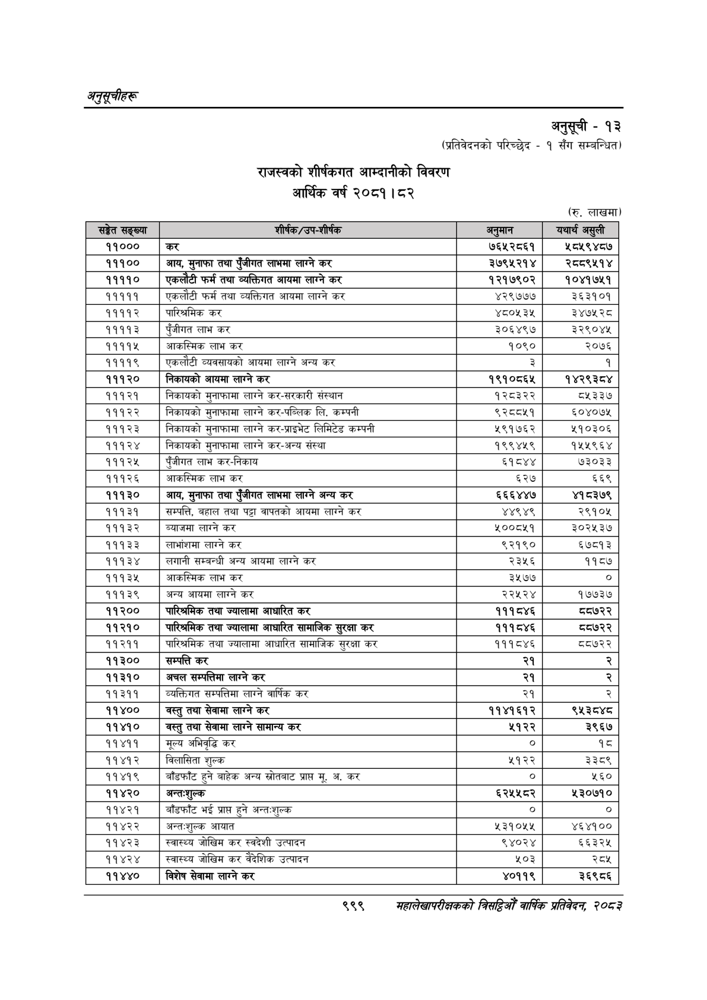

# Page 1061 QA

## Rendered page


## Extracted text

```text
अनुतूचीहरू
अनुसूची -१३
(प्रतिवेदनको परिच्छेद -१ सँग सम्बन्धित)
आर्थिक वर्ष २०८१। ८२ राजस्वको शीर्षकगत आम्दानीको विवरण
(रु. लाखमा)
९९९
सहालेखापरीक्षकको वार्षिक प्रतिवेदन; २०८२

|  |  |  |  |
| --- | --- | --- | --- |
| सङ्गत |  | अनुमा | बचाच असुली |
| ११००० | कर | ७६५२८६१ | ५८४५९४८७ |
| १११०० | आय, मुनाफा तथा पुँजीगत लाभमा लाग्ने कर | ३७९५२१४ | २८०९५१४ |
| ११११० | एकलौटी फर्म तथा व्यक्तिगत आयमा लाग्ने कर | १२१७९०२ | १०४१७५१ |
| १११११ | एकलौटी फर्म तथा व्यक्तिगत आयमा लाग्ने कर | ४२९७७४ | ३६३१०१ |
| ११११२ | पारिश्रमिक कर | ४८०५३५ | ३४७५२८ |
| ११११३ | पुँजीगत लाभ कर | ३०६४९७ | ३२९०४४५ |
| ११११५ | आकस्मिक लाभ कर | १०९० | २०७६ |
| ११११९ | एकलौटी ब्यवसाथको आयमा लाग्ने अन्य कर | ३ |  |
| १११२० | निकाबको आयमा लाग्ने कर | १९१०८६५ | १४२९३८४ |
| १११२१ | निकाथको मुनाफामा लाग्ने कर-सरकारी संस्थान | १२८३२२ | ८५३३७ |
| १११२२ | निकाथको मुनाफामा लाग्ने कर-पब्लिक लि. कम्पनी | ९२८८५१ | ६०४०७५ |
| १११२३ | निकाथको मुनाफामा लाग्ने कर-प्राइभेट लिमिटेड कम्पनी | ५९१७६२ | ५१०३०६ |
| १११२४ | निकाथको मुनाफामा लाग्ने कर-अन्य संस्था | १९९४५९ | १५५९६४ |
| १११२५ | पुँजीगत लाभ कर-निकाय | ६१८४४ | ७३०३३ |
| १११२६ | आकस्मिक लाभ कर | ६२७ | ६६९ |
| १११३० | आय, मुनाफा तथा पुँजीगत लाभमा लाग्ने अन्य कर | ६६६४४७ | ४१८३७९ |
| १११३१ | सम्पत्ति, बहाल तथा पट्टा वापतको आयमा लाग्ने कर | ४४९४९ | २९१०४५ |
| १११३२ | ब्याजमा लाग्ने कर | ५००८५१ | ३०२५३७ |
| १११३३ | 'लाभांशमा लाग्ने कर | ९२१९० | ६७८१३ |
| १११३४ | 'लगानी सम्बन्धी अन्य आयमा लाग्ने कर | २३५६ | ११८४ |
| १११३५ | आकल्तिक लाभ कर | ३५७७ | ० |
| १११३९ | अन्य आयमा लाग्ने कर | २२५२४ | १७७३७ |
| ११२०० | तथा ज्यालामा आधारित कर | १११८४६ | ८७२२ |
| ११२१० | पारित्रमिक तथा ज्यालामा आधारित सामाजिक सुरक्षा कर | १११८४६ | ८७२२ |
| ११२११ | पारिश्रमिक तथा ज्यालामा आधारित सामाजिक सुरक्षा कर | १११८४६ | ८८७२२ |
| ११३०० | सम्पत्ति कर | २१ | २ |
| ११३१० | अचल सम्पत्तिमा लाग्ने कर | २१ |  |
| १९३९९ | व्यक्तिगत सम्पत्तिमा लाग्ने वार्षिक कर | २१ | २ |
| ११४०० | वस्तु तथा सेवामा लाग्ने कर | ११४१६१२ | ९५३८४८ |
| ११४१० | वस्तु तथा सेवामा लाग्ने सामान्य कर | ५१२२ | ३९६७ |
| ११४११ | मूल्य अभिवृद्धि कर | ० | १८ |
| ११४१२ | विलासिता शुल्क | ५१२२ | ३३८९ |
| ११४१९ | बाँडफाँट हुने बाहेक अन्य स्रोतबाट प्राप्त मू, अ. कर | ० | ५६० |
| ११४२० | अन्तःशुल्क | ६२५४५८२ | ५३०७१० |
| ११४२१ | बाँडफाँट भई प्राप्त हुने अन्तःशुल्क | ० | ० |
| ११४२२ | अन्तःशुल्क आयात | ४३९०४४ | ४६४१०० |
| ११४२३ | स्वास्थ्य जोखिम कर स्वदेशी उत्पादन | ९४०२४ | ६६३२४५ |
| ११४२४ | स्वास्थ्य जोखिम कर वैदेशिक उत्पादन | ५०३ | २्व्शू |
| ११४४० | विशेष सेवामा लाग्ने कर | ४०११९ | ३६९८६ |
```

## Flags
- table_page
- medium_quality_table
