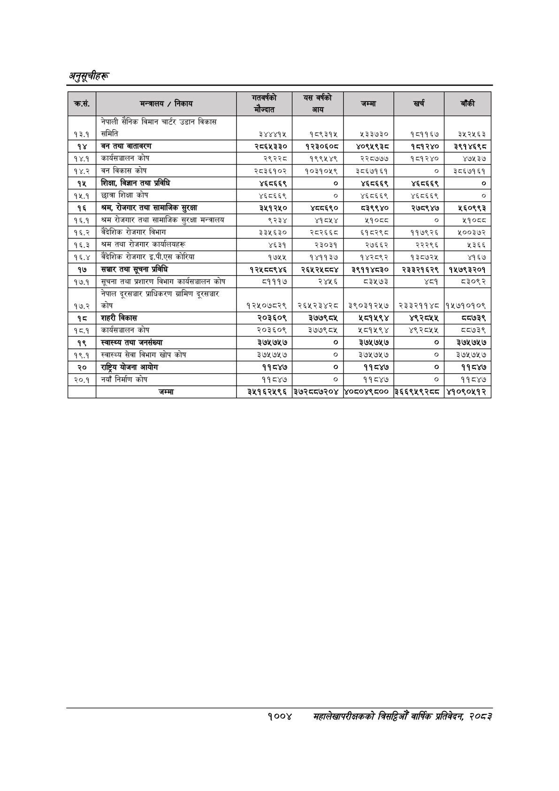

# Page 1066 QA

## Rendered page


## Extracted text

```text
अनुतूचीहरू
१००४ महालेखापरीक्षकको बिसय वाक प्रतिवेदन २०८२

|  | पकन | 'ए॥' |  |  |  |  |
| --- | --- | --- | --- | --- | --- | --- |
|  |  |  |  |  |  |  |
|  |  | बन ९ |  |  |  |  |
| १३.१ | नेपाली सैनिक विमान चार्टर उडान विकास समिति | ३४४४१५ | १८९३१५ | १३३७३० | १५११६७ | ३५२५६३ |
| १४ | वन तथा वातावरण | २८६५३३० | १२३०६०८ | ४०९५९३८ | १८७१२४० | ३९१४६९८ |
| १४.१ | कार्यक्षयालन कोष | २९२२८ | १९९५४९ | २२८७७७ | १८१२४० | ४७५३७ |
| १४.२ | बन विकास कोष | २८३६१०२ | १०३१०५९ | ३८६७१६१ | ० | ३८६७१६१ |
| १५ | शिक्षा, विज्ञान तथा प्रविधि | ४६८६६९ | ० | ४६८६६९ | ४६८६६९ | ० |
| १५.१ | छात्रा शिक्षा कोष | ४६८६६९ | ० | ४६८६६९ | ४६८६६९ | ० |
| १६ | श्रम, रोजगार तथा सामाजिक सुरक्षा | ३५१२५० | ४८८६९० | ८३९९४० | २७८९४७ | १६०९९३ |
| १६.१ | श्रम रोजगार तथा सामाजिक सुरक्षा मन्त्रालय | ९२३४ | ४१८५४ | २१०८८ | ० | ५१०८८ |
| १६.२ | बैदेशिक रोजगार विभाग | ३३५६३० | २८२६६८ | ६१८२९८ | ११७९२६ | ५००३७२ |
| १६.३ | श्रम तथा रोजगार क१र्याल४हरू | ४६३१ | २३०३१ | २७६६२ | २२२९६ | २३६६ |
| १६.४ | बैदेशिक रोजगार इ.पी.एस कोरिया | १७५५ | १४११३७ | १४२८९२ | १३८७२५ | ४१६७ |
| १७ | सञ्चार तथा सूचना प्रविधि | १२४८०८९४६ | २६५२४५८०४ | ३२९११४८३० | २३३२१६२९ | १४५७९३२०१ |
| १७.१ | सूचना तथा प्रशारण विभाग कार्वसञ्चालन कोष | ८१११७ | २४५६ | ८३५७३ | ४८१ | ८३०९२ |
| १७.२ | नेपाल दूरसञ्चार प्राधिकरण ग्रामिण दूरसञ्चार कोष | १२५०७८२९ | २६५२३४२८ | ३९०३१२५७ | २३३२११४८ | १५७१०१०९ |
| १ | शहरी बिकास | २०३६०९ | ३७७९८५ | ५८१५९४ | ४९२८५५ | ८७३९ |
| १८६.१ | कार्यक्यरालन कोष | २०३६०९ | ३७७९८५ | ५८१५९४ | ४९२८५४ | ८८७३९ |
| १९ | स्वास्थ्य तथा जनसंख्या | ३७५७५७ | ० | ३७५७५७ | ० | ३७५७५७ |
| १९.१ | स्वास्थ्य सेवा विभाग खोप कोष | ३७५७५७ | ० | ३७५७५७ | ० | ३७५७५७ |
| २० | राष्ट्रिय योजना आयोग | ११८४७ | ० | ११८४७ | ० | ११८४७ |
| २०.१ | नयाँ निर्माण कोष | ११८४७ | ० | ११८४७ | ० | ११८४४ |
|  | जम्मा | ३५१६२५९६ | ३७२८८७२०४ | ४०८०४९८०० | ३६६९५९२८०८ | ४१०९०५१२ |
```

## Flags
- table_page
- medium_quality_table
