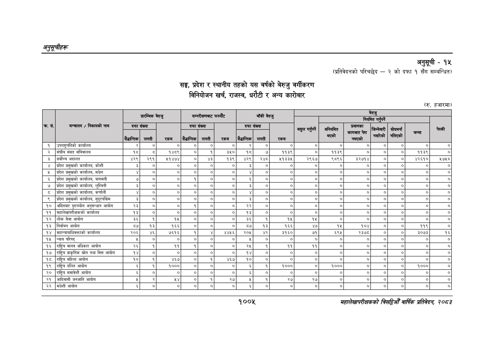

# Page 1067 QA

## Rendered page


## Extracted text

```text
अनुतूचीहरू
सङ्घ, प्रदेश र स्थानीय तहको यस वर्षको बेरुजु वर्गीकरण विनियोजन खर्च, राजस्व, धरौटी र अन्य कारोबार
अनुसूची -१५
(प्रतिवेदनको परिचछेद -२ को दफा १ सँग सम्बन्धित)
(रु. हजारमा)
१००५
सहालेखापरीक्षकको बिदिओँ वार्षिक प्रतिवेदन २०८२

(रु. हजारमा)

| क्र. सं.   | मन्त्रालय / निकायको नाम                        | प्रारम्भिक बेरुजु       | प्रारम्भिक बेरुजु   | प्रारम्भिक बेरुजु   | सम्परीक्षणबाट फस्यौट   | सम्परीक्षणबाट फस्यौट   | बाँकी बेरुजु   | बाँकी बेरुजु   | बेरुजु नियमित गर्नुपर्ने   | बेरुजु नियमित गर्नुपर्ने   | बेरुजु नियमित गर्नुपर्ने   | बेरुजु नियमित गर्नुपर्ने   | बेरुजु नियमित गर्नुपर्ने                    | बेरुजु नियमित गर्नुपर्ने   | बेरुजु नियमित गर्नुपर्ने   |
|------------|------------------------------------------------|-------------------------|---------------------|---------------------|------------------------|------------------------|----------------|----------------|----------------------------|----------------------------|----------------------------|----------------------------|---------------------------------------------|----------------------------|----------------------------|
| क्र. सं.   | मन्त्रालय / निकायको नाम                        | दफा संख्या              | दफा संख्या          | &#124;              | दफा संख्या             | दफा संख्या             |                |                | गर्नुपर्ने । i             | अनियमित                    | प्रमाणका कागजात पेश        | जिम्मेवारी &#124;          | &#124; सोधभर्ना &#124; नलिएको &#124; नलिएको | ना &#124;                  | I                          |
| क्र. सं.   | मन्त्रालय / निकायको नाम                        | सैद्धान्तिक &#124; लगती |                     | &#124;              | सैद्धान्तिक            | लगती                   |                |                | गर्नुपर्ने । i             | अनियमित                    | नभएको                      | नसारेको सारेको             |                                             | ना &#124;                  | I                          |
| [१         | उपराष्ट्रपतिको कार्यालय                        | २                       | ०                   | ०                   | &#124; ४०]             | ०]                     |                |                | [४]                        | ०                          | ०                          | ०                          | ०                                           | ०                          | ०]                         |
| २          | &#124;संघीय संसद सचिवालय                       | १८                      | 3                   | १४८९ ।              | ०]                     | १                      |                | ।              | ०]                         | ११३९ ।                     | ०] ।                       | &#124;                     | ०]                                          | ११३९ &#124;                | ०]                         |
| ३          | [सर्वोच्च अदालत                                | ४२९&#124;               | २९१                 | wivey&#124;         | ०                      | ४३                     |                |                | २९६७                       | ९८९६                       | ३२७१४&#124;                | ०] o]                      | ०]                                          | ४२६१०                      | २७५८                       |
| ४          | प्रदेश प्रमुखको कार्यालय, कोशी                 | ३                       | ४०                  | ०                   | ०                      | ०]                     |                |                | [                          | ० [                        | ०                          | ० [&#124;                  | ०                                           | ०                          | ०]                         |
| ५          | प्रदेश प्रमुखको कार्यालय, मधेश                 | ¥ &#124;                | ०] ।                | ०] ।                | ०]                     | [०]                    |                | [              | ०] ०]                      | 
```

## Flags
- table_page
- medium_quality_table
