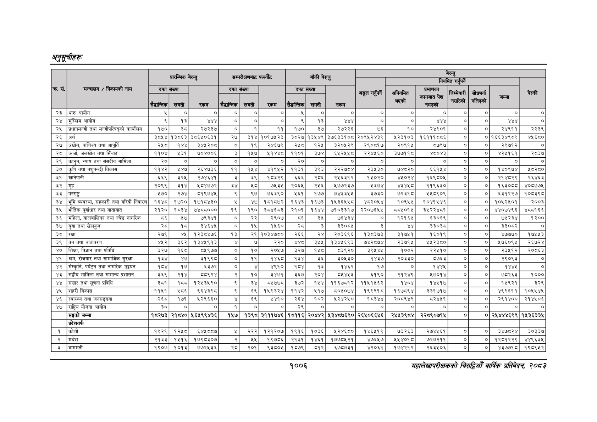

# Page 1068 QA

## Rendered page


## Extracted text

```text
अनुतूचीहरू
१००६
सहालेखापरीक्षकको वार्षिक प्रतिवेदन २०८२

| क्र. सं.   | मन्त्रालय / निकायको नाम                        | प्रारम्भिक बेरुजु     | प्रारम्भिक बेरुजु   | प्रारम्भिक बेरुजु   | सम्परीक्षणबाट फस्यौंट   | सम्परीक्षणबाट फस्यौंट   | सम्परीक्षणबाट फस्यौंट   | बाँकी बेरुजु        | बाँकी बेरुजु   | बाँकी बेरुजु   |                 | b &#124;      | b &#124;                         | b &#124;               | b &#124;         | b &#124;              | T       |
|------------|------------------------------------------------|-----------------------|---------------------|---------------------|-------------------------|-------------------------|-------------------------|---------------------|----------------|----------------|-----------------|---------------|----------------------------------|------------------------|------------------|-----------------------|---------|
| क्र. सं.   | मन्त्रालय / निकायको नाम                        | दफा संख्या            | दफा संख्या          | रकम                 | दफा संख्या &#124;       | दफा संख्या &#124;       |                         | दफा संख्या          | दफा संख्या     | रकम            | असुल गर्नुपर्ने | अनियमित प्ले  | प्रमाणका कागजात पेश नभएको &#124; | जिम्मेवारी &#124; पाको | सोधभनना &#124; T | न &#124;              | T       |
| क्र. सं.   | मन्त्रालय / निकायको नाम                        | सैद्धान्तिक &#124;    | लगती                | रकम                 | ।ुसैद्धान्तिक&#124;     | लगती                    | रकम                     | ।ुसैद्धान्तिक&#124; | लगती           | रकम            | असुल गर्नुपर्ने | अनियमित प्ले  |                                  |                        | सोधभनना &#124; T | न &#124;              | T       |
| २३         | थारु आयोग                                      | 4                     | । ०] ।              | ०] ।                | ०] &#124;               | ०] &#124;               | ०]                      | ्‌                  | &#124; ०]      | । ०]           | ०] &#124;       | ०]            | ०]                               | ०] &#124; ०]           | &#124;.          | ०] &#124;             | ०]      |
| २४         | &#124;मुस्लिम आयोग                             | <                     | 93                  | ¥YY                 | ‘                       |                         |                         |                     |                | ।              |                 | _             | । ४४४ &#124;                     | ०] &#124; ०]           |                  | ४४४ &#124;            | ०]      |
| २५         | प्रधानमन्त्री तथा मन्त्रीपरिषद्को कार्यालय     | १७०                   | ३८                  | २७२३७ &#124;        | ०]                      |                         | ११                      |                     |                |                |                 | [१०] o        | २४९०१ ।                          | ०] &#124; ०]           |                  | २४९११                 | २२३९    |
| २६         | &#124;अर्थ                                     | ३८५४&#124;१३८६३&#124; |                     | ३८६५०६३१            | २७                      |                         | १०१७५२३                 |                     |                |                |                 | ५२३१०३]       | १६१११८८६&#124;                   |                        |                  | ०]१६६३४९८९]           | wxsco   |
| २७         | &#124;उद्योग, वाणिज्य तथा आपूर्ति              | २५८]                  | १४४]                | ३४५२०८              | ०]                      |                         | २४६७९                   |                     |                |                |                 | २०९१५         | 5७९५                             | ०] ०]                  | o]               | २९७१२]                | ०]      |
| २८         | &#124;उर्जा, जलस्रोत तथा सिँचाइ                | ११०४&#124;            | 439&#124;           | ७०४००६              | 3                       |                         | ५१४४८                   |                 
```

## Flags
- table_page
- medium_quality_table
