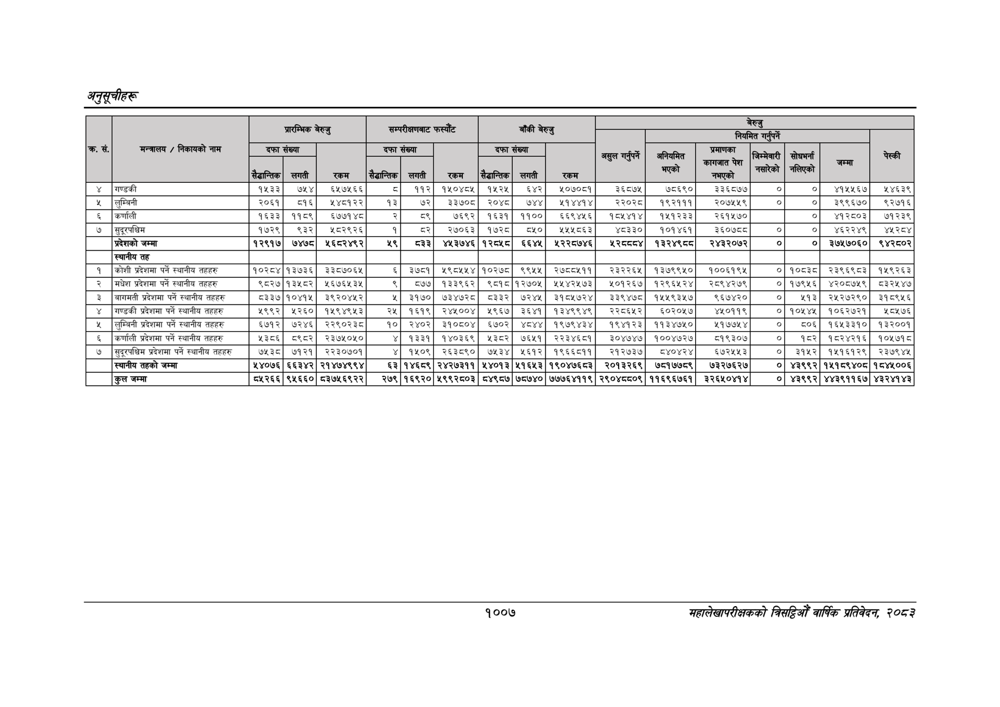

# Page 1069 QA

## Rendered page


## Extracted text

```text
अनुतूचीहरू
१००७
सहालेखापरीक्षकको वार्षिक प्रतिवेदन २०८२

|          |                                             | प्रारम्भिक बेरुजु   | प्रारम्भिक बेरुजु     | प्रारम्भिक बेरुजु   | सम्परीक्षणबाट फस्यौंट   | सम्परीक्षणबाट फस्यौंट   | सम्परीक्षणबाट फस्यौंट   | बाँकी बेरुजु       | बाँकी बेरुजु     | बाँकी बेरुजु    | बेरुजु          | बेरुजु         | बेरुजु                    | बेरुजु            | बेरुजु            | बेरुजु               | बेरुजु   |
|----------|---------------------------------------------|---------------------|-----------------------|---------------------|-------------------------|-------------------------|-------------------------|--------------------|------------------|-----------------|-----------------|----------------|---------------------------|-------------------|-------------------|----------------------|----------|
| क्र. सं. | मन्त्रालय / निकायको                         | दफा संख्या          | दफा संख्या            | रकम                 | दफा संख्या              | दफा संख्या              |                         | दफा संख्या         | दफा संख्या       | दफा संख्या      | असुल गर्नुपर्ने | &#124;         | &#124;                    | गर्नुपर्ने &#124; | गर्नुपर्ने &#124; | न &#124;             | चेस्की   |
| क्र. सं. | मन्त्रालय / निकायको                         | सैद्धान्तिक &#124;  | लगती                  | रकम                 | सैद्धान्तिक             |                         | रकम                     |                    |                  | रकम             | असुल गर्नुपर्ने | अनियमित प्ले   | प्रमाणका कागजात पेश नभएको | जिम्मेवारी पाको   | सोधभना &#124; T   | न &#124;             | चेस्की   |
| ४        | गण्डकी                                      | १५३३&#124;          | ७५४]                  | ६५७५६६              | c                       |                         | १५०४८५                  |                    |                  | २०७०८१          |                 | ७८६९० ३३६८७७   |                           |                   | o                 | ४१५५६७]              | १४६३९    |
| ५        | [लुम्बिनी                                   | २०६१&#124;          | ८०१६]                 | १५४८१२२             | १३                      |                         | ३३७०८                   |                    |                  | २१४४१४          |                 | १९२१११ २०७५५९  |                           | । &#124;          | o                 | ३९९६७०]              | ९२७१६    |
| ६        | &#124;कर्णाली                               | १६३३]               | ११८९]                 | ६७७१४८              | २                       | ८९                      | ७६९२&#124;              | १६३१               | ११००]            | ६६९४५६&#124;    | १८५४१४&#124;    | १५१२३३         | २६१५७०                    | ।                 | o]                | ४१२८०३]              | ७१२३९    |
| ७        | &#124;सुदूरपश्चिम                           | १७२९]               | ९३२]                  | ५८२९२६&#124;        | १]                      | बर२]                    | २७०६३]                  | &#124; १७२८]       | cwo&#124;        | २५४८६३          | ४८३३०&#124;     | १०१४६१         | ३६०७८८                    | &#124;            | o                 | ४६२२४९]              | ४५२८४    |
|          | प्रदेशको जम्मा                              | १२९१७&#124;         | ७४७८&#124;            | ५६८२४९२             | ५९]                     | ८३३]                    | ४५३७४६[१२८५८&#124;      |                    | ६६४५]            | ५२२८७४६]        | ५२८४]           | १३२४९८८&#124;  | २४३२०७२]&#124;            | ०]                | ०                 | ३७४५७०६०]&#124;      | ९४२८०२   |
|          | स्थानीय तह                                  |                     |                       |                     |                         |                         |                         |                    |                  |                 |                 |                |                           |                  
```

## Flags
- table_page
