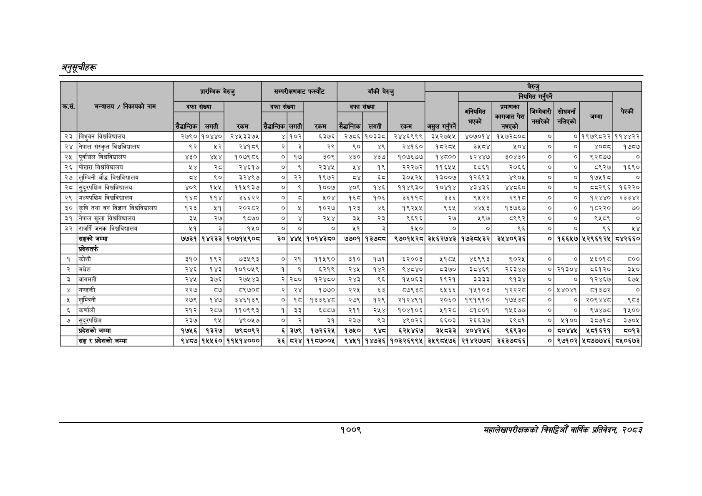

# Page 1071 QA

## Rendered page


## Extracted text

```text
अनुतूचीहरू
१००९
सहालेखापरीक्षकको वार्षिक प्रतिवेदन २०८२

| २३ | बिभुवन विच्वविधालय | २७९० | १०४४० | २४५३३७५ | ४ | १०२ | ५३७६ | २७८६ | १०३३८ | २४४६९९९ | ३५२७५५ | ४०७०१४ | १५७२८०८ | ० | ० | १९७९८२२ | ११४४२२ |
| --- | --- | --- | --- | --- | --- | --- | --- | --- | --- | --- | --- | --- | --- | --- | --- | --- | --- |
| २४ | नेपाल संस्कृत विच्वविद्यालय | ९२ | २२ | २४१८९ | २ | ३ | २९ | ९० |  | २४१६० | १८२८५ |  | ०४ | ० | ० | ४०८८ | १७८७ |
| २५ | पूर्वाञ्चल विचविद्यालय | ४३० | ४षट | १०७९८६ | ० | १७ | ३०९ | ४३० | ४३७ | १०७६७७ | १४८०० | ६२४४७ | ३०४३० | ० | ० | ९२८७७ | ० |
| २६ | पोखरा विश्वविद्यालय | २४ | रड |  | ० | ९ | २३४५ | ४ | १९ | २२२७२ | ११६५५ | ६८६१ | २०६६ | ० | ० | ब९२७ | १६९० |
| २७ | लुम्बिनी बौद्ध विच्वविद्यालय |  | ९० | ३२४९७ | ० | २२ | १९७२ | ८४ | ६८ | इ३०५२५ | १३००७ | १२६१३ | ४९०५ | ० | ० | १७५१८ | ० |
| २८ | सुदूरपश्चिम विश्वविद्यालय | ४०९ | १५५ | ११५९३७ | ० | ४९ | १००७ | ४०९ | १४६ | ११४९३० | १०४१४ | ४३४३६ | ४४८६० |  | ० | ५८२९६ | १६२२० |
| २९ | मध्यपश्चिम विच्वविद्यालय | १६८ | ११४ | ३६६२२ | ० | ८ | ५०४ | १६८ | १०६ | ३६११८ | ३३६ | ९५२२ | २९१८ | ० | ० | १२४४० | २३३४२ |
| ३० | कृषि तथा वन विज्ञान विधवविद्यालय | १२३ | २५१ | २०२८२ | ० | ४ | १०२७ | १२३ | ४६ | १९२५५ | ९६५ | ४४५३ | १३७६७ | ० | ० | १८६२२० | ७० |
| ३१ | नेपाल खुला विश्वविद्यालय | ३५ | २७ | ९८७० | ० | ४ | २५४ | ३४५ | २३ | ९६१६ | २७ | ५९७ | ५९९२ | ० | ० | ९५८९ | ० |
| ३२ | जनक विश्वविद्यालय | €९ | ३ | १५० | ० | ० | ० | ५१ | ३ | १५० | ० | ० | ९६ | ० | ० | ९६ | श४ |
|  | सङ्घको जम्मा | ७७३१ | १४२३३ | १०७१५९०८ | ३० | ४४५ | १०१४३८० | ७७०१ | १३७८ | ९७०१५२८ | ३५६२७४३ | १७३८५३२ | ३५४०९३६ | ० | १६६५७ | ५२९६१२५ | ८४२६६० |
|  | प्रदेशतर्फ |  |  |  |  |  |  |  |  |  |  |  |  |  |  |  |  |
| १ | कोशी | ३१० | १९२ | ७३५९३ | ० | २१ | ११५९० | ३१० | १७१ | ६२००३ | ११५५ | ४६९९३ | ९०२५ | ० | ० | १६०१ | ५०० |
| २ | मधेश | २४६ | १४३ | १०१०५९ | १ | १ | ६२१९ | २४५ | १४२ | ९४८४० | ८३७० | ३८४६९ | र२६३४७ |  | ०२१३०४ | ८६१२० | ३५१० |
| ३ | बागमती | २४५ | ३७६ | र२७१४३ |  | २२८० | १२४८० | २४३ | ९६ | १४१०६३ | १९२१ | ३३३३ | ९१३४ | ० | ० | १२४६७ | ६७५ |
| ४ | गण्डकी | २२७ | ८७ | ८९७० | २ | २४ | १७७० | २२५ | ६३ | ८७९३८ | ५६६ | १५१०३ | १२२२८ | ० | ५४०४१ | ५१३७२ | ० |
| ५ | लुम्बिनी | २७९ | १४७ | ३४६१३९ | ० | १८ | १३३६४८ | २७९ | १२९ | २१२४९१ | २०६० | १९१९१० | १७५३८ | ० |  | २०९४४८ | ९८३ |
| ६ | कर्णाली | २१२ | २८७ | ११०९९३ | १ | ३३ | ६८५७ | २११ | २५४ | १०४१०६ | श१२८० | ५१८०१ | १४६७४ | ० | ० | ९७४७८ | ११०० |
| ७ | सुदूरपश्चिम | २३७ | ९४ | ४९०५७ | ० | २ | ३१ | २३७ | ९३ | ४९०२६ | ६६०३ | २६६३७ | ६९८१ | ० | ४१०० | ३७१८ | ३७०५ |
|  | प्रदेशको जम्मा | १७२६ | १३२७ | ७९८०९२ | ६ | ३७९ | १७२६२५ | १७५० | ९४८ | ६२५४६७ | उे४८३३ | ४०४२४६ | ९६९३० | ० | द०४४५ | २५०१६२१ | ८०१३ |
|  | सङ्घ र प्रदेशको जम्मा | ९४८७ | १५५६० | ११५१४००० | ३६ | ८२४ | ११५७००५ | ९४५१ | १४७३६ | १०३२६९९५ | ३५९८५७६ | २१४२७७८ | ३६३७८६६ | ० | ९७१०२ | ५८७७७४६ | ८५०६७३ |
```

## Flags
- table_page
- medium_quality_table
