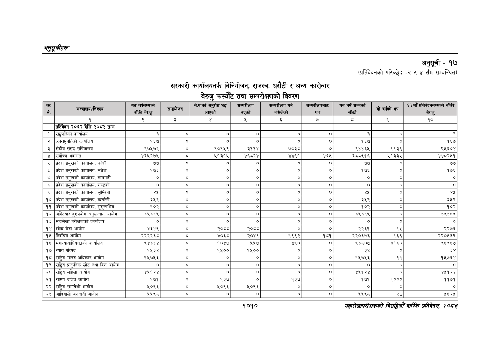

# Page 1072 QA

## Rendered page


## Extracted text

```text
अनुतूचीहरू
सरकारी कार्यालयतर्फ विनियोजन, राजस्व, धरौटी र अन्य कारोबार बेरुजु फस्यौट तथा सम्परीक्षणको विवरण
सहालेखापरीक्षकको वाषिक प्रतिवेदन २०८२
अनुसूची -१७
(प्रतिवेदनको परिच्छेद -२ र ४ सँग सम्बन्धित)
१०१०

| क्र. . सं.                 | मन्त्रालय/निकाय                          | गत वर्षसम्मको बाँकी बेरुजु   | समायोजन   | सं.प.को अनुरोध भई । आएको   | सम्परीक्षण भएको   | सम्परीक्षण गर्न नमिलेको   | सम्परीक्षणबाट &#124; थप   | गत वर्ष सम्मको बाँकी   | यो वर्षको थप   | ६३औं प्रतिवेदनसम्मको बाँकी ] बेरुजु   |
|----------------------------|------------------------------------------|------------------------------|-----------|----------------------------|-------------------|---------------------------|---------------------------|------------------------|----------------|---------------------------------------|
|                            | १                                        | २                            | 32        | ¥                          | %                 | &                         | ७                         | [र                     | ९              | १० ०                                  |
| &#124; प्रतिवेदन २०६२ देखि | २०८२ सम्म                                |                              |           |                            |                   |                           |                           |                        |                | &#124;                                |
| १                          | [राष्ट्रपतिको कार्यालय                   | 3                            | _         | _                          | -                 | _                         | _                         | 3                      | -              | 3                                     |
| २                          | &#124; उपराष्ट्रपतिको कार्यालय           | १६७                          | । ०] ।    | ०                          | &#124; ०] &#124;  | ०]                        | &#124; ०]                 | १६७                    | । ०            | १६७                                   |
| ३                          | [संघीय संसद सचिवालय                      | ९७५७९                        | । ०]      | १०१५२                      | ३११४              | ७०३८                      | [ ०]                      | ९४४६५                  | ११३९           | ९५६०४                                 |
| ४                          | &#124;सर्वेच्च अदालत                     | ४३२५२७२५                     | । ०]      | २५१३१५                     | ४६८२४             | ४४९१                      | ६२                        | ३८०९१६                 | २१३३४५         | ४४०२५१                                |
| ५                          | प्रदेश प्रमुखको कार्यालय, कोशी           | ५७]                          | ४         | ०)                         | ०                 | ०                         | o                         | ७७५                    | ०]             | ७७                                    |
| ६                          | &#124;प्रदेश प्रमुखको कार्यालय, मधेश     | १७६                          | [। ०]     | [ ०]                       | । ०]              | [                         | । ०]                      | १७६                    | [। ०]          | १७६                                   |
| ७                          | &#124;प्रदेश प्रमुखको कार्यालय, बागमती   | &#124; ०                     | ०         | न                          | ०                 | ०                         | ०                         | ०                      | ०              | ०]                                    |
| ८                          | प्रदेश प्रमुखको कार्यालय, गण्डकी         | । ०                          | ०]        | ना                         | नु                | ०                         | ना                        | ०                      | ०७०            | ०]                                    |
| ९                          | प्रदेश प्रमुखको कार्यालय, लुम्बिनी       | ४५]                          | ०         | ०                          |
```

## Flags
- table_page
