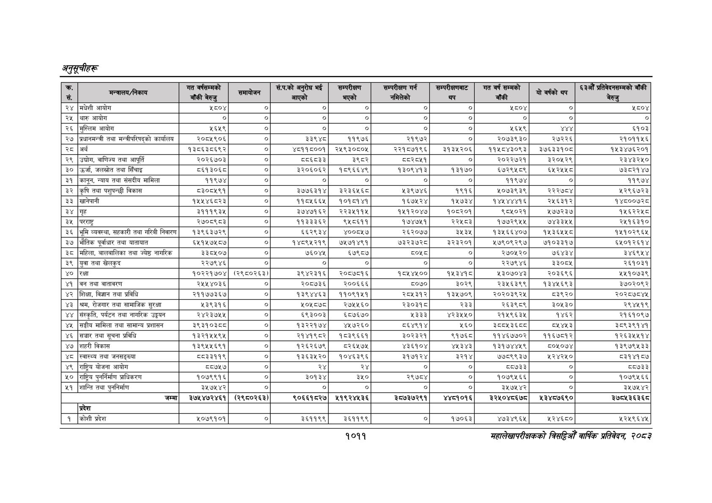

# Page 1073 QA

## Rendered page


## Extracted text

```text
अनुतूचीहरू
१०११
महालेखापरीक्षकको विडियो वार्षिक प्रतिवेकक २०५३

| क्र. . रस.   | मन्त्रालय/निकाय                                  | गत वर्षसम्मको बाँकी बेरुजु   | समायोजन          | सं.प.को अनुरोध भ । आएको   | सम्परीक्षण भएको   | सम्परीक्षण गर्न नमिलेको   | सम्परीक्षबाट &#124; थप   | गत वर्ष सम्मको बाँकी   | यो वर्षको थप   | £33 प्रतिवेदनसम्मको बाँकी बेरुजु   |
|--------------|--------------------------------------------------|------------------------------|------------------|---------------------------|-------------------|---------------------------|--------------------------|------------------------|----------------|------------------------------------|
| २४           | &#124;मधेशी आयोग                                 | ४८०४ &#124;                  | ०]               | ०]                        | &#124; ०] &#124;. | ०]                        | । ०]                     | ५८०४ &#124;            | ०              | ५८०४                               |
| २५           | &#124;थारु आयोग                                  | &#124; ०] ।                  | &#124; ०] &#124; | ०                         | &#124; ०] [       | ०]                        | &#124; ०] &#124;         | ०] &#124;              | &#124;         | ०]                                 |
| २६           | &#124;मुस्लिम आयोग                               | २६५९ [।                      | ०] [             | ०]                        | [। ०] [           |                           | । ०]                     | २६५९                   | 110.           | ६१०३                               |
| २७           | &#124;प्रधानमन्त्री तथा मन्त्रीपरिषद्को कार्यालय | २०८५९०६                      | ०]               | ३३९४८                     | ११९७६             | २१९७२                     | &#124; ०]                | २०७३९३०                | २७२२६          | २१०११५६                            |
| २८           | &#124;अर्थ                                       | &#124; १३८६३८६९२ [।          | ०]               | ४८११८००१&#124;            | २५९३०८०५          | २२१८७१९६                  | ३१३५२०६                  | ११५८४३०९३              | ३५६३३१०८       | १५३४७६२०१                          |
| २९           | उद्योग, वाणिज्य तथा आपूर्ति                      | २०२६७०३ &#124;               | ०]               | ८८६८३३                    | ३९८२              | 5०२८५१                    | ०]                       | २०२२७२१                | ३२०५२९         | २३४३२५०                            |
| ३०           | &#124;उर्जा, जलस्रोत तथा सिँचाइ                  | ८६१३०६८ ।                    | ०]               | ३२०६०६२                   | १८९६६४९           | &#124; १३०९४१३            | १३१७०                    | ६७२९५८९                | ६२२२५२५८       | ७३८२१४७                            |
| ३१           | &#124;कानून, न्याय तथा संसदीय मामिला             | ११९७४                        | ०] [             | ०]                        | ०] [              |                           | ०]                       | ११९७४                  | [। ०]          | ११९७४                              |
| ३२           | कृषि तथा पशुपन्छी विकास                          | [। ८३०८५९१ ।                 | ०]               | [। ३७७६३१४                | २२३६२५६८          | [ २३९७४६                  | १९१६                     | २०७३९३९                | २२२७८४         | २२९६७२३                            |
| ३३           | &#124;खानेपानी                                   | १५५४६८२३ [।                  | ०]               | ११८५६६५]                  | १०१८१४१           | १६७५२४                    | १५७३४                    | १४५ ४४४१६              | २५६३१२         | १४८००७२८                           |
| २४           | &#124;’                                          | २१११९३५ &#124;               | ०]               | ३७४७१६२                   | २२३५११५           | १५१२०४७                   | १०८२०१                   | ९८५०२१                 | २७७२३७         | १५६२२५८                            |
| ३५           | &#124;परराष्ट्र    
```

## Flags
- table_page
- medium_quality_table
