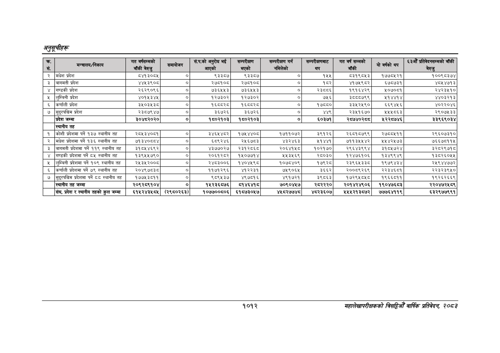

# Page 1074 QA

## Rendered page


## Extracted text

```text
अनुतूचीहरू
१०१२
महालेखापरीक्षकको विडियो वार्षिक प्रतिवेकक २०५३

| कः रस.   | मन्त्रालय/निकाय                            | गत वर्षसम्मको बाँकी बेरुजु   | समायोजन    | सं.प.को अनुरोध भ आएको   | सम्परीक्षण भएको   | सम्परीक्षण गर्न नमिलेको   | सम्परीक्षबाट थप   | गत वर्ष सम्मको बाँकी   | यो वर्षको थप   | £33 प्रतिवेदनसम्मको बाँकी ] बेरुजु   |
|----------|--------------------------------------------|------------------------------|------------|-------------------------|-------------------|---------------------------|-------------------|------------------------|----------------|--------------------------------------|
| २        | &#124;मधेश प्रदेश                          | ८४१३०८५ &#124;               | ०]         | ९३३८७                   | ९३३८७             | &#124;. ०]                | १५५               | 5394543                | १७७८५२१        | १००९८३७४                             |
| ३        | &#124;बागमती प्रदेश                        | ४४५३९०८ ।                    | ०]         | २७८१०८                  | २७८१०८            | [ ०]                      | १८२               | ४१७५९८२                | ६७८०७३१        | ४०५४७१३                              |
| ४        | गण्डकी प्रदेश                              | २६२९०९६ [।                   | ०]         | ७३६५२५३                 | ७३६२५२५३          | [                         | २३८०६             | १९१६४२९                | २०७०८१         | २४२३५१०                              |
| ५        | &#124;लुम्विनी प्रदेश                      | ४०१५३४४५ &#124;              | ०]         | १२७३०२                  | १२७३०२            | &#124; ०                  | ७५६               | ३८८०७९९                | २१४४१४         | ४४०३२१३                              |
| ६        | &#124;कर्णाली प्रदेश                       | ३५०३५३८ [।                   | ०]         | १६वव२८                  | १६८८२८            | [                         | १७८८०             | ३३५२५९०                | ६६९४५६         | ४०२२०४६                              |
| ७        | सुदूरपश्चिम प्रदेश                         | २३८७९४५                      | ०]         | ३६७२६                   | ३६७२६।            | ०                         | ४४९               | २३५१६७०                | २५५८६३         | २९०७५३३                              |
|          | प्रदेश जम्मा                               | ३०४८२०२० &#124;              | ०]         | १८०२१०३                 | 1503903           | _                         | ६०३७१             | २८७४०२८८               | ५२२८७४६        | २३९६९०३४                             |
|          | स्थानीय तह                                 | स्थानीय तह                   | स्थानीय तह | स्थानीय तह              | स्थानीय तह        | स्थानीय तह                | स्थानीय तह        | स्थानीय तह             | स्थानीय तह     | स्थानीय तह                           |
| [१]      | कोशी प्रदेशमा पर्ने १३७ स्थानीय तह         | २८५३४०८१ ।                   | ०]         | ३४६५४८२&#124;           | १७५४४०८           | १७११०७२                   | ३९१२६             | २६८१८७९९               | २७८८५११        | २९६०७३१०                             |
| २        | &#124;मधेश प्रदेशमा पर्ने १३६ स्थानीय तह   | ७१३४०८८४ [।                  | ०]         | ६5८९२४६                 | २५६७८३            | ४३२४६३                    | ५१४४१             | ७११३५५४२               | २५४२५७३        | ७६६७८११४५                            |
| ३        | बागमती प्रदेशमा पर्ने ११९ स्थानीय तह       | ३१८५४६९२२]                   | ०]         | ४३७७०२७&#124;           | २३१२८६८           | २०६४१५८                   | १०२१७०            | २९६४३९९४               | ३१८५७२४        | ३२८२९७१८                             |
| ४        | गण्डकी प्रदेशमा पर्ने ८५ स्थानीय तह        | १३९५५७९०]                    | ०]         | २०६१२८२&#124;           | १५०७७१४           | २५३५६९                    | २८०३०             | १२४७६१०६               | १३४९९४९        | १३८२६०५४                             |
| ५        | लुम्बिनी प्रदेशमा पर्ने १०९ स्थानीय तह     | 
```

## Flags
- table_page
